# Generic SQLite P2P Sync Service (ENX Data Service)

**📌 Quick Summary**: This document designs a **universal, reusable SQLite synchronization service** with P2P capabilities. While originally designed for the ENX vocabulary learning app, the service is completely **generic and table-agnostic**, making it suitable for any SQLite-based application that needs multi-device data synchronization.

**🎯 Design Philosophy**:
- ✅ **Generic First**: Table-agnostic APIs (no hardcoded schemas)
- ✅ **Configuration-Driven**: YAML config instead of code changes
- ✅ **ENX as User**: ENX is the first application using this generic service
- ✅ **Open-Source Goal**: Build for the broader SQLite community

## Document Information

| Field | Value |
|-------|-------|
| **Created** | 2025-11-12 |
| **Last Updated** | 2025-12-13 (Finalized generic data service design) |
| **Author** | wiloon |
| **AI Assisted** | Yes (GitHub Copilot) |
| **AI Model** | Claude Sonnet 4.5 |
| **Version** | 0.1.0 |
| **Status** | Proposed |

## ⚡ Critical Design Decision

**This data service is designed as a GENERIC, reusable tool, not ENX-specific.**

| Aspect | Decision |
|--------|----------|
| **Service Type** | ✅ Generic SQLite P2P sync service (universal) |
| **API Design** | ✅ Table-agnostic (Find/Query/Insert/Update/Delete) |
| **Configuration** | ✅ YAML-driven (no hardcoded schemas) |
| **Business Logic** | ❌ None in data service (stays in enx-api) |
| **Target Users** | ✅ Any SQLite-based application needing P2P sync |
| **ENX Role** | First real-world user & validation case |

## 🚨 Critical Prerequisites

**⚠️ WARNING: These requirements are MANDATORY for the sync system to work correctly. Failure to meet them will result in data inconsistencies and potential data loss.**

### 1. Clock Synchronization (CRITICAL)

**Why it matters**: The entire conflict resolution system is based on timestamp comparison. Without synchronized clocks, the system will merge data in the wrong order, potentially causing data loss.

| Requirement | Details |
|-------------|----------|
| **NTP Sync** | ✅ REQUIRED: All nodes MUST have NTP enabled |
| **Max Clock Skew** | ⚠️ Must be < 5 seconds between any two nodes |
| **Verification** | ✅ Automatic check on service startup (fails if NTP disabled) |
| **Consequences** | ❌ Wrong merge order, data overwritten incorrectly, silent data loss |

**Before enabling P2P sync, verify on EACH node:**

```bash
# 1. Check NTP status (REQUIRED)
timedatectl status

# Expected output:
#   System clock synchronized: yes  ✅
#   NTP service: active            ✅

# If NTP is disabled, enable it NOW:
sudo timedatectl set-ntp true

# 2. Compare times across all nodes (should differ by < 1 second)
date +"%Y-%m-%d %H:%M:%S.%3N"

# Example output from 3 nodes:
# Desktop: 2025-12-30 15:30:45.123
# MacBook: 2025-12-30 15:30:45.234  (diff: 111ms ✅)
# Ubuntu:  2025-12-30 15:30:45.089  (diff: 34ms ✅)

# ⚠️ If times differ by > 5 seconds, DO NOT enable sync until fixed!
```

**Startup Check (Automatic)**:

The data service will automatically verify clock synchronization on startup:

```go
// Service startup sequence
func main() {
    log.Println("🚀 Starting enx-data-service...")
    
    // STEP 1: Verify clock synchronization (BLOCKING)
    if err := verifyClockSync(); err != nil {
        log.Fatalf("❌ CRITICAL: Clock sync check failed: %v", err)
        log.Fatal("   Please enable NTP: sudo timedatectl set-ntp true")
        // Service will NOT start if NTP is disabled
    }
    log.Println("✅ Clock synchronization verified")
    
    // STEP 2: Initialize database
    db := initDatabase("./enx.db")
    
    // STEP 3: Start services
    // ...
}
```

**What happens if clocks are not synchronized:**

```
❌ Real Example of Data Loss:
━━━━━━━━━━━━━━━━━━━━━━━━━━━━━━━━━━━━━━━━━━━━━━━━━━━━━━━━

Scenario: Desktop clock is 10 minutes fast (NTP disabled)

Node A (Desktop, clock fast):      Node B (MacBook, correct):
  10:10 AM - Add word "algorithm"    10:00 AM - Add word "database"
  
Sync happens:
  Node B receives "algorithm" with timestamp 10:10
  10:10 > 10:00 → Desktop's record wins ✅
  
But 5 minutes later...
  Node A (Desktop):                  Node B (MacBook):
  10:15 - Mark "algorithm" learned   10:05 - Mark "database" learned
  
Sync happens again:
  10:15 > 10:05 → Desktop wins again
  
Problem: Desktop's clock being fast means it ALWAYS wins,
         even if MacBook's changes are actually newer!
         MacBook's "database" might never sync properly.

✅ Solution: Enable NTP on all nodes BEFORE enabling sync.
```

### 2. Network Configuration

**For Home LAN Setup (recommended for intermittent connectivity):**

| Requirement | Details |
|-------------|----------|
| **Network Segment** | All nodes should be on same subnet (e.g., 192.168.1.x) |
| **Firewall** | Allow TCP port 8091 between nodes |
| **Service Discovery** | Use static IP or hostname in config (mDNS optional for future) |
| **Connectivity Test** | Nodes should be able to ping each other |

**Verify network connectivity:**

```bash
# From each node, ping other nodes
ping 192.168.1.10  # Desktop
ping 192.168.1.20  # MacBook  
ping 192.168.1.30  # Ubuntu laptop

# Test port connectivity
nc -zv 192.168.1.10 8091
nc -zv 192.168.1.20 8091
nc -zv 192.168.1.30 8091
```

### 3. Database Schema Requirements

**All tables that need P2P sync MUST have:**

| Field | Type | Requirement | Purpose |
|-------|------|-------------|----------|
| `id` | TEXT (UUID) | ✅ MANDATORY | Primary key, avoid ID conflicts |
| `update_datetime` | INTEGER | ✅ MANDATORY | Unix timestamp (milliseconds) for conflict resolution |
| `deleted_at` | INTEGER | ⚠️ RECOMMENDED | Soft delete support (NULL = not deleted) |

**❌ Tables with auto-increment INTEGER IDs cannot be synced** (will cause ID conflicts)

### 4. Backup Before First Sync

**⚠️ IMPORTANT: Always backup your database before enabling P2P sync for the first time**

```bash
# Backup current database
cp ~/.local/share/enx/enx.db ~/.local/share/enx/enx.db.backup-$(date +%Y%m%d)

# Verify backup
ls -lh ~/.local/share/enx/*.backup*
```

### Quick Start Checklist

Before enabling P2P sync, verify:

- [ ] ✅ NTP enabled on ALL nodes (`timedatectl status`)
- [ ] ✅ Clock skew < 5 seconds between nodes
- [ ] ✅ Nodes can ping each other
- [ ] ✅ Port 8091 open on all nodes
- [ ] ✅ Database schema has UUID primary keys
- [ ] ✅ Database schema has `update_datetime` field
- [ ] ✅ Database backed up
- [ ] ✅ Static IPs or hostnames configured

**Only proceed with sync setup after all items are checked!**

**What this means:**
- **enx-data-service**: Generic CRUD + P2P sync for ANY SQLite database
- **enx-api**: ENX-specific business logic (word learning, user management, etc.)
- **Future**: Open-source the data service for broader community benefit

**Quick Comparison:**

```
❌ ENX-Specific Approach (Rejected):
──────────────────────────────────────
service ENXDataService {
  rpc GetWord(...)           // Only works with words table
  rpc MarkWordLearned(...)   // ENX business logic in data layer
  rpc GetUserStats(...)      // Hardcoded for ENX schema
}
→ Problem: Not reusable, tightly coupled to ENX

✅ Generic Approach (Chosen):
──────────────────────────────────────
service GenericDataService {
  rpc Find(...)              // Works with ANY table
  rpc Query(...)             // Raw SQL for flexibility
  rpc Update(...)            // Generic CRUD operations
}
→ Benefit: Reusable for blogs, tasks, notes, any SQLite app
→ ENX uses: client.Find(table="words", filter={...})
```

## Overview

This document describes the architecture design for separating ENX into two services: **enx-api** (application layer) and **enx-data-service** (generic data layer with P2P sync capabilities).

**🎯 Key Design Decision**: enx-data-service is designed as a **generic, reusable SQLite synchronization service** that works with any SQLite database, not just ENX. This allows us to:
- Build a universal tool for the SQLite community
- Benefit from broader testing and community contributions
- Use ENX as the first real-world validation case
- Potentially open-source the tool to help other developers

**ENX-specific business logic** (word learning, user preferences, etc.) remains in **enx-api**, while **generic data operations** (CRUD, sync, storage) are handled by **enx-data-service**.

## Problem Statement

### The Challenge

ENX is a **side project** with specific multi-environment development challenges:

1. **Long Development Cycle**: Development will continue over an extended period (months to years)
2. **Multiple Development Environments**:
   - **Desktop Linux**: Primary development environment (always connected to home LAN)
   - **MacBook**: Development + usage while traveling (intermittent connection)
   - **Ubuntu Laptop (Intermittent Isolation)**: Used in restricted network environment for hours, then connects to home LAN for sync
3. **Active Usage During Development**: The application is actively used while being developed (common for side projects)
4. **Data Fragmentation Across Environments**: Different environments accumulate different data over time, requiring intelligent merging
5. **Offline-First Requirement**: Network-isolated environment must work without internet connection
6. **Intermittent Connectivity** (Key Scenario): Ubuntu laptop usage pattern
   - **Typical usage**: Work offline for hours (e.g., 9 AM - 3 PM)
   - **Environment**: Isolated network with no external access
   - **Reconnection**: Join home LAN later, automatic sync triggers
   - **Implementation**: Network monitoring + opportunistic sync
7. **No Concurrent Access (Currently)**: Only one environment is used at any given time
   - **Current state**: No production environment yet, so no concurrent writes
   - **Future consideration**: If production environment is added, concurrent access may become a requirement
   - **Design implication**: Current design focuses on eventual consistency, not real-time multi-master sync

### Real-World Scenarios

**Scenario 1: Regular Switching**
```
Monday: Working on desktop Linux
  - Added 50 new words while reading technical articles

Friday: Taking a trip, using MacBook
  - Added 20 words while reading on the plane
  - Need access to Monday's 50 words ❌ (not synced)
```

**Scenario 2: Intermittent Network Access**
```
Saturday 9:00 AM: Working in network-isolated Ubuntu environment
  - Disconnect from home LAN, work on isolated project
  - Cannot access cloud services (security requirement)
  - Added 30 words while working
  - Modified learning progress on 15 words

Saturday 3:00 PM: Project work finished, back home
  - Ubuntu reconnects to home LAN ✅
  - Automatic P2P sync triggers
  - 30 words + progress sync to Desktop/MacBook ✅
  - Receive changes from other nodes ✅

Result: All nodes synchronized after reconnection
```

**Scenario 3: Intermittent Network (Ubuntu Laptop)**
```
Saturday Morning (Ubuntu disconnected from LAN):
  - Working on isolated project for 4 hours
  - Added 30 new words
  - Marked 15 words as learned
  - All changes stored locally in SQLite ✅

Saturday Afternoon (Ubuntu reconnects to home LAN):
  - enx-data-service detects network available
  - Connects to Desktop/MacBook on LAN
  - Pulls changes since last sync (Desktop added 20 words)
  - Pushes local changes (30 words + learning progress)
  - Merges using timestamps ✅
  
Result: All 3 nodes have 50 new words total, fully synchronized
```

**Scenario 4: Data Inconsistency**
```
Current state:
  - Desktop Linux: 1000 words, 500 marked as learned
  - MacBook: 950 words, 480 marked as learned
  - Ubuntu laptop: 920 words, 450 marked as learned (was offline)

Problem: Which is the "correct" version?
Answer: All of them! Each has unique data that should be merged.
```

### 🔑 Key Use Case: Intermittent Network Connectivity

**The Ubuntu Laptop Scenario** (Primary design driver):

```
Real-world usage pattern:
━━━━━━━━━━━━━━━━━━━━━━━━━━━━━━━━━━━━━━━━━━━━━━━━━━━━━━━━

Saturday Morning (9:00 AM):
  ✅ Ubuntu laptop connected to home LAN (192.168.1.x)
  ✅ All nodes synced (Desktop, MacBook, Ubuntu all at 1000 words)
  
  📴 Disconnect laptop, go to isolated work environment
  
During Isolated Work (9:15 AM - 3:00 PM):
  🔒 No external network access (security requirement)
  ✍️  Continue using ENX: add words, mark learning progress
  💾 All changes stored locally in SQLite
  ⏳ Cannot sync with other nodes (offline)
  
Back Home (3:00 PM):
  🔌 Reconnect to home LAN
  🔍 Network monitor detects connection restored
  🔄 Automatic sync triggers:
      • Pull changes from Desktop (4 words added during day)
      • Push changes to Desktop/MacBook (5 words added offline)
      • Merge using timestamps (conflict-free)
  ✅ All 3 nodes now synchronized (1009 words each)
  
Key Point: Works offline for 6 hours, syncs in seconds when reconnected!
```

**Why this pattern matters:**
- ✅ **Realistic**: Many developers work in isolated environments (secure labs, air-gapped systems)
- ✅ **Flexible**: Offline duration can be hours, days, or weeks - design handles all cases
- ✅ **Automatic**: No manual export/import, no cloud dependencies
- ✅ **Reliable**: Timestamp-based merge ensures data integrity

### Why This Design?

Given these challenges, the traditional solutions don't work:

❌ **Centralized Server**:
- Doesn't work in network-isolated environment
- Requires constant internet connection
- Single point of failure

❌ **Cloud File Sync (Dropbox/Google Drive)**:
- Delay in synchronization (2-10 seconds)
- Risk of file corruption with SQLite
- No intelligent conflict resolution
- Requires cloud sync client on all platforms

❌ **Manual Database Copy**:
- Error-prone
- Time-consuming
- No automatic conflict resolution
- Easy to forget

### The Solution: ENX Data Service

Since we need to solve the data synchronization problem anyway, why not:

1. **Wrap enx.db in a service** → enx-data-service
2. **Complete decoupling** → enx-api never touches the database directly
3. **Unified data access** → All database operations go through enx-data-service API
4. **Built-in synchronization** → enx-data-service handles node-to-node sync automatically

Benefits:

- ✅ **Development flexibility**: Develop on any environment, data stays in sync
- ✅ **Offline-first**: Work without network, sync when available
- ✅ **Intermittent connectivity**: Supports nodes that connect/disconnect periodically (like Ubuntu in isolated environment)
- ✅ **Opportunistic sync**: Automatically syncs when network becomes available
- ✅ **Data integrity**: Intelligent merge based on timestamps
- ✅ **Clean architecture**: Business logic completely separated from data management
- ✅ **Future-proof**: Easy to migrate from SQLite to PostgreSQL without touching enx-api
- ✅ **Service isolation**: enx-data-service can be restarted/upgraded independently

## Sync Requirements (New)

To support the P2P sync architecture, **ALL tables that need to be synced** must adhere to the following rules:

1.  **Primary Key**: Must be a **UUID** (String). ⚠️ **MANDATORY for all sync tables**
    *   *Reason*: Avoids ID conflicts between nodes (e.g., Node A and Node B both creating ID=100 with auto-increment).
    *   *Migration*: Existing tables with auto-increment IDs MUST be migrated to UUID before enabling sync.
    *   *Non-sync tables*: Tables that don't need P2P sync can keep auto-increment IDs.
2.  **Timestamp Field**: Must have an `update_datetime` (or similar) field.
    *   *Reason*: Used to identify changed records since the last sync.
    *   *Note*: **Clock synchronization is required** - nodes must sync system clocks (via NTP or manual) before starting sync process.
    *   *Implementation strategy*: Use system clock (simple approach), defer complex solutions (HLC, Vector Clock) until proven necessary.
3.  **Soft Delete**: Must have an `is_deleted` (boolean) or `deleted_at` (timestamp) field.
    *   *Reason*: Physical deletions cannot be synced. Soft deletes allow "deletion" events to propagate to other nodes.

## Implementation Strategy (Phase 1)

### Prerequisites

**⏰ Clock Synchronization Strategy**:

#### Phase 1 (MVP) - NTP Configuration Only ⭐ **CURRENT FOCUS**

**Requirements**:
- ✅ All nodes must enable NTP (Network Time Protocol)
- ✅ Document NTP setup instructions for users
- ✅ Rely on user to verify NTP is working

**Setup Commands**:
```bash
# Ubuntu/Debian
sudo timedatectl set-ntp true
timedatectl status  # Verify: "System clock synchronized: yes"

# macOS (usually enabled by default)
sudo systemsetup -setusingnetworktime on
systemsetup -getusingnetworktime  # Verify

# Verify all nodes have similar time (manual check)
date +%s  # Check Unix timestamp on each node
```

**Why This Is Enough for Phase 1**:
- ✅ Single user, low conflict probability
- ✅ Modern NTP accuracy: ±10-100ms (sufficient for word learning data)
- ✅ Operations typically minutes/hours apart (not milliseconds)
- ✅ Non-critical data (word learning progress)
- ✅ Keep MVP simple - add complexity only when needed

**Risk if NTP not configured**: Timestamp-based merge may choose wrong version, causing data to be overwritten.

#### Phase 2 - Automatic Detection & Protection (Future)

**Deferred features** (implement only if Phase 1 shows problems):
- ⏳ Startup clock sync verification
- ⏳ Peer-to-peer clock skew detection
- ⏳ Automatic warnings when clocks diverge > 5 seconds
- ⏳ Sync rejection if clock skew too large

#### Phase 3 - Advanced Solutions (If Necessary)

**Only if real-world issues emerge**:
- ⏳ Hybrid Logical Clock (HLC) for clock-skew tolerance
- ⏳ Vector clocks for true causality tracking
- ⏳ Conflict detection UI for user resolution

**Decision**: Start with documented NTP requirement, add automation only when proven necessary through real-world usage.

### Development Scope

1.  **Scope**:
    *   Create `enx-data-service` in a new directory.
    *   Implement only the **"words"** table initially.
    *   Do NOT modify `enx-api` yet.
2.  **Clock Synchronization** (Phase 1):
    *   ✅ Document NTP configuration requirement in README
    *   ✅ Add NTP setup verification steps
    *   ❌ No automatic clock checking in Phase 1 (keep it simple)
    *   ⏳ Defer automatic detection to Phase 2
3.  **Integration**:
    *   Develop and test `enx-data-service` independently.
    *   Once `enx-data-service` is stable, refactor `enx-api` to connect to it.


## Architecture Goals

1. **Decoupling**: Separate business logic from data management
   - enx-api focuses on HTTP routing, authentication, business rules
   - enx-data-service focuses on data CRUD, sync, storage

2. **P2P Sync**: Enable data synchronization across multiple nodes without central server
   - Each node (Linux desktop, MacBook, Ubuntu laptop) runs its own enx-data-service
   - Nodes sync directly with each other (peer-to-peer)
   - No central server required (works in isolated environments)

3. **Offline Support**: Continue working when disconnected, sync when online
   - enx-data-service works locally even without network
   - Changes are queued and synced when connection is restored
   - **Intermittent connectivity supported**: Nodes can go offline for hours/days, sync when reconnected
   - No data loss in offline scenarios
   - Timestamps ensure correct merge order

4. **Scalability**: Easy to upgrade storage backend (SQLite → PostgreSQL) without changing enx-api
   - enx-api uses abstract data service API
   - Backend can be swapped without API changes
   - Future support for Redis caching, read replicas, etc.

5. **Flexibility**: Each service can be deployed, scaled, and upgraded independently
   - Update enx-api without touching data service
   - Upgrade database schema without restarting API
   - Run multiple enx-api instances against one data service

## System Architecture

```plantuml
@startuml ENX System Architecture

!define ICONURL https://raw.githubusercontent.com/tupadr3/plantuml-icon-font-sprites/v2.4.0

skinparam rectangle {
    BackgroundColor<<client>> LightBlue
    BackgroundColor<<api>> LightGreen
    BackgroundColor<<data>> LightYellow
    BackgroundColor<<db>> Wheat
}

skinparam component {
    BackgroundColor<<browser>> AliceBlue
    BackgroundColor<<service>> LightGreen
    BackgroundColor<<database>> Wheat
}

package "Client Layer" as ClientLayer {
    component "Browser\n+ Extension" as Browser1 <<browser>>
    component "Browser\n+ Extension" as Browser2 <<browser>>
    component "Browser\n+ Extension" as Browser3 <<browser>>
}

package "Application Layer" as AppLayer {
    component "enx-api\nHost A\nPort: 8090" as API_A <<service>>
    component "enx-api\nHost B\nPort: 8090" as API_B <<service>>
    component "enx-api\nHost C\nPort: 8090" as API_C <<service>>
}

package "Data Layer" as DataLayer {

    package "Host A" as HostA <<data>> {
        component "Data Service\nPort: 8091" as DS_A <<service>>
        database "enx.db\n(SQLite)" as DB_A <<database>>
        DS_A -down-> DB_A : SQL
    }

    package "Host B" as HostB <<data>> {
        component "Data Service\nPort: 8091" as DS_B <<service>>
        database "enx.db\n(SQLite)" as DB_B <<database>>
        DS_B -down-> DB_B : SQL
    }

    package "Host C" as HostC <<data>> {
        component "Data Service\nPort: 8091" as DS_C <<service>>
        database "enx.db\n(SQLite)" as DB_C <<database>>
        DS_C -down-> DB_C : SQL
    }
}

' Client to API connections
Browser1 -down-> API_A : HTTP/HTTPS
Browser2 -down-> API_B : HTTP/HTTPS
Browser3 -down-> API_C : HTTP/HTTPS

' API to Data Service connections
API_A -down-> DS_A : gRPC/HTTP
API_B -down-> DS_B : gRPC/HTTP
API_C -down-> DS_C : gRPC/HTTP

' P2P Sync connections between Data Services
DS_A <-right-> DS_B : P2P Sync\n(gRPC/HTTP)
DS_B <-right-> DS_C : P2P Sync\n(gRPC/HTTP)
DS_A <.down.> DS_C : P2P Sync\n(gRPC/HTTP)

note right of DataLayer
  **Key Points:**
  • Each Data Service directly accesses its local enx.db
  • Data Services sync with each other via gRPC/HTTP (P2P)
  • enx.db is embedded with Data Service (same process/host)
  • No central server required
end note

@enduml
```



## Communication Protocol Selection

### Chosen Solution: Hybrid Approach ⭐⭐⭐⭐⭐

**Strategy**:
- **gRPC for inter-service communication** (enx-api ↔ data-service, high frequency)
- **gRPC for node sync** (data-service ↔ data-service, P2P sync)
- **REST for admin/monitoring** (health checks, metrics)

**Benefits**:
- Best performance for critical paths
- Easy debugging and monitoring
- Flexibility for different use cases

```
enx-api → gRPC → enx-data-service  (Fast, typed)
    ↓
User/Admin → REST → enx-api       (Easy debugging)

data-service → gRPC → data-service  (Efficient sync)
```

## Communication Patterns

### 1. Request-Response (Synchronous)

**Use Case**: CRUD operations, immediate response needed

#### ❌ **ENX-Specific API (NOT USED - This service is generic)**

```go
// ❌ This approach was rejected
// Reason: GetWord() is ENX-specific, not reusable for other projects
word, err := dataClient.GetWord(ctx, &pb.GetWordRequest{
    English: "hello",
})

// Problems:
// - Hardcoded "GetWord" method only works with words table
// - Not reusable for blogs, task managers, or other apps
// - Tightly coupled to ENX domain
// - Cannot open-source as universal tool
```

#### ✅ **Generic Data Service API (New Design - Recommended)**

**Scenario: Query a single word by English (ENX example)**

**Method 1: Structured API (Find) - ⭐ Recommended for simple queries**

```go
// Generic Find() API - works with any table
resp, err := dataClient.Find(ctx, &pb.FindRequest{
    Table: "words",                   // Table name (configurable)
    Filter: `{"english": "hello"}`,  // JSON filter (flexible)
    Limit: 1,                         // Only need one result
})

if err != nil {
    return nil, fmt.Errorf("failed to query record: %w", err)
}

if len(resp.Rows) == 0 {
    return nil, ErrRecordNotFound
}

// Parse result row
row := resp.Rows[0]
word := &Word{
    English: row.Cells[0].GetStringValue(),  // Column: english
    Chinese: row.Cells[1].GetStringValue(),  // Column: chinese
    // ... other fields
}
```

**Method 2: Raw SQL (Query) - For complex queries**

```go
// Using parameterized SQL query - works with any table/columns
resp, err := dataClient.Query(ctx, &pb.QueryRequest{
    Sql: "SELECT english, chinese, phonetic, definition FROM words WHERE english = ?",
    Params: []*pb.QueryParam{
        {Value: &pb.QueryParam_StringValue{StringValue: "hello"}},
    },
})

if err != nil {
    return nil, fmt.Errorf("failed to query records: %w", err)
}

// Parse result (same as Method 1)
// Note: Column names and types determined by your SQL query
```

**Method 3: Complex query with JOIN (user's learning progress)**

```go
// Query word with user's learning status
// ENX-specific: JOIN words table with user_dicts table
resp, err := dataClient.Query(ctx, &pb.QueryRequest{
    Sql: `
        SELECT w.english, w.chinese, w.phonetic, w.definition,
               ud.learned, ud.update_time
        FROM words w
        LEFT JOIN user_dicts ud ON w.english = ud.english AND ud.user_id = ?
        WHERE w.english = ?
    `,
    Params: []*pb.QueryParam{
        {Value: &pb.QueryParam_IntValue{IntValue: userID}},      // User ID
        {Value: &pb.QueryParam_StringValue{StringValue: "hello"}}, // Word
    },
})

// Result includes both word info and learning status
```

**Comparison:**

```
┌─────────────────────────────────────────────────────────────────┐
│ Method          │ Use Case              │ Pros              │ Cons           │
├─────────────────┼───────────────────────┼───────────────────┼────────────────┤
│ Find() JSON     │ Simple queries        │ ✅ Type-safe      │ ⚠️ JSON parsing │
│                 │ Single table          │ ✅ SQL-injection  │                │
│                 │ Basic filters         │    safe           │                │
├─────────────────┼───────────────────────┼───────────────────┼────────────────┤
│ Query() Simple  │ Single table          │ ✅ Familiar SQL   │ ⚠️ Need SQL    │
│                 │ Exact SQL control     │ ✅ Flexible       │    knowledge   │
├─────────────────┼───────────────────────┼───────────────────┼────────────────┤
│ Query() JOIN    │ Multi-table queries   │ ✅ Full SQL power │ ⚠️ More complex│
│                 │ Aggregations          │ ✅ Efficient      │                │
│                 │ Complex logic         │                   │                │
└─────────────────────────────────────────────────────────────────┘

Recommendation for ENX:
━━━━━━━━━━━━━━━━━━━━━━━━━━━━━━━━━━━━━━━━━━━━━━━━━━━━━━━━━━━━━━
• Simple word lookup:        Use Find() (Method 1)
• Word + learning status:    Use Query() with JOIN (Method 3)
• Batch operations:          Use BatchExecute()
• Search/filter words:       Use Find() with complex JSON filter
```

**Real-World Example: ENX API Handler Using Generic Service**

```go
// Example: enx-api/handlers/word.go
// This shows how ENX-specific business logic uses the generic data service

package handlers

import (
    "encoding/json"
    "net/http"

    "github.com/gin-gonic/gin"
    pb "enx-data-service/proto"  // Generic data service proto
)

type WordHandler struct {
    dataClient pb.GenericDataServiceClient  // Generic client
}

// GET /api/words/:english
func (h *WordHandler) GetWord(c *gin.Context) {
    english := c.Param("english")
    userID := c.GetInt64("user_id")  // From JWT token

    // Query word with user's learning progress (Method 3)
    resp, err := h.dataClient.Query(c.Request.Context(), &pb.QueryRequest{
        Sql: `
            SELECT
                w.english, w.chinese, w.phonetic, w.definition,
                w.update_datetime,
                COALESCE(ud.learned, 0) as learned,
                ud.update_time as user_update_time
            FROM words w
            LEFT JOIN user_dicts ud ON w.english = ud.english AND ud.user_id = ?
            WHERE w.english = ?
        `,
        Params: []*pb.QueryParam{
            {Value: &pb.QueryParam_IntValue{IntValue: userID}},
            {Value: &pb.QueryParam_StringValue{StringValue: english}},
        },
    })

    if err != nil {
        c.JSON(http.StatusInternalServerError, gin.H{"error": err.Error()})
        return
    }

    if len(resp.Rows) == 0 {
        c.JSON(http.StatusNotFound, gin.H{"error": "word not found"})
        return
    }

    // Parse result row into Word struct
    row := resp.Rows[0]
    word := map[string]interface{}{
        "english":      row.Cells[0].GetStringValue(),
        "chinese":      row.Cells[1].GetStringValue(),
        "phonetic":     row.Cells[2].GetStringValue(),
        "definition":   row.Cells[3].GetStringValue(),
        "update_datetime": row.Cells[4].GetStringValue(),
        "learned":      row.Cells[5].GetIntValue() == 1,
        "user_update_time": row.Cells[6].GetStringValue(),
    }

    c.JSON(http.StatusOK, word)
}

// POST /api/words/search (search multiple words)
func (h *WordHandler) SearchWords(c *gin.Context) {
    var req struct {
        Query  string `json:"query"`  // Search term
        Limit  int32  `json:"limit"`
        Offset int32  `json:"offset"`
    }

    if err := c.BindJSON(&req); err != nil {
        c.JSON(http.StatusBadRequest, gin.H{"error": err.Error()})
        return
    }

    // Use Find() API for simple search (Method 1)
    filter := map[string]interface{}{
        "english": map[string]interface{}{
            "$like": req.Query + "%",  // Prefix search
        },
    }
    filterJSON, _ := json.Marshal(filter)

    resp, err := h.dataClient.Find(c.Request.Context(), &pb.FindRequest{
        Table:  "words",
        Filter: string(filterJSON),
        Sort:   `{"english": 1}`,  // Sort alphabetically
        Limit:  req.Limit,
        Offset: req.Offset,
    })

    if err != nil {
        c.JSON(http.StatusInternalServerError, gin.H{"error": err.Error()})
        return
    }

    // Convert rows to words array
    words := make([]map[string]interface{}, 0, len(resp.Rows))
    for _, row := range resp.Rows {
        words = append(words, map[string]interface{}{
            "english": row.Cells[0].GetStringValue(),
            "chinese": row.Cells[1].GetStringValue(),
            // ... other fields
        })
    }

    c.JSON(http.StatusOK, gin.H{
        "words": words,
        "total": len(words),
    })
}
```

**Key Takeaways:**

```
━━━━━━━━━━━━━━━━━━━━━━━━━━━━━━━━━━━━━━━━━━━━━━━━━━━━━━━━━━━━━━
Generic Data Service Design Philosophy:
━━━━━━━━━━━━━━━━━━━━━━━━━━━━━━━━━━━━━━━━━━━━━━━━━━━━━━━━━━━━━━

❌ ENX-Specific Approach (NOT USED):
  dataClient.GetWord(ctx, &pb.GetWordRequest{English: "hello"})
  ↓
  • Hardcoded GetWord() method
  • Only works with words table
  • Not reusable for other projects
  • Tightly coupled to ENX domain

✅ Generic Approach (CHOSEN):
  dataClient.Find(ctx, &pb.FindRequest{
      Table: "words",                    // Configurable
      Filter: `{"english": "hello"}`,   // Flexible
  })
  ↓
  • Generic Find() method
  • Works with ANY table (words, users, posts, products, etc.)
  • Configuration-driven (no code changes for new tables)
  • Reusable across any SQLite-based project
  • Open-source potential

Design Decision:
  ✅ Build: Generic data service (universal SQLite sync tool)
  ✅ Use: ENX as first real-world user case
  ✅ Goal: Open source for broader community
  ✅ Benefit: Helps thousands of developers with same problem

Trade-offs:
  ✅ Gain: Flexibility, reusability, community support
  ⚠️ Cost: Runtime JSON parsing, manual column mapping
  ⚠️ Cost: Lose compile-time type safety for specific schemas
  ✅ Benefit: Configuration > Code (easier maintenance)

Conclusion:
  ✅ Worth it - Building universal tool serves broader purpose
  ✅ ENX benefits from battle-tested generic service
  ✅ Community benefits from open-source sync solution
```

**Characteristics**:
- Blocking call
- Timeout handling required
- Suitable for: Word lookup, search, CRUD operations

### 2. Streaming (Asynchronous)

**Use Case**: Large data transfer, real-time sync

```go
// Client streaming (enx-api → data-service)
stream, err := client.BatchCreateWords(ctx)
for _, word := range words {
    stream.Send(word)
}
response, err := stream.CloseAndRecv()

// Server streaming (data-service → enx-api)
stream, err := client.GetChanges(ctx, &pb.GetChangesRequest{
    Since: lastSyncTime,
})
for {
    change, err := stream.Recv()
    if err == io.EOF {
        break
    }
    applyChange(change)
}

// Bidirectional streaming (node-to-node sync)
stream, err := client.SyncNodes(ctx)
go func() {
    for {
        change := <-localChanges
        stream.Send(change)
    }
}()
for {
    change, err := stream.Recv()
    applyChange(change)
}
```

**Characteristics**:
- Non-blocking
- Efficient for large datasets
- Suitable for: Sync operations, batch operations

### 3. Event-Driven (Pub/Sub)

**Use Case**: Notify other nodes of changes (future enhancement)

```go
// Option: Add Redis Pub/Sub for change notifications
pubsub := redis.PubSub()
pubsub.Subscribe("enx:changes")

for msg := range pubsub.Channel() {
    // Node publishes: "word:123:updated"
    // Other nodes receive and pull changes
}
```

**Characteristics**:
- Decoupled
- Scalable
- Suitable for: Real-time notifications, event sourcing

## Protocol Comparison Matrix

| Feature              | gRPC         | REST/HTTP    | Hybrid       |
|---------------------|--------------|--------------|--------------|
| Performance         | ⭐⭐⭐⭐⭐     | ⭐⭐⭐        | ⭐⭐⭐⭐⭐     |
| Type Safety         | ⭐⭐⭐⭐⭐     | ⭐⭐          | ⭐⭐⭐⭐⭐     |
| Ease of Debugging   | ⭐⭐⭐        | ⭐⭐⭐⭐⭐     | ⭐⭐⭐⭐      |
| Learning Curve      | ⭐⭐⭐        | ⭐⭐⭐⭐⭐     | ⭐⭐⭐⭐      |
| Streaming Support   | ⭐⭐⭐⭐⭐     | ⭐⭐          | ⭐⭐⭐⭐⭐     |
| Browser Support     | ⭐⭐ (grpc-web)| ⭐⭐⭐⭐⭐     | ⭐⭐⭐⭐⭐     |
| Payload Size        | Small        | Large        | Optimal      |
| Setup Complexity    | Medium       | Low          | Medium       |

## Service Interfaces

### enx-data-service API

#### Data API (gRPC) - Generic Interface

```protobuf
service GenericDataService {
  // ==================== Structured CRUD APIs ====================
  // Recommended for common operations (80% use cases)
  // Type-safe, SQL injection protected
  
  // Find records with JSON filter
  rpc Find(FindRequest) returns (FindResponse);
  
  // Insert new records
  rpc Insert(InsertRequest) returns (InsertResponse);
  
  // Update existing records
  rpc Update(UpdateRequest) returns (UpdateResponse);
  
  // Delete records
  rpc Delete(DeleteRequest) returns (DeleteResponse);
  
  // ==================== Raw SQL APIs ====================
  // For complex queries (20% use cases: JOINs, aggregations, etc.)
  
  // Execute SELECT query
  rpc Query(QueryRequest) returns (QueryResponse);
  
  // Execute INSERT/UPDATE/DELETE
  rpc Execute(ExecuteRequest) returns (ExecuteResponse);
  
  // ==================== Batch Operations ====================
  
  // Batch execute multiple operations
  rpc BatchExecute(stream BatchRequest) returns (BatchResponse);
  
  // ==================== Health & Info ====================
  
  // Health check
  rpc HealthCheck(HealthCheckRequest) returns (HealthCheckResponse);
  
  // Get table schema information
  rpc GetTableSchema(GetTableSchemaRequest) returns (GetTableSchemaResponse);
}
```

#### Sync API (gRPC)

```protobuf
service SyncService {
  // Node management
  rpc RegisterNode(RegisterNodeRequest) returns (Node);
  rpc GetNodes(GetNodesRequest) returns (GetNodesResponse);
  rpc Heartbeat(HeartbeatRequest) returns (HeartbeatResponse);

  // Data sync
  rpc GetChanges(GetChangesRequest) returns (stream Change);
  rpc PushChanges(stream Change) returns (PushChangesResponse);
  rpc GetSnapshot(GetSnapshotRequest) returns (stream SnapshotChunk);

  // Conflict resolution
  rpc ResolveConflict(ResolveConflictRequest) returns (ResolveConflictResponse);
}
```

#### Admin API (REST)

```http
# Health and status
GET  /health
GET  /metrics
GET  /nodes
GET  /sync/status

# Manual operations
POST /sync/trigger
POST /sync/full-sync
GET  /sync/conflicts
```

## Data Flow Examples

**Note**: The following examples show how the ENX application (enx-api) uses the generic data service. 
The data service itself is completely generic and can work with any SQLite database - ENX just happens 
to be the first application using it. The same service could be used by a blog platform, task manager, 
or any other application that needs P2P SQLite synchronization.

### Example 1: User Marks a Word (ENX Application Using Generic Service)

```
┌─────────┐         ┌─────────┐         ┌──────────────────────┐
│ Browser │         │ enx-api │         │ generic-data-service │
└────┬────┘         └────┬────┘         └─────────┬────────────┘
     │                   │                         │
     │ POST /mark        │                         │
     ├──────────────────>│                         │
     │                   │ Update(gRPC)            │
     │                   │ Table: "user_dicts"     │
     │                   │ Filter: {"user_id":123} │
     │                   ├────────────────────────>│
     │                   │                         │
     │                   │                         │ Execute UPDATE
     │                   │                         │ Track Change
     │                   │                         │
     │                   │ Response                │
     │                   │<────────────────────────┤
     │ 200 OK            │                         │
     │<──────────────────┤                         │
     │                   │                         │
```

### Example 2: Automatic P2P Sync

```
┌────────────────┐         ┌────────────────┐         ┌────────────────┐
│ data-service A │         │ data-service B │         │ data-service C │
└───────┬────────┘         └───────┬────────┘         └───────┬────────┘
        │                          │                          │
        │ [5 min timer]            │                          │
        │                          │                          │
        │ GetChanges(since=10:00)  │                          │
        ├─────────────────────────>│                          │
        │                          │                          │
        │ Stream changes           │                          │
        │<─────────────────────────┤                          │
        │ Apply changes            │                          │
        │                          │                          │
        │ PushChanges              │                          │
        ├─────────────────────────>│                          │
        │                          │ Apply changes            │
        │                          │                          │
        │                          │ GetChanges               │
        │                          ├─────────────────────────>│
        │                          │                          │ (offline)
        │                          │ Connection timeout       │
        │                          │<─ ─ ─ ─ ─ ─ ─ ─ ─ ─ ─ ─ ┤
        │                          │                          │
```

### Example 3: Offline Node Recovery

```
┌────────────────┐         ┌────────────────┐
│ data-service C │         │ data-service A │
│   (offline)    │         │   (online)     │
└───────┬────────┘         └───────┬────────┘
        │                          │
        │ [comes online]           │
        │                          │
        │ RegisterNode             │
        ├─────────────────────────>│
        │                          │
        │ Node info + last_sync    │
        │<─────────────────────────┤
        │                          │
        │ GetSnapshot(full=true)   │
        ├─────────────────────────>│
        │                          │
        │ Stream all changes       │
        │ since last_sync          │
        │<═════════════════════════┤
        │ Apply changes            │
        │                          │
        │ PushChanges              │
        │ (local changes)          │
        ├═════════════════════════>│
        │                          │
        │ Ack + new last_sync      │
        │<─────────────────────────┤
        │                          │
        │ ✅ Fully synced          │
```

### Example 4: Intermittent Network Connection (Ubuntu Laptop Scenario)

**Real-world use case**: Ubuntu laptop works in isolated network for hours, then reconnects to home LAN.

```
Timeline: Saturday 9:00 AM - 3:00 PM
━━━━━━━━━━━━━━━━━━━━━━━━━━━━━━━━━━━━━━━━━━━━━━━━━━━━━━━━

09:00 - Ubuntu Laptop (Before Disconnect)
────────────────────────────────────────────────────────
┌─────────────────┐     Home LAN      ┌─────────────────┐
│ Ubuntu Laptop   │◄────────────────►│ Desktop Linux   │
│ enx.db: 1000    │    Connected     │ enx.db: 1000    │
│ Last sync: 9:00 │                  │ Last sync: 9:00 │
└─────────────────┘                  └─────────────────┘
✅ Both nodes synchronized at 1000 words

09:15 - Ubuntu Disconnects (Enter Isolated Network)
────────────────────────────────────────────────────────
┌─────────────────┐                  ┌─────────────────┐
│ Ubuntu Laptop   │    ╳╳╳╳╳╳╳╳     │ Desktop Linux   │
│ (OFFLINE)       │    Disconnected  │ (online)        │
│                 │                  │                 │
│ Working locally │                  │ Working locally │
└─────────────────┘                  └─────────────────┘

09:30 - 13:00 (Both nodes work independently)
────────────────────────────────────────────────────────
Ubuntu (offline):                Desktop (online):
  ├─ 09:45: Add "algorithm" (1)     ├─ 10:00: Add "database" (1)
  ├─ 10:30: Add "network" (2)       ├─ 10:30: Add "server" (2)
  ├─ 11:00: Add "protocol" (3)      ├─ 11:30: Mark 10 words learned
  ├─ 11:45: Add "security" (4)      ├─ 12:00: Add "cluster" (3)
  └─ 12:30: Add "encryption" (5)    └─ 13:00: Add "replica" (4)

Ubuntu: 1005 words (5 new)          Desktop: 1004 words (4 new)
All changes stored locally ✅        All changes stored locally ✅

15:00 - Ubuntu Reconnects to Home LAN
────────────────────────────────────────────────────────
┌─────────────────┐                  ┌─────────────────┐
│ Ubuntu Laptop   │                  │ Desktop Linux   │
│ enx.db: 1005    │◄────Connected───►│ enx.db: 1004    │
│ Last sync: 9:00 │    (Home LAN)    │ Last sync: 9:00 │
└────────┬────────┘                  └────────┬────────┘
         │                                    │
         │ 1. Detect network available        │
         │ 2. Query: "Any peers online?"      │
         │───────────────────────────────────>│
         │                                    │
         │ 3. Response: "Desktop at 192.168.1.10:8091"
         │<───────────────────────────────────│
         │                                    │
         │ 4. Request changes since 9:00 AM   │
         │───────────────────────────────────>│
         │                                    │
         │ 5. Desktop sends 4 words + metadata│
         │    (database, server, cluster,     │
         │     replica + learning progress)   │
         │<═══════════════════════════════════│
         │                                    │
         │ 6. Ubuntu applies changes          │
         │    Merge check: timestamps OK ✅   │
         │    Ubuntu now: 1009 words          │
         │                                    │
         │ 7. Push local changes to Desktop   │
         │    (algorithm, network, protocol,  │
         │     security, encryption)          │
         │═══════════════════════════════════>│
         │                                    │
         │                                    │ 8. Desktop applies changes
         │                                    │    Desktop now: 1009 words
         │                                    │
         │ 9. Sync complete acknowledgment    │
         │<───────────────────────────────────│
         │                                    │
         │ ✅ Ubuntu: 1009 words, synced      │
         │ ✅ Desktop: 1009 words, synced     │
         │ Last sync: 15:00 (both nodes)      │
         └────────────────────────────────────┘

Result: Full synchronization achieved
  • Ubuntu got: 4 words from Desktop
  • Desktop got: 5 words from Ubuntu
  • Total: 1009 words on both nodes
  • Conflict resolution: Timestamp-based (all timestamps different)
  • Offline duration: 6 hours (no problem!)
```

**Key Features Demonstrated:**

```
1. Local Persistence ✅
   - Both nodes work independently offline
   - All changes saved to local SQLite
   - No data loss during offline period

2. Automatic Reconnection ✅
   - Ubuntu detects network availability
   - Automatically discovers peers on LAN
   - Initiates sync without user intervention

3. Bidirectional Sync ✅
   - Ubuntu pulls changes from Desktop
   - Ubuntu pushes changes to Desktop
   - Both nodes reach same state

4. Timestamp-based Merge ✅
   - Each change has update_datetime
   - Compare timestamps to resolve conflicts
   - No manual conflict resolution needed

5. Offline Duration Tolerance ✅
   - 6 hours offline: No problem
   - Could be days/weeks: Still works
   - Only limitation: Storage space for changes
```

**Sync Configuration for Intermittent Nodes:**

```yaml
# sync-config.yaml (Ubuntu laptop)
node:
  id: "ubuntu-laptop"
  name: "Ubuntu Work Laptop"
  
network:
  mode: "opportunistic"        # Sync when network available
  reconnect_interval: "30s"    # Check for network every 30 seconds
  sync_on_reconnect: true      # Auto-sync when reconnected
  
peers:
  - address: "192.168.1.10:8091"  # Desktop Linux (home LAN)
    name: "desktop"
    auto_discover: true            # Auto-find on LAN
  
  - address: "192.168.1.20:8091"  # MacBook (if online)
    name: "macbook"
    auto_discover: true
    
sync:
  interval: "5m"               # Sync every 5 min when connected
  retry_on_failure: true
  max_offline_changes: 10000   # Store up to 10k changes offline
  
  # Clock synchronization (Phase 1: Manual NTP configuration)
  # Note: Ensure NTP is enabled on all nodes before running sync
  # Automatic clock checking deferred to Phase 2
  
storage:
  path: "./enx.db"
  wal_enabled: true            # Enable WAL for concurrent access
```

**Implementation Notes:**

1. **Clock Sync** (Phase 1): 
   - ✅ User manually configures NTP on all nodes
   - ✅ README documents verification steps
   - ⏳ Automatic checking deferred to Phase 2
2. **Network Detection**: Service periodically checks network availability
3. **Peer Discovery**: mDNS or broadcast to find peers on LAN
4. **Change Tracking**: All operations record `update_datetime` using system clock
5. **Conflict Resolution**: Last-Write-Wins (LWW) strategy - latest timestamp always wins
6. **Efficient Transfer**: Only send changes since `last_sync_time`

### Concurrent Write Conflict Resolution

**Strategy: Last-Write-Wins (LWW)** ⭐

**Scenario**: Two nodes modify the same record while disconnected

```
Node A (Desktop):
  10:00:00 AM - Update word "hello" → translation="你好", timestamp: 10:00:00
  
Node B (MacBook, offline):
  10:00:05 AM - Update word "hello" → translation="哈喽", timestamp: 10:00:05
  
Sync happens at 10:30 AM:
  Compare timestamps: 10:00:05 > 10:00:00
  → Node B's update wins ✅
  → Node A's update is overwritten (lost) ⚠️
```

**LWW Properties**:
- ✅ **Simple**: Just compare timestamps, no complex merge logic
- ✅ **Fast**: O(1) comparison, no computation overhead
- ✅ **Predictable**: Always the latest write wins (based on system clock)
- ⚠️ **Data Loss Possible**: Earlier writes are discarded without warning
- ⚠️ **Requires Clock Sync**: Inaccurate if clocks are skewed

**When LWW Works Well**:
- ✅ Single user accessing different devices (unlikely to edit same record simultaneously)
- ✅ Infrequent concurrent edits (rare conflicts)
- ✅ Simple data (text, numbers) where last version is acceptable

**When LWW Fails** (Not Your Scenario):
- ❌ Multiple users editing same record simultaneously (would need CRDT)
- ❌ Complex data structures needing field-level merge (e.g., nested JSON)
- ❌ High-value data where no loss is acceptable

**✅ ENX Decision: LWW is Perfect**
- ✅ Single user (developer only)
- ✅ Development-phase sync only
- ✅ Low conflict probability
- ✅ Simple and maintainable
- ❌ **CRDT NOT needed** - too complex for this use case

### Soft Delete and Sync Strategy (Simplified Approach)

**🎯 Design Philosophy: Timestamp-first, handle complexity later**

#### Phase 1: Timestamp-Based Undelete (MVP) ⭐ **CHOSEN for Initial Version**

**Core Principle**: Delete and Update operations both use timestamp comparison - if an update happens after a delete, it effectively "undeletes" the record.

```
Scenario: Delete followed by Update
━━━━━━━━━━━━━━━━━━━━━━━━━━━━━━━━━━━━━━━━━━━━━━━━━━━━━━━━

Node A:
  10:00 AM - Delete record (id="abc-123") → deleted_at: 10:00, update_datetime: 10:00
  
Node B (offline):
  10:05 AM - Update record (id="abc-123", content="new") → update_datetime: 10:05
  
Sync happens at 10:10 AM:
  Node A receives update with timestamp 10:05
  10:05 > 10:00 → Node B's update wins
  
Result: Record is "undeleted" with new content ✅
         (Equivalent to: delete, then recreate with same ID)
```

**Why This Works**:
1. ✅ **Simple**: No special delete handling, just timestamp comparison
2. ✅ **Intuitive**: Later operations override earlier ones (consistent with update behavior)
3. ✅ **No extra complexity**: Reuses existing conflict resolution logic
4. ✅ **Practical**: If user wants to update after deleting, they probably want to restore it

**Schema Requirements**:
```sql
CREATE TABLE example_table (
    id TEXT PRIMARY KEY,           -- UUID
    content TEXT,
    deleted_at INTEGER,             -- Unix timestamp (milliseconds), NULL if not deleted
    update_datetime INTEGER NOT NULL,  -- Unix timestamp (milliseconds)
    -- Other fields...
);

-- Soft delete: Set deleted_at and update_datetime
UPDATE example_table 
SET deleted_at = strftime('%s', 'now') * 1000,
    update_datetime = strftime('%s', 'now') * 1000
WHERE id = 'abc-123';

-- Update after delete: Sets deleted_at = NULL, updates content
UPDATE example_table 
SET content = 'new content',
    deleted_at = NULL,                    -- Clear deletion flag
    update_datetime = strftime('%s', 'now') * 1000
WHERE id = 'abc-123';
```

**Sync Logic**:
```go
// Merge logic applies to both updates and deletes
func mergeRecord(local, remote Record) Record {
    // Timestamp comparison (works for both delete and update)
    if remote.UpdateDateTime > local.UpdateDateTime {
        return remote  // Remote wins (could be delete or update)
    }
    return local      // Local wins
}

// No special handling needed - deleted_at is just another field
```

**Edge Cases Handled**:

| Scenario | Node A Action | Node B Action | Merge Result | Explanation |
|----------|---------------|---------------|--------------|-------------|
| **Delete → Update** | 10:00 Delete | 10:05 Update | **Undeleted** (B wins) | Update timestamp > Delete timestamp |
| **Update → Delete** | 10:00 Update | 10:05 Delete | **Deleted** (B wins) | Delete timestamp > Update timestamp |
| **Concurrent Delete** | 10:00 Delete | 10:00:05 Delete | **Deleted** (B wins) | Both deleted, timestamps close (5ms skew) |
| **Delete → Delete** | 10:00 Delete | 10:05 Delete | **Deleted** (B wins) | Later delete wins (both result in deleted state) |

**What We're NOT Handling (Intentionally Deferred)**:

❌ **Concurrent Writes (Same Record, Same Timestamp)**
  - **Real-world scenario**: Two nodes modify the same word within 1 second
  - **Why not handling**: **User never uses multiple devices simultaneously**
    - Only one device active at a time (Desktop OR MacBook OR Ubuntu laptop)
    - Sync happens when switching devices, not during active use
    - Probability of sub-second conflict: < 0.01% (once per 10,000 operations)
  - **If it happens**: Simple last-write-wins based on timestamp comparison
  - **When to add**: If concurrent usage becomes common (multi-user scenario)

❌ **Tie-breaker for Identical Timestamps**
  - **Scenario**: Two nodes modify at exactly the same millisecond (extremely rare)
  - **Why not handling**: With NTP sync, sub-millisecond conflicts are virtually impossible
    - Clock skew detection prevents significant differences
    - Single-user usage pattern makes this theoretical
  - **Fallback**: Natural ordering based on node comparison (deterministic but arbitrary)
  - **When to add**: If clock skew issues are reported in production

❌ **Field-Level Conflict Detection**
  - **Scenario**: Node A updates field1, Node B updates field2 on same record
  - **Why not handling**: Adds significant complexity, unclear benefit for word learning app
    - Words are small records (english, chinese, pronunciation)
    - Partial updates don't make sense (if you update a word, update the whole thing)
  - **When to add**: If users request granular merge control (probably never)

❌ **Tombstone Expiration**
  - **Scenario**: Deleted records accumulate over years
  - **Why not handling**: Storage is cheap, premature optimization
    - 10,000 deleted words ≈ 1MB (negligible)
    - No retention policy defined yet
  - **When to add**: If database size becomes a problem (> 100MB from tombstones)

❌ **Hard Delete**
  - **Scenario**: Permanently remove records (GDPR compliance)
  - **Why not handling**: Personal project, no legal requirements
    - Soft delete sufficient for "hide from UI" use case
  - **When to add**: If compliance requirements emerge

**Summary: Keep It Simple**

```
Current Design Philosophy:
━━━━━━━━━━━━━━━━━━━━━━━━━━━━━━━━━━━━━━━━━━━━━━━━━━━━━━━━

✅ Handle Common Cases:
   • Sequential updates (different times) → Simple timestamp comparison
   • Delete followed by update → Timestamp-based undelete
   • Offline sync → Change tracking with timestamps

⏳ Defer Rare Cases Until Proven Necessary:
   • Concurrent writes → User doesn't use multiple devices simultaneously
   • Identical timestamps → Virtually impossible with NTP + single-user
   • Field-level merge → No clear use case for word learning app
   • Tombstone cleanup → Storage not a concern yet

Philosophy: Add complexity only when real-world usage proves it's needed.
            Don't solve theoretical problems.
```

**Decision Rationale**:

1. **Single-user usage pattern**: User works on ONE device at a time, switches rarely (daily/weekly)
2. **NTP synchronization**: Clock skew < 5 seconds makes sub-second conflicts extremely rare
3. **Small data size**: Words are tiny records, storage overhead is negligible
4. **Development velocity**: Simple design allows faster iteration and fewer bugs

**When to revisit**:
- User reports unexpected data loss or merge issues
- Multi-user support required (family sharing, team collaboration)
- Storage becomes a bottleneck (> 100MB database)
- Clock skew frequently exceeds 5 seconds (NTP failures)
  - **When to add**: If users complain about unexpected undeletes

❌ **Multi-field Conflict Detection**: No field-level merge (e.g., merge content but keep delete flag)
  - **Why defer**: Adds significant complexity with unclear benefit
  - **When to add**: If users need fine-grained control (probably never for this project)

#### Phase 2: Tombstone Management (If Storage Becomes a Problem)

**Trigger**: Database grows too large from accumulated deleted records

**Approach**: Add tombstone expiration policy

```go
// Periodically clean up old tombstones
func cleanupTombstones(db *sql.DB, retentionDays int) {
    cutoff := time.Now().AddDate(0, 0, -retentionDays).UnixMilli()
    
    _, err := db.Exec(`
        DELETE FROM example_table 
        WHERE deleted_at IS NOT NULL 
        AND deleted_at < ?
    `, cutoff)
    
    // Log cleanup results...
}
```

**Decision**: Only implement if database size becomes a real problem

#### Phase 3: Advanced Conflict Strategies (If Users Complain)

**Trigger**: Users report unexpected behavior from delete/update conflicts

**Possible Approaches**:
1. **Last-Writer-Wins with Delete Priority**: Deletes always win over updates (regardless of timestamp)
2. **User Confirmation**: Prompt user when update conflicts with delete
3. **Field-Level Merge**: Merge content changes but preserve delete flag

**Decision**: Defer until specific use cases emerge from real-world usage

#### Recommended Decision Tree

```
Does storage grow too large from deleted records?
├─ No → Keep Phase 1 (timestamp-based) ✅
│       95% of use cases
│
└─ Yes → Implement tombstone cleanup (Phase 2) 🧹
   
Are users confused by undelete behavior?
├─ No → Keep Phase 1 ✅
│
└─ Yes → Consider Phase 3 (advanced conflict rules) 🤔
         (only if proven necessary through user feedback)
```

**Summary**: Start with simple timestamp comparison, treat delete as just another update. Add complexity only when proven necessary. 🚀

**Clock Sync Verification (Startup Check):**

```go
// Check clock synchronization at service startup
func verifyClockSync() error {
    // Method 1: Check NTP sync status (Linux)
    cmd := exec.Command("timedatectl", "status")
    output, err := cmd.Output()
    if err != nil {
        return fmt.Errorf("failed to check NTP status: %w", err)
    }
    
    if !strings.Contains(string(output), "NTP service: active") {
        return fmt.Errorf("⚠️  NTP is not active. Please enable with: sudo timedatectl set-ntp true")
    }
    
    log.Println("✅ NTP synchronization active")
    return nil
}

// Check clock skew between peers during sync
func (s *SyncService) checkClockSkew(peer Peer) error {
    // Get peer's current time
    peerTime, err := s.getPeerTime(peer)
    if err != nil {
        return err
    }
    
    localTime := time.Now()
    skew := localTime.Sub(peerTime).Abs()
    
    maxSkew := s.config.MaxClockSkew // e.g., 5 seconds
    
    if skew > maxSkew {
        log.Warnf("⚠️  Clock skew with %s: %v (local: %v, peer: %v)", 
            peer.Name, skew, localTime, peerTime)
        
        if skew > 1*time.Minute {
            return fmt.Errorf("clock skew too large (%v), sync aborted. Please sync system clocks", skew)
        }
    }
    
    return nil
}

// Service initialization with clock check
func main() {
    log.Println("🚀 Starting enx-data-service...")
    
    // STEP 1: Verify clock synchronization
    if err := verifyClockSync(); err != nil {
        log.Fatalf("❌ Clock sync check failed: %v", err)
        log.Fatal("   Please enable NTP: sudo timedatectl set-ntp true")
    }
    
    // STEP 2: Initialize database
    db := initDatabase("./enx.db")
    
    // STEP 3: Start sync service
    syncService := NewSyncService(db, loadConfig())
    
    // ... rest of initialization
}
```

## Error Handling

### Connection Errors

```go
// Retry with exponential backoff
func (c *DataClient) GetWordWithRetry(word string) (*Word, error) {
    backoff := time.Second
    maxRetries := 3

    for i := 0; i < maxRetries; i++ {
        word, err := c.GetWord(word)
        if err == nil {
            return word, nil
        }

        if isNetworkError(err) {
            time.Sleep(backoff)
            backoff *= 2
            continue
        }

        return nil, err
    }

    return nil, ErrMaxRetriesExceeded
}
```

### Timeout Handling

```go
// Set appropriate timeouts
ctx, cancel := context.WithTimeout(context.Background(), 5*time.Second)
defer cancel()

word, err := client.GetWord(ctx, req)
if err == context.DeadlineExceeded {
    // Handle timeout
    log.Warn("Request timeout, using cached data")
    return getCachedWord(req.English)
}
```

### Circuit Breaker Pattern

```go
// Prevent cascading failures
type CircuitBreaker struct {
    maxFailures int
    timeout     time.Duration
    failures    int
    lastFail    time.Time
    state       State  // Closed, Open, HalfOpen
}

func (cb *CircuitBreaker) Call(fn func() error) error {
    if cb.state == Open {
        if time.Since(cb.lastFail) > cb.timeout {
            cb.state = HalfOpen
        } else {
            return ErrCircuitOpen
        }
    }

    err := fn()
    if err != nil {
        cb.failures++
        cb.lastFail = time.Now()
        if cb.failures >= cb.maxFailures {
            cb.state = Open
        }
        return err
    }

    cb.failures = 0
    cb.state = Closed
    return nil
}
```

### Network Detection and Auto-Sync (for Intermittent Connectivity)

**Implementation for Ubuntu laptop scenario: Detect when network becomes available and trigger sync**

```go
package sync

import (
    "context"
    "log"
    "net"
    "time"
)

// NetworkMonitor detects network availability changes
type NetworkMonitor struct {
    isOnline     bool
    lastCheck    time.Time
    checkInterval time.Duration
    syncService  *SyncService
}

// NewNetworkMonitor creates a network monitor for intermittent connectivity
func NewNetworkMonitor(syncService *SyncService, checkInterval time.Duration) *NetworkMonitor {
    return &NetworkMonitor{
        isOnline:      false,
        checkInterval: checkInterval,
        syncService:   syncService,
    }
}

// Start begins monitoring network availability
func (nm *NetworkMonitor) Start(ctx context.Context) {
    log.Println("🔍 Starting network monitor for opportunistic sync...")
    
    ticker := time.NewTicker(nm.checkInterval)
    defer ticker.Stop()

    for {
        select {
        case <-ctx.Done():
            log.Println("Network monitor stopped")
            return
            
        case <-ticker.C:
            nm.checkAndSync()
        }
    }
}

// checkAndSync checks network and triggers sync if newly online
func (nm *NetworkMonitor) checkAndSync() {
    online := nm.isNetworkAvailable()
    
    // Detect state transition: offline → online
    if online && !nm.isOnline {
        log.Println("🌐 Network detected! Starting opportunistic sync...")
        nm.onNetworkReconnect()
    } else if !online && nm.isOnline {
        log.Println("📡 Network lost. Working offline...")
    }
    
    nm.isOnline = online
    nm.lastCheck = time.Now()
}

// isNetworkAvailable checks if network is reachable
func (nm *NetworkMonitor) isNetworkAvailable() bool {
    // Method 1: Try to resolve a known host
    _, err := net.LookupHost("google.com")
    if err == nil {
        return true
    }
    
    // Method 2: Check if we can reach peers on LAN
    peers := nm.syncService.GetConfiguredPeers()
    for _, peer := range peers {
        if nm.canReachPeer(peer.Address) {
            return true
        }
    }
    
    return false
}

// canReachPeer checks if a peer is reachable on LAN
func (nm *NetworkMonitor) canReachPeer(address string) bool {
    conn, err := net.DialTimeout("tcp", address, 2*time.Second)
    if err != nil {
        return false
    }
    conn.Close()
    return true
}

// onNetworkReconnect handles network reconnection event
func (nm *NetworkMonitor) onNetworkReconnect() {
    ctx := context.Background()
    
    log.Println("━━━━━━━━━━━━━━━━━━━━━━━━━━━━━━━━━━━")
    log.Println("🔄 Network Reconnected - Starting Sync")
    log.Println("━━━━━━━━━━━━━━━━━━━━━━━━━━━━━━━━━━━")
    
    // Discover peers on LAN
    peers, err := nm.syncService.DiscoverPeers(ctx)
    if err != nil {
        log.Printf("⚠️  Peer discovery failed: %v", err)
        return
    }
    
    if len(peers) == 0 {
        log.Println("ℹ️  No peers found on network")
        return
    }
    
    log.Printf("✅ Found %d peer(s): %v", len(peers), peers)
    
    // Sync with each discovered peer
    for _, peer := range peers {
        log.Printf("🔄 Syncing with %s...", peer.Name)
        
        if err := nm.syncService.SyncWithPeer(ctx, peer); err != nil {
            log.Printf("❌ Sync with %s failed: %v", peer.Name, err)
            continue
        }
        
        log.Printf("✅ Sync with %s completed", peer.Name)
    }
    
    log.Println("━━━━━━━━━━━━━━━━━━━━━━━━━━━━━━━━━━━")
    log.Println("✅ Opportunistic sync completed")
    log.Println("━━━━━━━━━━━━━━━━━━━━━━━━━━━━━━━━━━━")
}

// SyncService methods for peer discovery and sync
func (s *SyncService) DiscoverPeers(ctx context.Context) ([]Peer, error) {
    var peers []Peer
    
    // Try configured peers first
    for _, peerAddr := range s.config.Peers {
        if s.isPeerReachable(peerAddr) {
            peer := Peer{
                Address: peerAddr,
                Name:    s.getPeerName(peerAddr),
            }
            peers = append(peers, peer)
        }
    }
    
    // Optional: mDNS discovery for auto-discovery on LAN
    if s.config.AutoDiscover {
        discovered := s.discoverViaMDNS(ctx)
        peers = append(peers, discovered...)
    }
    
    return peers, nil
}

func (s *SyncService) SyncWithPeer(ctx context.Context, peer Peer) error {
    // 1. Get changes from peer since last sync
    lastSyncTime := s.getLastSyncTime(peer.Address)
    
    remoteChanges, err := s.fetchChangesFromPeer(ctx, peer, lastSyncTime)
    if err != nil {
        return fmt.Errorf("failed to fetch changes: %w", err)
    }
    
    log.Printf("📥 Received %d changes from %s", len(remoteChanges), peer.Name)
    
    // 2. Apply remote changes locally
    if err := s.applyChanges(ctx, remoteChanges); err != nil {
        return fmt.Errorf("failed to apply changes: %w", err)
    }
    
    // 3. Push local changes to peer
    localChanges := s.getLocalChanges(lastSyncTime)
    
    log.Printf("📤 Sending %d changes to %s", len(localChanges), peer.Name)
    
    if err := s.pushChangesToPeer(ctx, peer, localChanges); err != nil {
        return fmt.Errorf("failed to push changes: %w", err)
    }
    
    // 4. Update last sync time
    s.updateLastSyncTime(peer.Address, time.Now())
    
    return nil
}

// Main service initialization
func main() {
    // Initialize data service
    db := initDatabase("./enx.db")
    syncService := NewSyncService(db, loadConfig())
    
    // Start network monitor for opportunistic sync
    networkMonitor := NewNetworkMonitor(syncService, 30*time.Second)
    
    ctx, cancel := context.WithCancel(context.Background())
    defer cancel()
    
    // Start monitoring in background
    go networkMonitor.Start(ctx)
    
    // Also run periodic sync when online (every 5 minutes)
    go func() {
        ticker := time.NewTicker(5 * time.Minute)
        defer ticker.Stop()
        
        for range ticker.C {
            if networkMonitor.isOnline {
                log.Println("⏰ Periodic sync triggered")
                networkMonitor.onNetworkReconnect()
            }
        }
    }()
    
    // Start gRPC server
    startGRPCServer(syncService)
}
```

**Configuration for Intermittent Connectivity:**

```yaml
# config.yaml (Ubuntu laptop)
network:
  # Check network every 30 seconds
  monitor_interval: "30s"
  
  # Auto-sync when network detected
  sync_on_reconnect: true
  
  # Also do periodic sync when online
  periodic_sync_interval: "5m"
  
peers:
  # Home LAN peers (auto-discover)
  - address: "192.168.1.10:8091"
    name: "desktop"
    
  - address: "192.168.1.20:8091"
    name: "macbook"
    
auto_discover:
  enabled: true              # Use mDNS to find peers on LAN
  service_name: "_enx-sync._tcp"
  
sync:
  # Store changes offline
  offline_buffer_size: 10000
  
  # Retry failed syncs
  retry_on_failure: true
  max_retries: 3
  retry_backoff: "1m"
```

**Log Output Example (Ubuntu reconnecting):**

```
2025-12-13 15:00:01 🔍 Starting network monitor for opportunistic sync...
2025-12-13 15:00:31 📡 Network lost. Working offline...
2025-12-13 15:05:01 📡 Working offline... (check interval)
2025-12-13 15:10:01 📡 Working offline... (check interval)
2025-12-13 15:15:01 🌐 Network detected! Starting opportunistic sync...
━━━━━━━━━━━━━━━━━━━━━━━━━━━━━━━━━━━
🔄 Network Reconnected - Starting Sync
━━━━━━━━━━━━━━━━━━━━━━━━━━━━━━━━━━━
✅ Found 2 peer(s): [desktop macbook]
🔄 Syncing with desktop...
📥 Received 4 changes from desktop
📤 Sending 5 changes to desktop
✅ Sync with desktop completed
🔄 Syncing with macbook...
📥 Received 2 changes from macbook
📤 Sending 5 changes to macbook
✅ Sync with macbook completed
━━━━━━━━━━━━━━━━━━━━━━━━━━━━━━━━━━━
✅ Opportunistic sync completed
━━━━━━━━━━━━━━━━━━━━━━━━━━━━━━━━━━━
```

**Key Benefits:**

1. ✅ **Automatic**: No manual intervention required
2. ✅ **Resilient**: Works offline, syncs when possible
3. ✅ **Efficient**: Only checks network periodically (low CPU)
4. ✅ **Robust**: Handles peer discovery and connection failures
5. ✅ **Flexible**: Configurable check interval and retry logic

## Performance Considerations

### Connection Pooling

```go
// Reuse gRPC connections
var (
    connPool = make(map[string]*grpc.ClientConn)
    poolMux  sync.RWMutex
)

func GetConnection(addr string) (*grpc.ClientConn, error) {
    poolMux.RLock()
    if conn, exists := connPool[addr]; exists {
        poolMux.RUnlock()
        return conn, nil
    }
    poolMux.RUnlock()

    poolMux.Lock()
    defer poolMux.Unlock()

    conn, err := grpc.Dial(addr, grpc.WithInsecure())
    if err != nil {
        return nil, err
    }

    connPool[addr] = conn
    return conn, nil
}
```

### Request Batching

```go
// Batch multiple operations
type BatchRequest struct {
    Operations []Operation
}

func (c *DataClient) BatchExecute(ops []Operation) error {
    ctx, cancel := context.WithTimeout(context.Background(), 10*time.Second)
    defer cancel()

    stream, err := c.client.BatchExecute(ctx)
    if err != nil {
        return err
    }

    for _, op := range ops {
        if err := stream.Send(op); err != nil {
            return err
        }
    }

    resp, err := stream.CloseAndRecv()
    return err
}
```

### Caching Strategy

```go
// Cache frequently accessed data (generic approach)
type CachedDataClient struct {
    client GenericDataServiceClient
    cache  *lru.Cache
    ttl    time.Duration
}

func (c *CachedDataClient) FindWithCache(table, filter string) (*pb.FindResponse, error) {
    cacheKey := fmt.Sprintf("%s:%s", table, filter)
    
    // Check cache first
    if val, ok := c.cache.Get(cacheKey); ok {
        if entry := val.(*CacheEntry); time.Since(entry.Time) < c.ttl {
            return entry.Response, nil
        }
    }

    // Cache miss, fetch from service
    result, err := c.client.Find(context.Background(), &pb.FindRequest{
        Table:  table,
        Filter: filter,
    })
    if err != nil {
        return nil, err
    }

    // Update cache
    c.cache.Add(cacheKey, &CacheEntry{
        Response: result,
        Time:     time.Now(),
    })

    return result, nil
}

// Example: ENX-specific wrapper for word lookup
func (c *CachedDataClient) GetWord(word string) (*Word, error) {
    resp, err := c.FindWithCache("words", fmt.Sprintf(`{"english": "%s"}`, word))
    if err != nil {
        return nil, err
    }
    // Parse response to Word struct (ENX-specific business logic)
    return parseWord(resp.Rows[0]), nil
}
```

## Clock Synchronization Strategy

### Why Clock Sync Matters

Timestamp-based conflict resolution requires consistent time across all nodes:

```
❌ Without Clock Sync:
━━━━━━━━━━━━━━━━━━━━━━━━━━━━━━━━━━━━━━━━━━━━━━━━━━━━━━━━

Desktop (clock fast +10 min):
  10:10 AM - Update word "hello" → timestamp: 10:10
  
Ubuntu (clock correct):
  10:05 AM - Update word "hello" → timestamp: 10:05
  
Sync happens:
  Desktop's 10:10 > Ubuntu's 10:05 → Desktop wins ✅
  BUT Desktop's change actually happened BEFORE Ubuntu's! ❌
  
Result: Wrong merge order, data loss


✅ With Clock Sync (NTP enabled):
━━━━━━━━━━━━━━━━━━━━━━━━━━━━━━━━━━━━━━━━━━━━━━━━━━━━━━━━

Desktop (NTP synced):
  10:05:30 AM - Update word "hello" → timestamp: 10:05:30
  
Ubuntu (NTP synced):
  10:06:15 AM - Update word "hello" → timestamp: 10:06:15
  
Sync happens:
  Ubuntu's 10:06:15 > Desktop's 10:05:30 → Ubuntu wins ✅
  
Result: Correct merge order, no data loss
```

### Implementation Strategy (Phased Approach)

**🎯 Design Philosophy: Start simple, add complexity only when needed**

#### Phase 1: System Clock (MVP) ⭐ **CHOSEN for Initial Version**

**Approach**: Require nodes to sync system clocks before using P2P sync

**Prerequisites**:
```bash
# Enable NTP on all nodes (one-time setup)

# Linux (Ubuntu/Debian)
sudo timedatectl set-ntp true
timedatectl status  # Verify: "NTP service: active"

# macOS (usually auto-enabled)
sudo systemsetup -setusingnetworktime on
systemsetup -getusingnetworktime

# Verify time sync
date  # Check if times match across nodes
```

**Pros**:
- ✅ **Simple**: No extra code, uses OS features
- ✅ **Reliable**: NTP is battle-tested (accuracy: ~10-50ms)
- ✅ **No overhead**: Zero performance cost
- ✅ **Standard practice**: Most servers already use NTP

**Cons**:
- ⚠️ **Requires NTP**: Needs internet connection for NTP servers
- ⚠️ **Manual setup**: Users must enable NTP on all nodes
- ⚠️ **Trust OS**: Assumes OS time management works correctly

**When this works**:
- ✅ Development environment (can ensure NTP is enabled)
- ✅ Home LAN with internet access
- ✅ Single user controlling all nodes
- ✅ Infrequent clock adjustments

**When this fails**:
- ❌ VMs with time drift (paused/resumed VMs)
- ❌ Containers with isolated clocks
- ❌ Networks without NTP access
- ❌ Frequently hibernated laptops

**Implementation**: Add startup check

```go
func main() {
    // Fail fast if NTP not enabled
    if err := verifyNTPEnabled(); err != nil {
        log.Fatal("Clock sync required. Enable NTP: sudo timedatectl set-ntp true")
    }
    
    // Continue with normal startup
    startService()
}
```

#### Phase 2: Hybrid Logical Clock (HLC) - If Clock Skew Becomes a Problem

**Trigger**: If users report incorrect merge order due to clock skew

**Approach**: Implement HLC (combines physical time + logical counter)

```go
type HLC struct {
    PhysicalTime int64  // Milliseconds since epoch
    Logical      int64  // Counter for same physical time
}

// Update HLC when receiving remote event
func (h *HLC) Update(remoteHLC HLC) {
    h.PhysicalTime = max(h.PhysicalTime, remoteHLC.PhysicalTime, time.Now().UnixMilli())
    if h.PhysicalTime == remoteHLC.PhysicalTime {
        h.Logical = max(h.Logical, remoteHLC.Logical) + 1
    } else {
        h.Logical = 0
    }
}
```

**Pros**:
- ✅ Tolerates clock skew up to ~10 minutes
- ✅ Maintains causality (happened-before relationships)
- ✅ Gradually corrects clock differences

**Cons**:
- ⚠️ More complex implementation
- ⚠️ Need to store HLC in every record (extra storage)
- ⚠️ Requires schema migration

**Decision point**: Only implement if Phase 1 proves insufficient in real-world usage

#### Phase 3: Vector Clocks - Only if Causality Tracking Required

**Trigger**: If HLC still insufficient (very unlikely for this project)

**Approach**: Full vector clock per node

```go
type VectorClock map[string]int64  // node_id -> counter

func (vc VectorClock) Merge(other VectorClock) {
    for node, count := range other {
        vc[node] = max(vc[node], count)
    }
}
```

**Pros**:
- ✅ Perfect causality tracking
- ✅ Works with arbitrary clock differences

**Cons**:
- ❌ Much more complex
- ❌ O(N) storage per record (N = number of nodes)
- ❌ Difficult conflict detection

**Decision**: Defer until absolutely necessary (likely never for 3-node setup)

### Recommended Decision Tree

```
Is NTP available on all nodes?
├─ Yes → Use Phase 1 (System Clock) ✅
│        95% of use cases
│
└─ No → Can you enable NTP?
   ├─ Yes → Enable NTP, use Phase 1 ✅
   │
   └─ No → Is clock skew causing problems?
      ├─ No → Keep using Phase 1, document requirement 📝
      │
      └─ Yes → Implement Phase 2 (HLC) 🔧
                (only if proven necessary through bug reports)
```

### Deployment Checklist

**Before enabling P2P sync, verify:**

```bash
# 1. Check NTP status on each node
timedatectl status

# Expected output:
#   System clock synchronized: yes
#   NTP service: active

# 2. Compare times across nodes (should differ by < 1 second)
# Run on each node:
date +"%Y-%m-%d %H:%M:%S.%3N"

# Example output:
# Desktop: 2025-12-13 15:30:45.123
# MacBook: 2025-12-13 15:30:45.234  (diff: 111ms ✅)
# Ubuntu:  2025-12-13 15:30:45.089  (diff: 34ms ✅)

# 3. If times differ by > 5 seconds, force sync:
sudo systemctl restart systemd-timesyncd  # Linux
sudo sntp -sS time.apple.com             # macOS
```

### Future Considerations

**When to upgrade from Phase 1**:
- ⚠️ Users report data loss from incorrect merge order
- ⚠️ Clock skew > 5 seconds frequently occurs
- ⚠️ Nodes often run in VMs that pause/resume
- ⚠️ Network doesn't have NTP access

**Until then**: Keep it simple, use system clock with NTP ✅

## Security Considerations

### Peer-to-Peer Sync Authentication

**⚠️ IMPORTANT: This section discusses authentication BETWEEN sync nodes (peer-to-peer), not end-user authentication**

**Context**: When Node A (Desktop) connects to Node B (MacBook) for P2P sync, we need to ensure:
- ✅ Only trusted nodes can connect (not any random device on LAN)
- ✅ Prevent unauthorized access to database sync API
- ✅ Ensure data is not exposed to untrusted peers

**End-user authentication** (user login to enx-api) is a separate concern handled by the application layer.

### Recommended Approach: Pre-Shared Key (Environment Variable) ⭐

**For initial implementation, we use a simple pre-shared key approach:**

**Why this approach:**
- ✅ **Simple**: No complex JWT logic, no certificate management
- ✅ **Sufficient**: All nodes are trusted (your own devices)
- ✅ **Low maintenance**: Single shared secret across all nodes
- ✅ **Easy deployment**: Configure once via environment variable
- ⚠️ **Security trade-off**: Key must be kept secret, suitable for home LAN

**When to upgrade**: If you need multi-tenant support or expose sync service to untrusted networks, consider JWT or mTLS.

#### Implementation: Simple API Key Authentication

**1. Server Side (Validates incoming requests)**

```go
// ==================== Server Side ====================

package main

import (
    "context"
    "os"
    "google.golang.org/grpc"
    "google.golang.org/grpc/codes"
    "google.golang.org/grpc/metadata"
    "google.golang.org/grpc/status"
)

// Simple API Key Interceptor
type APIKeyInterceptor struct {
    validAPIKey string  // Pre-shared key from environment variable
}

// Unary interceptor for API key validation
func (a *APIKeyInterceptor) Unary() grpc.UnaryServerInterceptor {
    return func(ctx context.Context, req interface{}, info *grpc.UnaryServerInfo,
                handler grpc.UnaryHandler) (interface{}, error) {

        // Skip authentication for health check
        if info.FullMethod == "/enx.data.DataService/HealthCheck" {
            return handler(ctx, req)
        }

        // Extract metadata
        md, ok := metadata.FromIncomingContext(ctx)
        if !ok {
            return nil, status.Error(codes.Unauthenticated, "missing metadata")
        }

        // Get API key from metadata
        keys := md.Get("x-api-key")
        if len(keys) == 0 {
            return nil, status.Error(codes.Unauthenticated, "missing API key")
        }

        // Validate API key
        if keys[0] != a.validAPIKey {
            return nil, status.Error(codes.Unauthenticated, "invalid API key")
        }

        // Authentication successful
        return handler(ctx, req)
    }
}

// Create gRPC server with API key authentication
func NewAuthenticatedServer() *grpc.Server {
    // Load API key from environment variable
    apiKey := os.Getenv("ENX_SYNC_API_KEY")
    if apiKey == "" {
        log.Fatal("❌ ENX_SYNC_API_KEY environment variable not set")
    }
    
    if len(apiKey) < 32 {
        log.Fatal("❌ ENX_SYNC_API_KEY must be at least 32 characters")
    }

    authInterceptor := &APIKeyInterceptor{
        validAPIKey: apiKey,
    }

    server := grpc.NewServer(
        grpc.UnaryInterceptor(authInterceptor.Unary()),
    )

    log.Printf("✅ API key authentication enabled (key length: %d)", len(apiKey))
    return server
}
```

**2. Client Side (Adds API key to requests)**

```go
// ==================== Client Side ====================

package main

import (
    "context"
    "os"
    "google.golang.org/grpc"
    "google.golang.org/grpc/metadata"
)

// Client interceptor to add API key to requests
func apiKeyInterceptor(apiKey string) grpc.UnaryClientInterceptor {
    return func(ctx context.Context, method string, req, reply interface{},
                cc *grpc.ClientConn, invoker grpc.UnaryInvoker, opts ...grpc.CallOption) error {

        // Add API key to metadata
        ctx = metadata.AppendToOutgoingContext(ctx, "x-api-key", apiKey)

        return invoker(ctx, method, req, reply, cc, opts...)
    }
}

// Create authenticated client
func NewAuthClient(addr string) (*grpc.ClientConn, error) {
    // Load API key from environment variable
    apiKey := os.Getenv("ENX_SYNC_API_KEY")
    if apiKey == "" {
        return nil, fmt.Errorf("ENX_SYNC_API_KEY environment variable not set")
    }

    conn, err := grpc.Dial(addr,
        grpc.WithInsecure(),
        grpc.WithUnaryInterceptor(apiKeyInterceptor(apiKey)),
    )
    if err != nil {
        return nil, err
    }

    log.Printf("✅ Connected to %s with API key authentication", addr)
    return conn, nil
}
```

**3. Configuration (Environment Variable Setup)**

```bash
# Generate a secure random API key (do this ONCE)
openssl rand -hex 32
# Output example: a1b2c3d4e5f6g7h8i9j0k1l2m3n4o5p6q7r8s9t0u1v2w3x4y5z6a7b8c9d0e1f2

# Set environment variable on ALL nodes (use the SAME key)
export ENX_SYNC_API_KEY="a1b2c3d4e5f6g7h8i9j0k1l2m3n4o5p6q7r8s9t0u1v2w3x4y5z6a7b8c9d0e1f2"

# Add to shell profile to persist across reboots
echo 'export ENX_SYNC_API_KEY="your-key-here"' >> ~/.bashrc
source ~/.bashrc

# Verify on each node
echo $ENX_SYNC_API_KEY  # Should output your key
```

**4. Deployment Configuration**

```yaml
# config.yaml (per node)
node:
  id: "desktop-linux-001"
  name: "Desktop Linux"
  listen_addr: "0.0.0.0:8091"

peers:
  - id: "macbook-001"
    name: "MacBook"
    addr: "192.168.1.10:8091"
    # API key loaded from ENX_SYNC_API_KEY env var
  - id: "ubuntu-laptop-001"
    name: "Ubuntu Laptop"
    addr: "192.168.1.20:8091"
    # Same API key on all nodes

security:
  api_key_env: "ENX_SYNC_API_KEY"  # Environment variable name
  min_key_length: 32               # Minimum key length requirement
```

**Security Considerations:**

✅ **Sufficient for home LAN:**
- All nodes are your own devices (trusted)
- Network is physically secured (home router)
- No external access to sync service

⚠️ **Limitations:**
- Key is shared across all nodes (can't revoke per-node)
- If one node is compromised, all nodes are at risk
- No key rotation mechanism (need to update all nodes)

**When to upgrade to JWT/mTLS:**
- Multiple users need different access levels
- Exposing sync service over internet
- Need per-node access revocation
- Compliance requirements (enterprise)

**For now: Pre-shared key is simple, secure enough for home use, and easy to maintain.**

---

### Alternative Authentication Methods (Future Reference)

gRPC supports more complex authentication methods if needed in the future:

#### JWT Token-Based Authentication (For Future Reference)

<details>
<summary>Click to expand: JWT implementation details (not used in initial version)</summary>

```go
// Example JWT implementation (for future reference)
type Claims struct {
    UserID   int64  `json:"user_id"`
    Username string `json:"username"`
    jwt.StandardClaims
}

// Unary interceptor for JWT validation
func (a *AuthInterceptor) Unary() grpc.UnaryServerInterceptor {
    return func(ctx context.Context, req interface{}, info *grpc.UnaryServerInfo,
                handler grpc.UnaryHandler) (interface{}, error) {

        // Skip authentication for public endpoints
        if isPublicMethod(info.FullMethod) {
            return handler(ctx, req)
        }

        // Extract metadata
        md, ok := metadata.FromIncomingContext(ctx)
        if !ok {
            return nil, status.Error(codes.Unauthenticated, "missing metadata")
        }

        // Get authorization token
        tokens := md.Get("authorization")
        if len(tokens) == 0 {
            return nil, status.Error(codes.Unauthenticated, "missing authorization token")
        }

        // Validate token
        claims, err := a.validateToken(tokens[0])
        if err != nil {
            return nil, status.Error(codes.Unauthenticated, fmt.Sprintf("invalid token: %v", err))
        }

        // Add user info to context
        ctx = context.WithValue(ctx, "user_id", claims.UserID)
        ctx = context.WithValue(ctx, "username", claims.Username)

        return handler(ctx, req)
    }
}

// Validate JWT token
func (a *AuthInterceptor) validateToken(tokenString string) (*Claims, error) {
    token, err := jwt.ParseWithClaims(tokenString, &Claims{}, func(token *jwt.Token) (interface{}, error) {
        if _, ok := token.Method.(*jwt.SigningMethodHMAC); !ok {
            return nil, fmt.Errorf("unexpected signing method: %v", token.Header["alg"])
        }
        return a.jwtSecret, nil
    })

    if err != nil {
        return nil, err
    }

    if claims, ok := token.Claims.(*Claims); ok && token.Valid {
        return claims, nil
    }

    return nil, fmt.Errorf("invalid token")
}

// Public methods that don't require authentication
func isPublicMethod(method string) bool {
    publicMethods := map[string]bool{
        "/enx.data.DataService/HealthCheck": true,
        "/enx.data.AuthService/Login":       true,
        "/enx.data.AuthService/Register":    true,
    }
    return publicMethods[method]
}

// Create gRPC server with authentication
func NewAuthenticatedServer(jwtSecret string) *grpc.Server {
    authInterceptor := &AuthInterceptor{
        jwtSecret: []byte(jwtSecret),
    }

    server := grpc.NewServer(
        grpc.UnaryInterceptor(authInterceptor.Unary()),
    )

    return server
}

// ==================== Client Side ====================

// Client with JWT token
type AuthClient struct {
    conn  *grpc.ClientConn
    token string
}

// Create authenticated client
func NewAuthClient(addr, token string) (*AuthClient, error) {
    conn, err := grpc.Dial(addr,
        grpc.WithInsecure(),
        grpc.WithUnaryInterceptor(tokenInterceptor(token)),
    )
    if err != nil {
        return nil, err
    }

    return &AuthClient{
        conn:  conn,
        token: token,
    }, nil
}

// Client interceptor to add token to requests
func tokenInterceptor(token string) grpc.UnaryClientInterceptor {
    return func(ctx context.Context, method string, req, reply interface{},
                cc *grpc.ClientConn, invoker grpc.UnaryInvoker, opts ...grpc.CallOption) error {

        // Add token to metadata
        ctx = metadata.AppendToOutgoingContext(ctx, "authorization", token)

        return invoker(ctx, method, req, reply, cc, opts...)
    }
}

// Example: Login to get token
func Login(client AuthServiceClient, username, password string) (string, error) {
    ctx := context.Background()

    resp, err := client.Login(ctx, &LoginRequest{
        Username: username,
        Password: password,
    })
    if err != nil {
        return "", err
    }

    return resp.Token, nil
}

// Generate JWT token (server-side)
func GenerateToken(userID int64, username string, secret []byte, duration time.Duration) (string, error) {
    claims := &Claims{
        UserID:   userID,
        Username: username,
        StandardClaims: jwt.StandardClaims{
            ExpiresAt: time.Now().Add(duration).Unix(),
            IssuedAt:  time.Now().Unix(),
        },
    }

    token := jwt.NewWithClaims(jwt.SigningMethodHS256, claims)
    return token.SignedString(secret)
}
```

#### 2. **Basic Authentication (Username/Password)**

**Simple username/password authentication**

```go
// ==================== Server Side ====================

type BasicAuthInterceptor struct {
    users map[string]string // username -> password hash
}

func (b *BasicAuthInterceptor) Unary() grpc.UnaryServerInterceptor {
    return func(ctx context.Context, req interface{}, info *grpc.UnaryServerInfo,
                handler grpc.UnaryHandler) (interface{}, error) {

        md, ok := metadata.FromIncomingContext(ctx)
        if !ok {
            return nil, status.Error(codes.Unauthenticated, "missing credentials")
        }

        // Get username and password
        usernames := md.Get("username")
        passwords := md.Get("password")

        if len(usernames) == 0 || len(passwords) == 0 {
            return nil, status.Error(codes.Unauthenticated, "missing username or password")
        }

        // Validate credentials
        if !b.validateCredentials(usernames[0], passwords[0]) {
            return nil, status.Error(codes.Unauthenticated, "invalid credentials")
        }

        ctx = context.WithValue(ctx, "username", usernames[0])
        return handler(ctx, req)
    }
}

func (b *BasicAuthInterceptor) validateCredentials(username, password string) bool {
    expectedHash, exists := b.users[username]
    if !exists {
        return false
    }

    // Compare password hash (use bcrypt in production)
    return comparePasswordHash(password, expectedHash)
}

// ==================== Client Side ====================

type BasicAuthClient struct {
    conn     *grpc.ClientConn
    username string
    password string
}

func basicAuthInterceptor(username, password string) grpc.UnaryClientInterceptor {
    return func(ctx context.Context, method string, req, reply interface{},
                cc *grpc.ClientConn, invoker grpc.UnaryInvoker, opts ...grpc.CallOption) error {

        // Add credentials to metadata
        ctx = metadata.AppendToOutgoingContext(ctx,
            "username", username,
            "password", password,
        )

        return invoker(ctx, method, req, reply, cc, opts...)
    }
}

func NewBasicAuthClient(addr, username, password string) (*BasicAuthClient, error) {
    conn, err := grpc.Dial(addr,
        grpc.WithInsecure(),
        grpc.WithUnaryInterceptor(basicAuthInterceptor(username, password)),
    )
    if err != nil {
        return nil, err
    }

    return &BasicAuthClient{
        conn:     conn,
        username: username,
        password: password,
    }, nil
}
```

#### 3. **API Key Authentication**

**Authentication using API Keys**

```go
// ==================== Server Side ====================

type APIKeyInterceptor struct {
    validKeys map[string]string // apiKey -> userID
}

func (a *APIKeyInterceptor) Unary() grpc.UnaryServerInterceptor {
    return func(ctx context.Context, req interface{}, info *grpc.UnaryServerInfo,
                handler grpc.UnaryHandler) (interface{}, error) {

        md, ok := metadata.FromIncomingContext(ctx)
        if !ok {
            return nil, status.Error(codes.Unauthenticated, "missing metadata")
        }

        // Get API key
        keys := md.Get("x-api-key")
        if len(keys) == 0 {
            return nil, status.Error(codes.Unauthenticated, "missing API key")
        }

        // Validate API key
        userID, valid := a.validKeys[keys[0]]
        if !valid {
            return nil, status.Error(codes.Unauthenticated, "invalid API key")
        }

        ctx = context.WithValue(ctx, "user_id", userID)
        return handler(ctx, req)
    }
}

// ==================== Client Side ====================

func apiKeyInterceptor(apiKey string) grpc.UnaryClientInterceptor {
    return func(ctx context.Context, method string, req, reply interface{},
                cc *grpc.ClientConn, invoker grpc.UnaryInvoker, opts ...grpc.CallOption) error {

        ctx = metadata.AppendToOutgoingContext(ctx, "x-api-key", apiKey)
        return invoker(ctx, method, req, reply, cc, opts...)
    }
}
```

#### 4. **OAuth2 / OpenID Connect**

**Enterprise-grade authentication solution**

```go
import (
    "golang.org/x/oauth2"
    "google.golang.org/grpc/credentials/oauth"
)

// Client with OAuth2
func NewOAuth2Client(addr, accessToken string) (*grpc.ClientConn, error) {
    perRPC := oauth.NewOauthAccess(&oauth2.Token{
        AccessToken: accessToken,
    })

    return grpc.Dial(addr,
        grpc.WithPerRPCCredentials(perRPC),
        grpc.WithTransportCredentials(insecure.NewCredentials()),
    )
}
```

#### 5. **Mutual TLS (mTLS)**

**Bidirectional certificate authentication between client and server**

```go
// ==================== Server Side ====================

import (
    "crypto/tls"
    "crypto/x509"
    "io/ioutil"

    "google.golang.org/grpc"
    "google.golang.org/grpc/credentials"
)

func NewMTLSServer(certFile, keyFile, caFile string) (*grpc.Server, error) {
    // Load server certificate
    cert, err := tls.LoadX509KeyPair(certFile, keyFile)
    if err != nil {
        return nil, err
    }

    // Load CA certificate
    caCert, err := ioutil.ReadFile(caFile)
    if err != nil {
        return nil, err
    }

    caPool := x509.NewCertPool()
    caPool.AppendCertsFromPEM(caCert)

    // Configure TLS
    tlsConfig := &tls.Config{
        Certificates: []tls.Certificate{cert},
        ClientAuth:   tls.RequireAndVerifyClientCert,
        ClientCAs:    caPool,
    }

    creds := credentials.NewTLS(tlsConfig)
    server := grpc.NewServer(grpc.Creds(creds))

    return server, nil
}

// ==================== Client Side ====================

func NewMTLSClient(addr, certFile, keyFile, caFile string) (*grpc.ClientConn, error) {
    // Load client certificate
    cert, err := tls.LoadX509KeyPair(certFile, keyFile)
    if err != nil {
        return nil, err
    }

    // Load CA certificate
    caCert, err := ioutil.ReadFile(caFile)
    if err != nil {
        return nil, err
    }

    caPool := x509.NewCertPool()
    caPool.AppendCertsFromPEM(caCert)

    tlsConfig := &tls.Config{
        Certificates: []tls.Certificate{cert},
        RootCAs:      caPool,
    }

    creds := credentials.NewTLS(tlsConfig)
    return grpc.Dial(addr, grpc.WithTransportCredentials(creds))
}
```

</details>

---

## Monitoring and Observability

### Metrics

```go
// Prometheus metrics
var (
    requestDuration = promauto.NewHistogramVec(
        prometheus.HistogramOpts{
            Name: "enx_data_service_request_duration_seconds",
            Help: "Request duration in seconds",
        },
        []string{"method", "status"},
    )

    syncOperations = promauto.NewCounterVec(
        prometheus.CounterOpts{
            Name: "enx_data_service_sync_operations_total",
            Help: "Total number of sync operations",
        },
        []string{"type", "node"},
    )
)

// Instrument RPC calls
func instrumentedHandler(ctx context.Context, req interface{}) (interface{}, error) {
    start := time.Now()
    resp, err := originalHandler(ctx, req)
    duration := time.Since(start).Seconds()

    status := "success"
    if err != nil {
        status = "error"
    }

    requestDuration.WithLabelValues(method, status).Observe(duration)
    return resp, err
}
```

### Logging

```go
// Structured logging
func LoggingInterceptor() grpc.UnaryServerInterceptor {
    return func(ctx context.Context, req interface{}, info *grpc.UnaryServerInfo,
                handler grpc.UnaryHandler) (interface{}, error) {
        start := time.Now()

        log.WithFields(log.Fields{
            "method": info.FullMethod,
            "request": req,
        }).Info("RPC started")

        resp, err := handler(ctx, req)

        log.WithFields(log.Fields{
            "method": info.FullMethod,
            "duration": time.Since(start),
            "error": err,
        }).Info("RPC completed")

        return resp, err
    }
}
```

### Tracing

```go
// OpenTelemetry tracing
import "go.opentelemetry.io/otel"

func TracingInterceptor() grpc.UnaryServerInterceptor {
    return func(ctx context.Context, req interface{}, info *grpc.UnaryServerInfo,
                handler grpc.UnaryHandler) (interface{}, error) {
        tracer := otel.Tracer("enx-data-service")
        ctx, span := tracer.Start(ctx, info.FullMethod)
        defer span.End()

        resp, err := handler(ctx, req)
        if err != nil {
            span.RecordError(err)
        }

        return resp, err
    }
}
```

## SQLite WAL (Write-Ahead Logging) - Performance Optimization

**⚠️ IMPORTANT: WAL is a SQLite configuration for better performance, NOT a requirement for P2P sync**

**Clarification**:
- ❌ WAL does NOT affect sync logic (sync is based on timestamps, not WAL)
- ✅ WAL improves concurrent read/write performance on local SQLite
- ✅ WAL is optional - sync works with or without WAL mode
- 💡 Recommendation: Enable WAL for better local performance, but it's independent of sync

### What is WAL?

**WAL (Write-Ahead Logging)** is an alternative journaling mode in SQLite that provides better concurrency and performance compared to the traditional rollback journal.

**Official Documentation**: https://www.sqlite.org/wal.html

### Core Concept

In WAL mode, changes are written to a separate **WAL file** before being applied to the main database:

```
Traditional Mode (Rollback Journal):
┌──────────┐
│ enx.db   │ ← Direct write (locks entire file)
└──────────┘
│ Rollback │ ← Backup for crash recovery
│ Journal  │
└──────────┘

WAL Mode:
┌──────────┐
│ enx.db   │ ← Main database (readers read here)
└──────────┘
┌──────────┐
│ enx.db-wal│ ← Write-Ahead Log (writers write here first)
└──────────┘
┌──────────┐
│ enx.db-shm│ ← Shared memory (coordination)
└──────────┘
```

### How WAL Works

#### 1. **Write Flow**

```
Step 1: Write to WAL file
─────────────────────────────────────────────────
Client: INSERT INTO words VALUES ('hello', '你好')
SQLite: Appends change to enx.db-wal
        (Main database enx.db NOT modified yet)

Step 2: Transaction commit
─────────────────────────────────────────────────
Client: COMMIT
SQLite: Marks transaction complete in WAL
        WAL file now contains: [INSERT hello 你好] [COMMIT]

Step 3: Checkpoint (periodic)
─────────────────────────────────────────────────
SQLite: Copies changes from WAL to main database
        enx.db-wal → enx.db
        Truncates or resets WAL file
```

#### 2. **Read Flow**

```
Traditional Mode:
─────────────────────────────────────────────────
Reader: SELECT * FROM words
        Must wait if writer is active ❌

WAL Mode:
─────────────────────────────────────────────────
Reader: SELECT * FROM words
        Reads from enx.db + uncommitted changes in WAL
        Can read even while writer is writing ✅
```

#### 3. **Read with Uncommitted WAL (Your Question!)**

**✅ Readers can see data in WAL even before checkpoint**

```
Timeline: UPDATE in WAL, Query before Checkpoint
━━━━━━━━━━━━━━━━━━━━━━━━━━━━━━━━━━━━━━━━━━━━━━━━━━━━━━━━━━━━━━

10:00:00 - Initial State
─────────────────────────────────────────────────────────────
enx.db:
  id | english | chinese
  ---|---------|--------
  1  | hello   | 你好

enx.db-wal: (empty)

10:00:01 - Writer: UPDATE chinese
─────────────────────────────────────────────────────────────
UPDATE words SET chinese = '您好' WHERE english = 'hello';
COMMIT;

enx.db: (unchanged)
  id | english | chinese
  ---|---------|--------
  1  | hello   | 你好     ← Still old value

enx.db-wal: (has new data)
  Frame 1: [UPDATE words id=1 chinese='您好']
  Frame 2: [COMMIT]

10:00:02 - Reader: Query BEFORE Checkpoint
─────────────────────────────────────────────────────────────
SELECT * FROM words WHERE english = 'hello';

SQLite reads:
  Step 1: Check enx.db-shm (shared memory index)
          → Finds: "WAL has data for page containing id=1"

  Step 2: Read from WAL (priority over main DB)
          → Gets: chinese = '您好' (from WAL)

  Step 3: Returns merged result
          → Result: (1, 'hello', '您好') ✅ NEW DATA!

Reader sees updated data ✅ even though:
  - Data still only in WAL
  - enx.db not updated yet
  - Checkpoint hasn't happened yet

10:05:00 - Later: Checkpoint happens
─────────────────────────────────────────────────────────────
PRAGMA wal_checkpoint(PASSIVE);

enx.db: (now updated)
  id | english | chinese
  ---|---------|--------
  1  | hello   | 您好     ← Updated from WAL

enx.db-wal: (reset/truncated)
```

**How SQLite merges reads from enx.db + WAL**:

```
Reader query process in WAL mode:
━━━━━━━━━━━━━━━━━━━━━━━━━━━━━━━━━━━━━━━━━━━━━━━━━━━━━━━━━━━━━━

1. Query starts: SELECT * FROM words WHERE id = 1

2. SQLite checks WAL index (in enx.db-shm):
   ┌─────────────────────────────────┐
   │ WAL Index (Shared Memory)       │
   ├─────────────────────────────────┤
   │ Page 1: Frame 5 (in WAL)        │ ← Page 1 has newer version in WAL
   │ Page 2: Not in WAL              │
   │ Page 3: Frame 7 (in WAL)        │
   └─────────────────────────────────┘

3. For page containing id=1:
   if (page in WAL) {
       Read from WAL  ✅ (newer version)
   } else {
       Read from enx.db (no WAL changes)
   }

4. Result: Merged view
   - Some pages from enx.db (no changes)
   - Some pages from WAL (has changes)
   - Reader sees consistent snapshot
```

**Detailed example with multiple records**:

```
Scenario: Partial data in WAL
━━━━━━━━━━━━━━━━━━━━━━━━━━━━━━━━━━━━━━━━━━━━━━━━━━━━━━━━━━━━━━

enx.db (main database):
  id | english | chinese | update_time
  ---|---------|---------|------------
  1  | hello   | 你好    | 10:00
  2  | world   | 世界    | 10:00
  3  | bye     | 再见    | 10:00

enx.db-wal (has updates for id=1 and id=3):
  Frame 1: UPDATE words SET chinese='您好' WHERE id=1
  Frame 2: UPDATE words SET chinese='拜拜' WHERE id=3
  (id=2 not updated, not in WAL)

Query: SELECT * FROM words ORDER BY id;

SQLite reads:
  Row 1 (id=1): Check WAL → Found Frame 1 → Return '您好' (from WAL) ✅
  Row 2 (id=2): Check WAL → Not found → Return '世界' (from enx.db) ✅
  Row 3 (id=3): Check WAL → Found Frame 2 → Return '拜拜' (from WAL) ✅

Result:
  id | english | chinese | Source
  ---|---------|---------|--------
  1  | hello   | 您好    | WAL ✅
  2  | world   | 世界    | enx.db
  3  | bye     | 拜拜    | WAL ✅

Reader sees a consistent, merged view!
```

**Consistency guarantees**:

```
Transaction consistency in WAL mode:
━━━━━━━━━━━━━━━━━━━━━━━━━━━━━━━━━━━━━━━━━━━━━━━━━━━━━━━━━━━━━━

Scenario: Writer in middle of transaction
─────────────────────────────────────────────────────────────
10:00:00 - BEGIN TRANSACTION
10:00:01 - UPDATE words SET chinese='您好' WHERE id=1  ← In WAL, uncommitted
10:00:02 - Reader: SELECT ... WHERE id=1
           → Sees OLD data ('你好') ✅ Correct!
           → Uncommitted changes not visible

10:00:03 - UPDATE words SET chinese='您好' WHERE id=2  ← In WAL, uncommitted
10:00:04 - COMMIT ✅
10:00:05 - Reader: SELECT ... WHERE id=1
           → Sees NEW data ('您好') ✅ Correct!
           → Committed changes now visible

Key point: Readers see consistent snapshots
  - Before COMMIT: Old data
  - After COMMIT: New data (from WAL)
  - No partial/inconsistent reads
```

**Performance implications**:

```
Why reading from WAL is fast:
━━━━━━━━━━━━━━━━━━━━━━━━━━━━━━━━━━━━━━━━━━━━━━━━━━━━━━━━━━━━━━

1. WAL Index in Shared Memory (enx.db-shm):
   - Hash table: page_number → frame_number
   - O(1) lookup: "Is this page in WAL?"
   - Very fast (in RAM, not disk)

2. Sequential reads:
   If page in WAL: Read WAL frame (sequential)
   Else:           Read enx.db page (random, but cached)

3. Most pages NOT in WAL:
   - Only recently changed pages in WAL
   - Most data still from enx.db (fast)
   - WAL overhead minimal (~5-10% slower)

Example:
  Database: 1000 pages
  Recent changes: 10 pages in WAL

  Query touching 50 pages:
    40 pages from enx.db (fast, no WAL overhead)
    10 pages from WAL (check index + read WAL)

  Total overhead: 10/50 = 20% of reads check WAL
  Performance impact: ~2% slower (negligible)
```

### File Structure

#### **enx.db** (Main Database)
- Contains "checkpoint" state of data
- Updated periodically by checkpoint process
- Readers primarily read from here

#### **enx.db-wal** (Write-Ahead Log)
- Append-only file containing recent transactions
- Format: [page_number | page_data | frame_header] repeated
- Grows until checkpoint occurs

#### **enx.db-shm** (Shared Memory)
- Coordination between readers and writers
- Contains WAL index for fast lookups
- Automatically managed by SQLite

```
$ ls -lh enx.db*
-rw-r--r--  1 user  staff  500K Nov 12 10:00 enx.db
-rw-r--r--  1 user  staff   64K Nov 12 10:05 enx.db-wal    ← Recent changes
-rw-r--r--  1 user  staff   32K Nov 12 10:05 enx.db-shm    ← Coordination
```

### Key Advantages

#### 1. **Concurrent Readers and Writers**

```
Traditional Mode:
─────────────────────────────────────────────────
Time    Reader          Writer          Result
────────────────────────────────────────────────
10:00   SELECT ...      -               ✅ Read
10:01   SELECT ...      INSERT ...      ❌ Blocked
10:02   -               INSERT ...      ✅ Write
10:03   SELECT ...      INSERT ...      ❌ Blocked

Problem: Readers block writers, writers block readers
```

```
WAL Mode:
─────────────────────────────────────────────────
Time    Reader          Writer          Result
────────────────────────────────────────────────
10:00   SELECT ...      -               ✅ Read
10:01   SELECT ...      INSERT ...      ✅ Both work
10:02   SELECT ...      INSERT ...      ✅ Both work
10:03   SELECT ...      INSERT ...      ✅ Both work

Benefit: Readers and writers don't block each other
```

#### 2. **Better Write Performance**

```
Traditional Mode:
─────────────────────────────────────────────────
INSERT: Write to rollback journal → Write to database
        2 writes, synchronous, slower

WAL Mode:
─────────────────────────────────────────────────
INSERT: Append to WAL file
        1 write, sequential append, much faster
```

**Benchmark**:
```
Operation: Insert 1000 rows

Traditional Mode: 5.2 seconds
WAL Mode:         1.1 seconds  (5x faster!)
```

#### 3. **Crash Recovery**

```
Traditional Mode:
─────────────────────────────────────────────────
Crash during write → Rollback journal replays changes
                   → Database restored to previous state

WAL Mode:
─────────────────────────────────────────────────
Crash during write → WAL file contains complete transactions
                   → Committed transactions in WAL applied
                   → Uncommitted transactions ignored
                   → Database in consistent state
```

### Checkpoint Process

**Checkpoint** moves changes from WAL to main database:

```
Before Checkpoint:
┌──────────┐       ┌──────────┐
│ enx.db   │       │ enx.db-wal│
│ 1000 rows│       │ +50 rows  │ ← Recent inserts
└──────────┘       └──────────┘

After Checkpoint:
┌──────────┐       ┌──────────┐
│ enx.db   │       │ enx.db-wal│
│ 1050 rows│ ✅    │ (empty)   │ ← Truncated
└──────────┘       └──────────┘
```

#### Checkpoint Modes

```sql
-- PASSIVE: Don't block, checkpoint what's possible
PRAGMA wal_checkpoint(PASSIVE);

-- FULL: Wait for readers, checkpoint everything
PRAGMA wal_checkpoint(FULL);

-- RESTART: FULL + start new WAL file
PRAGMA wal_checkpoint(RESTART);

-- TRUNCATE: RESTART + truncate WAL to 0 bytes
PRAGMA wal_checkpoint(TRUNCATE);
```

### Manual Checkpoint APIs

**✅ Yes! SQLite provides multiple APIs to manually trigger WAL checkpoint**

#### 1. SQL API (PRAGMA)

**最简单的方式：使用 PRAGMA 语句**

```sql
-- PASSIVE checkpoint (推荐用于后台任务)
PRAGMA wal_checkpoint(PASSIVE);
-- 返回：(busy, log, checkpointed)
-- 例如：0|100|100
-- 意思：0=成功, 100页在日志中, 100页已checkpoint

-- FULL checkpoint (等待读者完成)
PRAGMA wal_checkpoint(FULL);

-- RESTART checkpoint (FULL + 重置WAL)
PRAGMA wal_checkpoint(RESTART);

-- TRUNCATE checkpoint (RESTART + 截断WAL到0字节)
PRAGMA wal_checkpoint(TRUNCATE);

-- 不指定模式（默认 PASSIVE）
PRAGMA wal_checkpoint;
```

**返回值解释**：

```
PRAGMA wal_checkpoint(mode) 返回：(busy, log_pages, checkpointed_pages)

busy:
  0 = 成功 checkpoint 所有页
  1 = 部分页因为有活跃读者而无法 checkpoint

log_pages:
  WAL 文件中的总页数

checkpointed_pages:
  成功 checkpoint 的页数

示例：
━━━━━━━━━━━━━━━━━━━━━━━━━━━━━━━━━━━━━━━━━━━━━━━━━━━━━━━━
PRAGMA wal_checkpoint(PASSIVE);
→ 0|500|500  ✅ 成功 checkpoint 500页
→ 1|500|300  ⚠️ 只 checkpoint 了300页（200页有读者在用）
→ 0|0|0      ✅ WAL 为空，无需 checkpoint
```

#### 2. Go API (database/sql)

**在 Go 中触发 checkpoint**

```go
package main

import (
    "database/sql"
    "fmt"
    "log"

    _ "github.com/mattn/go-sqlite3"
)

// Simple checkpoint (PASSIVE mode)
func checkpointSimple(db *sql.DB) error {
    _, err := db.Exec("PRAGMA wal_checkpoint(PASSIVE)")
    return err
}

// Checkpoint with result
func checkpointWithResult(db *sql.DB, mode string) (busy, logPages, checkpointed int, err error) {
    query := fmt.Sprintf("PRAGMA wal_checkpoint(%s)", mode)
    err = db.QueryRow(query).Scan(&busy, &logPages, &checkpointed)
    return
}

// Example usage
func main() {
    db, _ := sql.Open("sqlite3", "enx.db")
    defer db.Close()

    // Enable WAL
    db.Exec("PRAGMA journal_mode=WAL")

    // ... perform writes ...
    db.Exec("INSERT INTO words VALUES (...)")
    db.Exec("UPDATE user_dicts SET ...")

    // Manual checkpoint
    busy, log, ckpt, err := checkpointWithResult(db, "PASSIVE")
    if err != nil {
        log.Fatal(err)
    }

    fmt.Printf("Checkpoint result:\n")
    fmt.Printf("  Busy: %d\n", busy)
    fmt.Printf("  WAL pages: %d\n", log)
    fmt.Printf("  Checkpointed: %d\n", ckpt)

    if busy == 1 {
        fmt.Println("⚠️ Some pages couldn't be checkpointed (active readers)")
    } else {
        fmt.Println("✅ All pages checkpointed successfully")
    }
}

// Checkpoint with retry
func checkpointWithRetry(db *sql.DB, maxRetries int) error {
    for i := 0; i < maxRetries; i++ {
        busy, _, _, err := checkpointWithResult(db, "PASSIVE")
        if err != nil {
            return err
        }

        if busy == 0 {
            log.Printf("✅ Checkpoint successful on attempt %d", i+1)
            return nil
        }

        log.Printf("⚠️ Checkpoint busy, retrying (%d/%d)", i+1, maxRetries)
        time.Sleep(100 * time.Millisecond)
    }

    return fmt.Errorf("checkpoint failed after %d retries", maxRetries)
}

// Background checkpoint worker
func startCheckpointWorker(db *sql.DB, interval time.Duration) {
    ticker := time.NewTicker(interval)
    defer ticker.Stop()

    for range ticker.C {
        busy, log, ckpt, err := checkpointWithResult(db, "PASSIVE")
        if err != nil {
            log.Printf("❌ Checkpoint error: %v", err)
            continue
        }

        walSizeMB := float64(log * 4096) / 1024 / 1024
        log.Printf("📊 Checkpoint: WAL %.2fMB (%d pages), checkpointed %d pages, busy: %d",
            walSizeMB, log, ckpt, busy)

        // Force RESTART if WAL too large and not busy
        if walSizeMB > 50 && busy == 0 {
            log.Println("⚠️ WAL > 50MB, forcing RESTART checkpoint")
            db.Exec("PRAGMA wal_checkpoint(RESTART)")
        }
    }
}

// Checkpoint on shutdown
func gracefulShutdown(db *sql.DB) {
    log.Println("🛑 Shutting down, performing final checkpoint...")

    // Use TRUNCATE to clean up WAL file
    busy, log, ckpt, err := checkpointWithResult(db, "TRUNCATE")
    if err != nil {
        log.Printf("❌ Final checkpoint error: %v", err)
    } else {
        log.Printf("✅ Final checkpoint: %d/%d pages, WAL truncated", ckpt, log)
    }

    db.Close()
    log.Println("✅ Database closed cleanly")
}
```

#### 3. C API (for advanced use)

**SQLite C API**

```c
#include <sqlite3.h>

// Basic checkpoint
int checkpoint_basic(sqlite3 *db) {
    return sqlite3_wal_checkpoint(db, NULL);  // NULL = all databases
}

// Checkpoint with mode (v2 API, recommended)
int checkpoint_with_mode(sqlite3 *db, int mode) {
    int nLog, nCkpt;  // Output parameters

    int rc = sqlite3_wal_checkpoint_v2(
        db,              // Database connection
        NULL,            // Database name (NULL = all attached DBs)
        mode,            // SQLITE_CHECKPOINT_PASSIVE/FULL/RESTART/TRUNCATE
        &nLog,           // OUT: Pages in WAL
        &nCkpt           // OUT: Pages checkpointed
    );

    printf("Checkpoint: WAL=%d pages, checkpointed=%d pages\n", nLog, nCkpt);

    return rc;
}

// Checkpoint modes
#define SQLITE_CHECKPOINT_PASSIVE  0
#define SQLITE_CHECKPOINT_FULL     1
#define SQLITE_CHECKPOINT_RESTART  2
#define SQLITE_CHECKPOINT_TRUNCATE 3

// Example usage
void example() {
    sqlite3 *db;
    sqlite3_open("enx.db", &db);

    // Enable WAL
    sqlite3_exec(db, "PRAGMA journal_mode=WAL", NULL, NULL, NULL);

    // ... perform operations ...

    // Checkpoint
    int nLog, nCkpt;
    int rc = sqlite3_wal_checkpoint_v2(
        db, NULL, SQLITE_CHECKPOINT_PASSIVE, &nLog, &nCkpt
    );

    if (rc == SQLITE_OK) {
        printf("✅ Checkpoint successful: %d/%d pages\n", nCkpt, nLog);
    } else {
        printf("❌ Checkpoint failed: %s\n", sqlite3_errmsg(db));
    }

    sqlite3_close(db);
}
```

#### 4. Checkpoint Hooks (C API)

**注册 checkpoint 回调**

```c
// Checkpoint hook function
int checkpoint_hook(void *pArg, sqlite3 *db, const char *zDb, int nFrame) {
    printf("Checkpoint hook: %d frames to checkpoint\n", nFrame);
    return SQLITE_OK;  // Allow checkpoint
}

// Register hook
void setup_checkpoint_hook(sqlite3 *db) {
    sqlite3_wal_hook(db, checkpoint_hook, NULL);
}

// This hook is called BEFORE auto-checkpoint
// Can be used to:
// - Log checkpoint events
// - Delay checkpoint if needed
// - Perform cleanup before checkpoint
```

#### 5. When to Trigger Manual Checkpoint

**使用场景**

```
Scenario 1: Application shutdown
━━━━━━━━━━━━━━━━━━━━━━━━━━━━━━━━━━━━━━━━━━━━━━━━━━━━━━━━
func main() {
    db, _ := sql.Open("sqlite3", "enx.db")
    defer func() {
        // Clean shutdown with TRUNCATE
        db.Exec("PRAGMA wal_checkpoint(TRUNCATE)")
        db.Close()
    }()

    // ... application logic ...
}

Why: Ensures WAL is merged and cleaned up before exit


Scenario 2: Before backup
━━━━━━━━━━━━━━━━━━━━━━━━━━━━━━━━━━━━━━━━━━━━━━━━━━━━━━━━
func backupDatabase(db *sql.DB) error {
    // Checkpoint to merge WAL into main DB
    _, err := db.Exec("PRAGMA wal_checkpoint(TRUNCATE)")
    if err != nil {
        return err
    }

    // Now safe to copy enx.db (contains all data)
    return copyFile("enx.db", "backup/enx.db")
}

Why: Ensures backup includes all data (not just main DB)


Scenario 3: Low disk space
━━━━━━━━━━━━━━━━━━━━━━━━━━━━━━━━━━━━━━━━━━━━━━━━━━━━━━━━
func monitorDiskSpace(db *sql.DB) {
    ticker := time.NewTicker(1 * time.Minute)
    for range ticker.C {
        diskFree := getDiskFreeSpace()
        if diskFree < 100*1024*1024 {  // < 100MB
            log.Warn("Low disk space, checkpointing WAL")
            db.Exec("PRAGMA wal_checkpoint(RESTART)")
        }
    }
}

Why: Merge WAL to free up disk space


Scenario 4: Performance maintenance
━━━━━━━━━━━━━━━━━━━━━━━━━━━━━━━━━━━━━━━━━━━━━━━━━━━━━━━━
func performanceMaintenance(db *sql.DB) {
    var logPages int
    db.QueryRow("PRAGMA wal_checkpoint(PASSIVE)").Scan(&_, &logPages, &_)

    walSizeMB := float64(logPages * 4096) / 1024 / 1024
    if walSizeMB > 50 {
        log.Warn("WAL > 50MB, forcing checkpoint")
        db.Exec("PRAGMA wal_checkpoint(RESTART)")
    }
}

Why: Keep WAL size manageable for good read performance


Scenario 5: Scheduled maintenance
━━━━━━━━━━━━━━━━━━━━━━━━━━━━━━━━━━━━━━━━━━━━━━━━━━━━━━━━
func scheduledMaintenance(db *sql.DB) {
    // Run every night at 2 AM
    schedule := cron.New()
    schedule.AddFunc("0 2 * * *", func() {
        log.Info("Running scheduled checkpoint")
        db.Exec("PRAGMA wal_checkpoint(TRUNCATE)")
        db.Exec("PRAGMA optimize")  // Also optimize DB
        log.Info("Maintenance complete")
    })
    schedule.Start()
}

Why: Periodic cleanup during low-activity hours
```

#### 6. Best Practices

**手动 checkpoint 最佳实践**

```
✅ DO:
━━━━━━━━━━━━━━━━━━━━━━━━━━━━━━━━━━━━━━━━━━━━━━━━━━━━━━━━

1. Use PASSIVE for background tasks
   - Non-blocking, safe during normal operations
   - Good for periodic maintenance

2. Use TRUNCATE on shutdown
   - Cleans up WAL file completely
   - Leaves database in clean state

3. Use RESTART when WAL > 50MB
   - Keeps WAL size manageable
   - Improves read performance

4. Checkpoint before backup
   - Ensures backup is complete
   - Simpler backup process (one file)

5. Handle busy return value
   - Retry if busy=1 (readers active)
   - Don't force FULL/RESTART if busy


❌ DON'T:
━━━━━━━━━━━━━━━━━━━━━━━━━━━━━━━━━━━━━━━━━━━━━━━━━━━━━━━━

1. Don't use FULL in hot path
   - Blocks on active readers
   - Can cause latency spikes

2. Don't checkpoint too frequently
   - Wastes CPU, defeats WAL purpose
   - Let auto-checkpoint handle it

3. Don't ignore errors
   - Check return value
   - Log failures for debugging

4. Don't checkpoint in transactions
   - Can interfere with transaction
   - Checkpoint outside transaction

5. Don't assume TRUNCATE always truncates
   - May not truncate if readers active
   - Check return value
```

#### 7. Complete Example for Your Project

**ENX 项目完整示例**

```go
package main

import (
    "database/sql"
    "log"
    "os"
    "os/signal"
    "syscall"
    "time"

    _ "github.com/mattn/go-sqlite3"
)

type Database struct {
    db *sql.DB
}

func NewDatabase(path string) (*Database, error) {
    db, err := sql.Open("sqlite3", path)
    if err != nil {
        return nil, err
    }

    // Enable WAL
    if _, err := db.Exec("PRAGMA journal_mode=WAL"); err != nil {
        return nil, err
    }

    // Configure auto-checkpoint
    if _, err := db.Exec("PRAGMA wal_autocheckpoint=1000"); err != nil {
        return nil, err
    }

    d := &Database{db: db}

    // Start background checkpoint worker
    go d.checkpointWorker()

    // Setup graceful shutdown
    d.setupGracefulShutdown()

    return d, nil
}

// Background checkpoint worker
func (d *Database) checkpointWorker() {
    ticker := time.NewTicker(5 * time.Minute)
    defer ticker.Stop()

    for range ticker.C {
        d.periodicCheckpoint()
    }
}

// Periodic checkpoint
func (d *Database) periodicCheckpoint() {
    var busy, logPages, checkpointed int
    err := d.db.QueryRow("PRAGMA wal_checkpoint(PASSIVE)").Scan(
        &busy, &logPages, &checkpointed,
    )
    if err != nil {
        log.Printf("❌ Checkpoint error: %v", err)
        return
    }

    walSizeMB := float64(logPages * 4096) / 1024 / 1024
    log.Printf("📊 WAL: %.2fMB (%d pages), checkpointed: %d, busy: %d",
        walSizeMB, logPages, checkpointed, busy)

    // Force RESTART if WAL > 50MB and not busy
    if walSizeMB > 50 && busy == 0 {
        log.Println("⚠️ WAL > 50MB, forcing RESTART checkpoint")
        d.db.Exec("PRAGMA wal_checkpoint(RESTART)")
    }
}

// Manual checkpoint (for backup, etc.)
func (d *Database) Checkpoint() error {
    log.Println("🔄 Manual checkpoint requested")

    var busy, logPages, checkpointed int
    err := d.db.QueryRow("PRAGMA wal_checkpoint(TRUNCATE)").Scan(
        &busy, &logPages, &checkpointed,
    )
    if err != nil {
        return err
    }

    if busy == 1 {
        log.Printf("⚠️ Partial checkpoint: %d/%d pages (readers active)",
            checkpointed, logPages)
    } else {
        log.Printf("✅ Checkpoint complete: %d pages, WAL truncated", logPages)
    }

    return nil
}

// Graceful shutdown
func (d *Database) setupGracefulShutdown() {
    sigChan := make(chan os.Signal, 1)
    signal.Notify(sigChan, syscall.SIGINT, syscall.SIGTERM)

    go func() {
        <-sigChan
        log.Println("🛑 Shutdown signal received")
        d.Close()
        os.Exit(0)
    }()
}

// Close with final checkpoint
func (d *Database) Close() error {
    log.Println("🔄 Performing final checkpoint...")

    // TRUNCATE checkpoint on shutdown
    var busy, logPages, checkpointed int
    err := d.db.QueryRow("PRAGMA wal_checkpoint(TRUNCATE)").Scan(
        &busy, &logPages, &checkpointed,
    )
    if err != nil {
        log.Printf("⚠️ Final checkpoint error: %v", err)
    } else {
        log.Printf("✅ Final checkpoint: %d/%d pages", checkpointed, logPages)
    }

    // Close database
    if err := d.db.Close(); err != nil {
        return err
    }

    log.Println("✅ Database closed cleanly")
    return nil
}

func main() {
    db, err := NewDatabase("enx.db")
    if err != nil {
        log.Fatal(err)
    }
    defer db.Close()

    // Your application logic...

    // Manual checkpoint when needed
    db.Checkpoint()
}
```

### Summary: Checkpoint APIs

| API Type | Command | Use Case |
|----------|---------|----------|
| **SQL** | `PRAGMA wal_checkpoint(mode)` | 最简单，所有语言通用 |
| **Go** | `db.Exec("PRAGMA wal_checkpoint(...)")` | Go 应用推荐 |
| **C** | `sqlite3_wal_checkpoint_v2()` | 高级用户，C 扩展 |
| **Hook** | `sqlite3_wal_hook()` | 监控 checkpoint 事件 |

#### Auto-Checkpoint

```sql
-- Checkpoint automatically when WAL reaches 1000 pages (~4MB)
PRAGMA wal_autocheckpoint=1000;

-- Disable auto-checkpoint (manual control)
PRAGMA wal_autocheckpoint=0;
```

### SQLite Automatic Checkpoint Mechanisms

**✅ Yes! SQLite has multiple automatic checkpoint mechanisms**

#### 1. Auto-Checkpoint (Most Common)

**基于写入页数的自动触发**

```
Trigger Condition:
━━━━━━━━━━━━━━━━━━━━━━━━━━━━━━━━━━━━━━━━━━━━━━━━━━━━━━━━
WAL 文件达到配置的页数阈值时，下一次写操作会触发 checkpoint

Default: 1000 pages (4MB)
Mode: PASSIVE (non-blocking)

Timing:
┌─────────────────────────────────────────────────────────┐
│ Write 1 → Write 2 → ... → Write 999 → Write 1000        │
│                                         ↓                │
│                               Checkpoint triggered!      │
│                               (on next write commit)     │
└─────────────────────────────────────────────────────────┘

Important: Checkpoint happens AFTER the threshold is reached,
           on the NEXT write transaction commit
```

**Example**

```go
// Configure auto-checkpoint threshold
db.Exec("PRAGMA wal_autocheckpoint=1000")

// These writes accumulate in WAL
for i := 0; i < 1100; i++ {
    db.Exec("INSERT INTO words VALUES (...)")
}
// After ~1000 pages written, next transaction triggers checkpoint

// Check status
var pages int
db.QueryRow("PRAGMA wal_checkpoint(PASSIVE)").Scan(&_, &pages, &_)
fmt.Printf("WAL pages: %d\n", pages)  // Should be < 100 after checkpoint
```

#### 2. Last Connection Close

**最后一个连接关闭时触发**

```
Trigger Condition:
━━━━━━━━━━━━━━━━━━━━━━━━━━━━━━━━━━━━━━━━━━━━━━━━━━━━━━━━
当最后一个数据库连接关闭时，SQLite 会尝试执行 checkpoint

Mode: PASSIVE (default) or TRUNCATE (configurable)

Scenario 1: Single connection
┌─────────────────────────────────────────────────────────┐
│ App starts → Opens DB → ... → Closes DB                 │
│                                    ↓                     │
│                          Checkpoint triggered!           │
│                          WAL merged to main DB           │
└─────────────────────────────────────────────────────────┘

Scenario 2: Multiple connections
┌─────────────────────────────────────────────────────────┐
│ Conn 1: Open → ... → Close                              │
│ Conn 2: Open → ... → Close                              │
│ Conn 3: Open → ... → Close (last one!)                  │
│                         ↓                                │
│               Checkpoint triggered!                      │
└─────────────────────────────────────────────────────────┘

Why: Clean up WAL file when database is no longer in use
```

**Example**

```go
func main() {
    // Open database
    db, _ := sql.Open("sqlite3", "enx.db")
    db.Exec("PRAGMA journal_mode=WAL")

    // Perform writes
    db.Exec("INSERT INTO words VALUES (...)")
    db.Exec("UPDATE user_dicts SET ...")

    // Close database (last connection)
    db.Close()  // ← Triggers checkpoint here!

    // After close:
    // - WAL merged to enx.db
    // - WAL file may be truncated (depending on config)
}

// Check on disk
$ ls -lh enx.db*
-rw-r--r-- 1 user user 500K enx.db        # All data here
-rw-r--r-- 1 user user  32K enx.db-wal    # Small residual (or truncated)
-rw-r--r-- 1 user user  32K enx.db-shm    # Shared memory
```

#### 3. Checkpoint on Commit (Conditional)

**提交事务时的条件触发**

```
Trigger Condition:
━━━━━━━━━━━━━━━━━━━━━━━━━━━━━━━━━━━━━━━━━━━━━━━━━━━━━━━━
写事务 COMMIT 时，如果满足以下条件之一：

1. WAL 达到 auto-checkpoint 阈值
2. 系统资源压力（内存/磁盘）
3. 长时间未 checkpoint（某些实现）

Timing:
┌─────────────────────────────────────────────────────────┐
│ BEGIN TRANSACTION                                        │
│   INSERT INTO words VALUES (...)                         │
│   UPDATE user_dicts SET ...                              │
│ COMMIT  ← Check if checkpoint needed                    │
│         ↓                                                │
│   If threshold reached → Trigger checkpoint              │
└─────────────────────────────────────────────────────────┘

Note: This is implementation-dependent behavior
      Primary mechanism is still auto-checkpoint threshold
```

#### 4. Forced Checkpoint (Programmatic)

**程序主动触发**

```
Trigger Condition:
━━━━━━━━━━━━━━━━━━━━━━━━━━━━━━━━━━━━━━━━━━━━━━━━━━━━━━━━
应用程序显式调用 checkpoint API

Methods:
- PRAGMA wal_checkpoint(mode)
- sqlite3_wal_checkpoint_v2()
- Background worker
- Scheduled maintenance

Timing: Anytime, controlled by application

Use Cases:
┌─────────────────────────────────────────────────────────┐
│ ✅ Before backup                                         │
│ ✅ Before shutdown                                       │
│ ✅ Low disk space                                        │
│ ✅ WAL too large (>50MB)                                 │
│ ✅ Scheduled maintenance (2 AM)                          │
└─────────────────────────────────────────────────────────┘
```

#### 5. System Events (Advanced)

**系统级触发条件**

```
Trigger Conditions:
━━━━━━━━━━━━━━━━━━━━━━━━━━━━━━━━━━━━━━━━━━━━━━━━━━━━━━━━

1. Memory Pressure
   - System running low on memory
   - SQLite may checkpoint to free cache

2. Disk Sync Events
   - fsync() or similar system calls
   - Database pages being flushed to disk

3. Lock Contention
   - Many readers waiting
   - Checkpoint to improve read performance

4. Process Termination
   - SIGTERM, SIGINT signals
   - Graceful shutdown attempts checkpoint

Note: These are less common, implementation-specific
      Primary mechanism is still auto-checkpoint threshold
```

#### Complete Auto-Checkpoint Workflow

**完整的自动 checkpoint 流程**

```
Timeline:
━━━━━━━━━━━━━━━━━━━━━━━━━━━━━━━━━━━━━━━━━━━━━━━━━━━━━━━━

T0: App starts
    ├─ Open database
    ├─ Enable WAL: PRAGMA journal_mode=WAL
    └─ Set threshold: PRAGMA wal_autocheckpoint=1000

T1-T999: Normal writes (WAL grows)
    ├─ Write 1: INSERT INTO words ... → WAL: 1 page
    ├─ Write 2: UPDATE user_dicts ... → WAL: 2 pages
    ├─ ...
    └─ Write 999: INSERT INTO words ... → WAL: 999 pages

T1000: Threshold reached
    ├─ Write 1000: INSERT INTO words ... → WAL: 1000 pages
    └─ ⚠️ Threshold reached! Checkpoint scheduled

T1001: Next write commits
    ├─ BEGIN TRANSACTION
    ├─ INSERT INTO words ...
    ├─ COMMIT
    │   ├─ 🔄 Auto-checkpoint triggered (PASSIVE mode)
    │   ├─ Merge WAL → enx.db (non-blocking)
    │   └─ Reset WAL write position
    └─ ✅ Transaction committed, checkpoint complete

T1002+: Continue normally
    ├─ WAL restarted from beginning
    └─ Cycle repeats

T_end: App exits
    ├─ db.Close() called
    ├─ 🔄 Final checkpoint (last connection)
    └─ ✅ Clean shutdown


Monitoring:
━━━━━━━━━━━━━━━━━━━━━━━━━━━━━━━━━━━━━━━━━━━━━━━━━━━━━━━━

Check WAL status anytime:
PRAGMA wal_checkpoint(PASSIVE);
→ Returns: (busy, log_pages, checkpointed_pages)

Example outputs:
0|0|0       ✅ WAL empty, no checkpoint needed
0|500|500   ✅ Checkpoint successful, 500 pages merged
1|1000|800  ⚠️ Partial checkpoint, 200 pages still have readers
```

#### Configuration Examples

**针对不同场景的配置**

```go
// Scenario 1: Low-frequency writes (your case)
// Default is perfect - checkpoint every 4MB
db.Exec("PRAGMA wal_autocheckpoint=1000")  // 4MB

// Scenario 2: High-frequency writes
// Increase threshold to reduce checkpoint frequency
db.Exec("PRAGMA wal_autocheckpoint=5000")  // 20MB

// Scenario 3: Manual control (advanced)
// Disable auto-checkpoint, manual checkpoints only
db.Exec("PRAGMA wal_autocheckpoint=0")
// Then manually checkpoint in background worker
go func() {
    ticker := time.NewTicker(5 * time.Minute)
    for range ticker.C {
        db.Exec("PRAGMA wal_checkpoint(PASSIVE)")
    }
}()

// Scenario 4: Aggressive checkpointing
// Checkpoint very frequently (for small databases)
db.Exec("PRAGMA wal_autocheckpoint=100")  // 400KB
```

#### Summary: When Does Checkpoint Happen?

| Trigger Mechanism | Frequency | Mode | Automatic? |
|-------------------|-----------|------|------------|
| **Auto-checkpoint** | Every N pages (default: 1000) | PASSIVE | ✅ Yes |
| **Last connection close** | On app exit | PASSIVE/TRUNCATE | ✅ Yes |
| **Commit checkpoint** | On threshold + commit | PASSIVE | ✅ Yes |
| **Manual PRAGMA** | Anytime (app-controlled) | Configurable | ❌ No |
| **Background worker** | Scheduled (e.g., 5 min) | Configurable | ✅ Yes (if implemented) |
| **System events** | Rare (memory pressure, etc.) | PASSIVE | ✅ Yes |

**Key Takeaway:**

```
For your ENX project:
━━━━━━━━━━━━━━━━━━━━━━━━━━━━━━━━━━━━━━━━━━━━━━━━━━━━━━━━

✅ Auto-checkpoint (default 1000 pages = 4MB) handles most cases
✅ Last connection close cleans up on app exit
✅ No manual intervention needed for normal usage

Optional enhancements:
- Background worker for proactive checkpointing
- Shutdown checkpoint (TRUNCATE) for clean exit
- Monitoring/logging for WAL size tracking
```

### WAL Size Limits and Capacity

#### Default Configuration

**默认 Auto-Checkpoint 阈值：1000 页**

```
Page size:       4096 bytes (4KB, SQLite default)
Checkpoint at:   1000 pages
Maximum WAL:     1000 × 4KB = 4MB (before auto-checkpoint)

计算：
─────────────────────────────────────────────────────────────
Default: PRAGMA wal_autocheckpoint=1000
         PRAGMA page_size=4096

WAL capacity = 1000 pages × 4KB/page = 4MB

这意味着：WAL 最多累积 4MB 数据后自动触发 checkpoint
```

#### Theoretical Maximum (No Limit!)

**WAL 理论上没有硬性大小限制**

```
重要：WAL 文件本身没有最大大小限制！
─────────────────────────────────────────────────────────────

如果禁用 auto-checkpoint：
PRAGMA wal_autocheckpoint=0;

WAL 可以无限增长：
- 10MB, 100MB, 1GB, 10GB... 理论上可以无限大
- 只受限于磁盘空间
- 但会导致严重性能问题（见下文）
```

#### Practical Limits

**实际使用中的推荐限制**

```
推荐配置：
━━━━━━━━━━━━━━━━━━━━━━━━━━━━━━━━━━━━━━━━━━━━━━━━━━━━━━━━

Small database (<10MB):
  PRAGMA wal_autocheckpoint=1000;    // 4MB WAL

Medium database (10MB-100MB):
  PRAGMA wal_autocheckpoint=2000;    // 8MB WAL

Large database (>100MB):
  PRAGMA wal_autocheckpoint=5000;    // 20MB WAL

Your case (enx.db ~500KB):
  PRAGMA wal_autocheckpoint=1000;    // 4MB WAL ✅ Perfect!

Reason: 4MB WAL = 8x your entire database
        More than enough for typical usage
```

#### How Much Data Can WAL Hold?

**WAL 容量 = 页数 × 页大小**

```
Examples with default 4KB pages:
━━━━━━━━━━━━━━━━━━━━━━━━━━━━━━━━━━━━━━━━━━━━━━━━━━━━━━━━

wal_autocheckpoint | Max WAL Size | Approximate Data
-------------------|--------------|------------------
100                | 400KB        | ~500 rows (200 bytes each)
1000 (default)     | 4MB          | ~5,000 rows
2000               | 8MB          | ~10,000 rows
5000               | 20MB         | ~25,000 rows
10000              | 40MB         | ~50,000 rows
0 (disabled)       | Unlimited    | Limited only by disk space

Note: "Approximate Data" assumes typical word records
      Actual capacity depends on record size and update patterns
```

#### Calculate Capacity for Your Use Case

**以你的 words 表为例**

```
Your table structure:
─────────────────────────────────────────────────────────────
CREATE TABLE words (
    id INTEGER PRIMARY KEY,        -- 8 bytes
    english TEXT NOT NULL,         -- ~10 bytes avg
    chinese TEXT,                  -- ~10 bytes avg
    pronunciation TEXT,            -- ~20 bytes avg
    update_datetime TEXT,          -- 20 bytes
    load_count INTEGER             -- 8 bytes
);
-- Total per row: ~76 bytes (data)
-- Plus SQLite overhead: ~100-150 bytes per row

Page size: 4KB = 4096 bytes
Rows per page: 4096 / 150 = ~27 rows per page

With default wal_autocheckpoint=1000:
  1000 pages × 27 rows/page = ~27,000 word records

Your current database: ~1000 words
WAL capacity: 27x your entire database ✅ More than enough!

Example scenario:
─────────────────────────────────────────────────────────────
You add 50 words:        50 rows = ~2 pages
You update 100 words:    100 rows = ~4 pages
You mark 200 learned:    200 rows = ~8 pages

Total: 14 pages in WAL (out of 1000 capacity)
Checkpoint will NOT trigger yet (only 1.4% full)

You would need to modify ~27,000 words to trigger checkpoint!
```

#### WAL Growth Patterns

**不同操作对 WAL 大小的影响**

```
Operation patterns and WAL growth:
━━━━━━━━━━━━━━━━━━━━━━━━━━━━━━━━━━━━━━━━━━━━━━━━━━━━━━━━

1. INSERT (新增)
   Each INSERT: 1 page per ~27 rows

   Example: INSERT 1000 new words
   WAL size: 1000 / 27 = ~37 pages (~150KB)

2. UPDATE (更新)
   Each UPDATE: 1 page per modified row

   Example: UPDATE 1000 existing words
   WAL size: ~37 pages (~150KB)

3. DELETE (删除)
   Each DELETE: 1 page per deleted row

   Example: DELETE 1000 words
   WAL size: ~37 pages (~150KB)

4. Transaction size impact:
   ─────────────────────────────────────────────────────────
   Small transactions (< 100 rows):
     WAL grows slowly, checkpoint rarely needed

   Large transactions (> 10,000 rows):
     WAL grows fast, checkpoint frequently

   Your typical usage (add 10-50 words/day):
     WAL: < 2 pages/day
     Checkpoint: Every few months at current pace
```

#### When WAL Gets Too Large

**WAL 过大的影响和处理**

```
Performance degradation with large WAL:
━━━━━━━━━━━━━━━━━━━━━━━━━━━━━━━━━━━━━━━━━━━━━━━━━━━━━━━━

WAL Size        | Read Performance | Checkpoint Time | Status
----------------|------------------|-----------------|--------
< 10MB          | Excellent        | < 1 second      | ✅ Optimal
10-50MB         | Good             | 1-5 seconds     | ✅ OK
50-100MB        | Acceptable       | 5-10 seconds    | ⚠️ Consider checkpoint
100-500MB       | Slow             | 10-60 seconds   | ⚠️ Should checkpoint
> 500MB         | Very slow        | > 60 seconds    | ❌ Must checkpoint

Why performance degrades:
1. Larger WAL index to search
2. More frames to check per read
3. Checkpoint takes longer (blocks some operations)

Solution: Adjust wal_autocheckpoint to trigger earlier
```

#### Monitoring WAL Size

**如何检查和监控 WAL 大小**

```sql
-- Check WAL file size in pages
PRAGMA wal_checkpoint(PASSIVE);
-- Returns: (busy, log_pages, checkpointed_pages)

-- Example output:
-- 0|237|237
-- Meaning: 237 pages in WAL, all checkpointed
-- WAL size: 237 × 4KB = 948KB

-- Get detailed WAL stats
SELECT
    page_count,
    page_size,
    page_count * page_size / 1024 / 1024 as wal_size_mb
FROM pragma_page_count('wal');
```

```go
// Monitor WAL size in Go
func monitorWALSize(db *sql.DB) {
    var busy, logPages, checkpointedPages int
    err := db.QueryRow("PRAGMA wal_checkpoint(PASSIVE)").Scan(
        &busy, &logPages, &checkpointedPages,
    )

    walSizeMB := float64(logPages * 4096) / 1024 / 1024

    log.Printf("WAL: %.2f MB (%d pages)", walSizeMB, logPages)

    if walSizeMB > 10 {
        log.Warn("WAL size exceeds 10MB, consider checkpoint")
        db.Exec("PRAGMA wal_checkpoint(RESTART)")
    }
}
```

```bash
# Check WAL size on disk
$ ls -lh enx.db-wal
-rw-r--r-- 1 user staff 2.3M Nov 12 10:00 enx.db-wal

# Calculate pages (assuming 4KB page size)
$ echo "scale=2; $(stat -f%z enx.db-wal) / 4096" | bc
573.00  # 573 pages in WAL
```

#### Configuring WAL Limits

**调整 WAL 阈值**

```sql
-- Small WAL (checkpoint frequently)
PRAGMA wal_autocheckpoint=500;    -- 2MB

-- Default (balanced)
PRAGMA wal_autocheckpoint=1000;   -- 4MB

-- Large WAL (checkpoint less frequently, better write performance)
PRAGMA wal_autocheckpoint=5000;   -- 20MB

-- Disable auto-checkpoint (manual control)
PRAGMA wal_autocheckpoint=0;      -- Unlimited

-- Important: This setting persists in the database!
-- Set once, applies to all future connections
```

#### Best Practices for Your Project

**针对 ENX 项目的建议**

```
Your situation:
━━━━━━━━━━━━━━━━━━━━━━━━━━━━━━━━━━━━━━━━━━━━━━━━━━━━━━━━
Database size:      ~500KB (1000 words)
Daily changes:      10-50 words
Change frequency:   Low (human usage)
WAL capacity:       4MB (27,000 words)

Recommendation:
  PRAGMA wal_autocheckpoint=1000;  ✅ Default is perfect!

Reasons:
1. 4MB WAL = 50x your typical daily changes
2. Auto-checkpoint rarely triggers (low frequency)
3. When it does, < 1 second (not noticeable)
4. No manual management needed

Alternative scenarios:

If you do bulk imports (1000+ words at once):
  PRAGMA wal_autocheckpoint=2000;  // 8MB, more headroom

If you want checkpoint more often:
  PRAGMA wal_autocheckpoint=500;   // 2MB, checkpoint sooner

If using on low-storage device:
  PRAGMA wal_autocheckpoint=250;   // 1MB, save disk space
```

### Summary: WAL Size Limits

| Metric | Value |
|--------|-------|
| **Theoretical max** | Unlimited (disk space) |
| **Default threshold** | 1000 pages (4MB) |
| **Recommended max** | 10-50MB (performance) |
| **Your project needs** | 4MB (default) is perfect |
| **Typical WAL size** | < 1MB (with 1000 words) |
| **Capacity** | ~27,000 words before checkpoint |

### WAL File Lifecycle (enx.db-wal)

#### When Data is Written to WAL

**每次写入操作都会写入 WAL**：

```
Timeline of WAL writes:
─────────────────────────────────────────────────────────────
10:00:00 - db.Exec("INSERT INTO words VALUES ('hello', '你好')")
           → enx.db-wal: Append [Frame 1: INSERT hello]
           → enx.db: NOT modified yet

10:00:01 - db.Exec("UPDATE user_dicts SET learned = 1 WHERE word_id = 5")
           → enx.db-wal: Append [Frame 2: UPDATE user_dicts]
           → enx.db: Still NOT modified

10:00:02 - tx.Commit()
           → enx.db-wal: Append [Commit marker]
           → enx.db: STILL NOT modified (changes only in WAL)
           → Transaction is DURABLE (even though not in main DB)

10:00:03 - db.Exec("INSERT INTO words VALUES ('world', '世界')")
           → enx.db-wal: Append [Frame 3: INSERT world]

Current state:
enx.db-wal: [Frame 1, Frame 2, Commit, Frame 3] (growing)
enx.db:     Old state (no new changes yet)
```

#### When WAL is Checkpointed (Merged to Main DB)

**✅ Correct understanding: WAL is periodically reclaimed by SQLite**

```
Checkpoint triggers (WAL → enx.db):
─────────────────────────────────────────────────────────────

1. Auto-checkpoint (most common)
   Trigger: WAL reaches 1000 pages (~4MB by default)

   10:05:00 - WAL size: 900 pages
   10:05:30 - WAL size: 1000 pages (threshold reached)
              → SQLite: AUTO CHECKPOINT
              → Copy frames from enx.db-wal to enx.db
              → enx.db-wal: Reset to beginning (reused)
              → File still exists, but content overwritten

2. Manual checkpoint
   db.Exec("PRAGMA wal_checkpoint(PASSIVE)")

3. Database close
   db.Close()
   → Final checkpoint before closing

4. Read after long time
   If no recent checkpoint and readers need consistent view
```

#### WAL Content Management

**重要：WAL 文件不是"删除"，而是"重用"**

```
WAL file behavior:
─────────────────────────────────────────────────────────────

Phase 1: WAL file created (first write after enabling WAL)
  $ ls -lh enx.db*
  enx.db          500K
  enx.db-wal        0K  ← Created but empty
  enx.db-shm       32K

Phase 2: Writes accumulate in WAL
  10:00 - INSERT hello     → enx.db-wal: 4K
  10:01 - INSERT world     → enx.db-wal: 8K
  10:02 - INSERT goodbye   → enx.db-wal: 12K
  ...
  10:30 - Many inserts     → enx.db-wal: 4MB (1000 pages)

Phase 3: Auto-checkpoint triggers
  10:30:01 - Checkpoint starts
             1. Copy 4MB from enx.db-wal to enx.db
             2. Mark frames as "checkpointed" in WAL
             3. Reset WAL write position to beginning

  $ ls -lh enx.db*
  enx.db          504K  ← Grew by 4MB of data
  enx.db-wal      4MB   ← File still exists (not deleted)

Phase 4: WAL reused (not deleted)
  10:31 - INSERT new       → enx.db-wal: Overwrites from beginning
  10:32 - INSERT another   → enx.db-wal: Continues overwriting

  File size may stay same, but content is reused
```

#### Detailed Checkpoint Behavior

```
PASSIVE Checkpoint (default auto-checkpoint):
─────────────────────────────────────────────────────────────
Before:
  enx.db-wal: [1000 frames, 4MB]
  Active readers: 2 connections reading frames 1-500

Checkpoint process:
  1. Check for active readers on each frame
  2. Frame 1-500:   Skip (readers still using) ✋
  3. Frame 501-1000: Copy to enx.db ✅
  4. Reset write position to frame 501

After:
  enx.db-wal: [Frames 1-500 still present, new writes at 501]
  File not truncated, partially checkpointed

Next writes:
  New frames written starting at position 501
  WAL grows: 501, 502, 503...

─────────────────────────────────────────────────────────────
FULL Checkpoint:
─────────────────────────────────────────────────────────────
Before:
  enx.db-wal: [1000 frames, 4MB]
  Active readers: 2 connections

Checkpoint process:
  1. WAIT for all readers to finish ⏳
  2. Once no readers, copy ALL frames to enx.db ✅
  3. Reset write position to 0

After:
  enx.db-wal: [File size 4MB, but all frames checkpointed]
  Write position at 0, ready for reuse

─────────────────────────────────────────────────────────────
TRUNCATE Checkpoint:
─────────────────────────────────────────────────────────────
Before:
  enx.db-wal: [1000 frames, 4MB]

Checkpoint process:
  1. WAIT for all readers to finish
  2. Copy ALL frames to enx.db
  3. ftruncate(wal_fd, 0) → Physically shrink file to 0 bytes ✂️

After:
  enx.db-wal: [File size 0 bytes] ← Actually deleted content

This is the ONLY mode that "deletes" WAL content
```

#### When WAL File is Actually Deleted

```
WAL file deletion scenarios:
─────────────────────────────────────────────────────────────

❌ NOT deleted on checkpoint:
   PASSIVE/FULL/RESTART: File remains, content reused

✅ Deleted when:
   1. Switch journal mode:
      PRAGMA journal_mode=DELETE;  → enx.db-wal deleted

   2. Last connection closes + no writes:
      All connections: db.Close()
      If WAL is empty → enx.db-wal may be removed

   3. Manual deletion (dangerous!):
      rm enx.db-wal  ← DON'T do this while DB is open!
```

#### Practical Example

```go
// Real-world WAL lifecycle
func demonstrateWALLifecycle() {
    db, _ := sql.Open("sqlite3", "enx.db")
    db.Exec("PRAGMA journal_mode=WAL")
    db.Exec("PRAGMA wal_autocheckpoint=1000")

    // Phase 1: Initial writes
    for i := 0; i < 500; i++ {
        db.Exec("INSERT INTO words ...")
        // WAL size: ~2MB
    }
    fmt.Println("WAL size: ~2MB, NOT checkpointed yet")

    // Phase 2: Trigger auto-checkpoint
    for i := 0; i < 600; i++ {
        db.Exec("INSERT INTO words ...")
        // After insert 500: WAL reaches 1000 pages → AUTO CHECKPOINT
    }
    fmt.Println("WAL auto-checkpointed, content merged to enx.db")
    fmt.Println("WAL file still exists, but write position reset")

    // Phase 3: More writes (reuses WAL)
    for i := 0; i < 100; i++ {
        db.Exec("INSERT INTO words ...")
        // Writes to WAL starting from position 0 (reused)
    }
    fmt.Println("WAL reused, size: ~400KB")

    // Phase 4: Manual checkpoint with truncate
    db.Exec("PRAGMA wal_checkpoint(TRUNCATE)")
    fmt.Println("WAL truncated to 0 bytes")

    // Phase 5: Close database
    db.Close()
    // WAL file may be deleted if empty, or kept for next open
}
```

#### Summary: WAL File Lifecycle

| Stage | enx.db-wal State | Action |
|-------|------------------|--------|
| **1. First write** | Created, empty | File created |
| **2. Accumulating writes** | Growing (0 → 4MB) | Append frames |
| **3. Reach threshold** | 4MB (1000 pages) | Auto-checkpoint triggered |
| **4. After checkpoint** | File exists, reused | Content overwritten from start |
| **5. More writes** | Growing again | Reuses same file |
| **6. Database close** | May be kept/deleted | Depends on content |

**Key Points**:

✅ **写入时机**: 每次 INSERT/UPDATE/DELETE 都立即写入 WAL
✅ **回收时机**: WAL 达到阈值时自动 checkpoint（定期回收）
✅ **文件处理**: WAL 文件不删除，而是**重用**（覆盖写）
✅ **真正删除**: 只有 TRUNCATE checkpoint 或切换 journal mode 才物理删除内容

### Configuration Options

```sql
-- Enable WAL mode (one-time, persists in database)
PRAGMA journal_mode=WAL;

-- Synchronous mode (durability vs performance)
PRAGMA synchronous=FULL;      -- Maximum durability, slower
PRAGMA synchronous=NORMAL;    -- Good balance (recommended)
PRAGMA synchronous=OFF;       -- Fastest, risk data loss

-- Busy timeout (wait for locks)
PRAGMA busy_timeout=5000;     -- Wait 5 seconds

-- Page size (affects performance)
PRAGMA page_size=4096;        -- Default, good for most cases

-- Cache size (memory for pages)
PRAGMA cache_size=-2000;      -- 2MB cache
```

### Performance Characteristics

| Operation | Traditional | WAL | Improvement |
|-----------|-------------|-----|-------------|
| **Small writes** | 10-20/sec | 50-100/sec | **5x faster** |
| **Large writes** | 100 MB/sec | 150 MB/sec | **1.5x faster** |
| **Concurrent reads** | Blocked | Never blocked | **∞** |
| **Read latency** | Low | Slightly higher* | 5-10% slower |
| **Storage** | 1x | 1.3x** | +30% during peak |

*Readers must check both database and WAL
**WAL file size before checkpoint

### Limitations and Considerations

#### ❌ 1. Not Recommended for Network File Systems

```
Problem: WAL requires POSIX advisory locking
         Network file systems (NFS, SMB) may not support properly

Solution: Use local disk for database files
          (Your P2P design already does this ✅)
```

#### ❌ 2. All Connections Must Use WAL

```
Problem: If one connection uses WAL, all must use WAL
         Mixed mode not supported

Solution: Enable WAL once, all connections inherit
          (Not an issue in your design ✅)
```

#### ⚠️ 3. Checkpoint Blocking

```
Scenario: Large WAL file + many readers
          Checkpoint must wait for all readers to finish

Mitigation: Use PASSIVE checkpoint (doesn't block)
            Acceptable WAL size (a few MB is fine)
```

#### ⚠️ 4. Read Performance

```
Readers must check: enx.db + enx.db-wal
                    Slightly slower than single file

Impact: ~5-10% slower reads (negligible for your use case)
```

### Best Practices

#### 1. **Always Enable WAL for Modern Apps**

```go
db, _ := sql.Open("sqlite3", "enx.db")
db.Exec("PRAGMA journal_mode=WAL")
db.Exec("PRAGMA synchronous=NORMAL")
db.Exec("PRAGMA busy_timeout=5000")
```

#### 2. **Monitor WAL Size**

```go
func checkWALSize(db *sql.DB) {
    var walPages int
    db.QueryRow("PRAGMA wal_checkpoint(PASSIVE)").Scan(&walPages)

    if walPages > 10000 {  // > 40MB
        log.Warn("WAL file too large, forcing checkpoint")
        db.Exec("PRAGMA wal_checkpoint(RESTART)")
    }
}
```

#### 3. **Backup Strategy**

```bash
# ❌ Wrong: Copy database while WAL active
cp enx.db backup.db  # Missing changes in WAL!

# ✅ Correct: Checkpoint first
sqlite3 enx.db "PRAGMA wal_checkpoint(TRUNCATE)"
cp enx.db backup.db
cp enx.db-wal backup.db-wal  # Optional, usually empty after TRUNCATE
```

#### 4. **Checkpoint Timing**

```go
// Checkpoint during low activity
ticker := time.NewTicker(5 * time.Minute)
go func() {
    for range ticker.C {
        if isLowActivity() {
            db.Exec("PRAGMA wal_checkpoint(PASSIVE)")
        }
    }
}()
```

### WAL Integration for P2P Sync

### ⚠️ CRITICAL: Why NOT Use WAL File Directly for Sync

**❌ WAL 文件本身不适合作为同步机制**

Before discussing how to **leverage** WAL mode for performance, it's crucial to understand why you should **NOT** use the WAL file itself as a sync mechanism:

#### Problem 1: Unpredictable Checkpoint Timing

**WAL 合并时机不可控**

```
WAL checkpoint can happen at ANY time:
━━━━━━━━━━━━━━━━━━━━━━━━━━━━━━━━━━━━━━━━━━━━━━━━━━━━━━━━

✅ Automatic checkpoints:
   - Every 1000 pages (4MB) by default
   - On last connection close
   - On transaction commit (if threshold reached)
   - On system events (memory pressure, etc.)

❌ You cannot reliably predict WHEN checkpoint happens:

Timeline:
T0:   Write change A → WAL contains [A]
T1:   Write change B → WAL contains [A, B]
T2:   💥 Auto-checkpoint! → WAL cleared, changes merged to DB
T3:   Try to sync WAL → ❌ Changes A, B already gone!

Host A: Writes 10 changes → Auto-checkpoint → WAL cleared
Host B: Tries to read WAL from cloud → ❌ Missing changes 1-10
Host C: Has different checkpoint timing → Inconsistent state
```

**Example of the Problem**

```go
// Host A (Desktop)
for i := 0; i < 100; i++ {
    db.Exec("INSERT INTO words VALUES (...)")
}
// After ~1000 pages → Auto-checkpoint triggered
// WAL file cleared, changes merged to enx.db

// Host B (MacBook) tries to sync
file := downloadFromCloud("enx.db-wal")
// ❌ WAL file is empty or has different content!
// ❌ Missing changes from Host A
// ❌ Sync fails or gets partial data
```

#### Problem 2: No Historical Record

**WAL 文件不保留历史**

```
WAL is a TEMPORARY buffer, not a change log:
━━━━━━━━━━━━━━━━━━━━━━━━━━━━━━━━━━━━━━━━━━━━━━━━━━━━━━━━

Traditional change log (what you need for sync):
┌────────────────────────────────────────────────────────┐
│ Change 1: 2025-11-01 10:00 - Insert word "hello"      │
│ Change 2: 2025-11-01 10:05 - Update word "world"      │
│ Change 3: 2025-11-02 14:30 - Insert word "goodbye"    │
│ ...                                                    │
│ Change 100: 2025-11-10 09:15 - Delete word "test"     │
│                                                         │
│ ✅ All changes preserved                                │
│ ✅ Can replay any subset                                │
│ ✅ Can sync incrementally                               │
└────────────────────────────────────────────────────────┘

WAL file (NOT a change log):
┌────────────────────────────────────────────────────────┐
│ Page 1: [current data]                                 │
│ Page 2: [current data]                                 │
│ Page 3: [current data]                                 │
│ ...                                                     │
│ 💥 Checkpoint → All cleared                             │
│                                                         │
│ ❌ No historical changes                                │
│ ❌ Cannot replay past changes                           │
│ ❌ Cannot do incremental sync                           │
└────────────────────────────────────────────────────────┘

Problem:
- WAL only contains UNCOMMITTED or RECENT changes
- After checkpoint, old changes are GONE FOREVER
- No way to retrieve "changes since last sync"
```

#### Problem 3: No Access API

**无法可靠读取 WAL 内容**

```
SQLite does NOT provide API to read WAL content:
━━━━━━━━━━━━━━━━━━━━━━━━━━━━━━━━━━━━━━━━━━━━━━━━━━━━━━━━

❌ No API to:
   - List changes in WAL
   - Extract change records
   - Replay WAL to another database
   - Query WAL content

❌ WAL file format is internal:
   - Binary format (not human-readable)
   - Page-level data (not record-level)
   - No guarantees across SQLite versions
   - Not designed for external consumption

❌ Even if you parse WAL manually:
   - Complex binary format
   - Requires deep SQLite internals knowledge
   - Breaks on SQLite updates
   - No official documentation
```

#### Problem 4: Offline Sync Impossible

**离线同步无法实现**

```
Your P2P scenario requires offline capability:
━━━━━━━━━━━━━━━━━━━━━━━━━━━━━━━━━━━━━━━━━━━━━━━━━━━━━━━━

Reality with WAL-based sync:

Host A (Desktop):
  Day 1: Add 50 words → WAL grows → Auto-checkpoint → WAL cleared
  Day 2: Add 30 words → WAL grows → Auto-checkpoint → WAL cleared
  Day 3: Upload WAL to cloud → ❌ Only contains Day 3 changes!
                              → ❌ Day 1-2 changes lost!

Host B (MacBook, offline for 2 days):
  Day 1-2: No network, can't sync
  Day 3: Come online, download WAL → ❌ Missing 50 + 30 words from Day 1-2

Host C (Ubuntu, isolated network):
  Week 1: Work offline entirely
  Week 2: Connect to sync → ❌ WAL checkpointed many times
                           → ❌ All changes lost except recent ones
```

#### Problem 5: Conflict Resolution Impossible

**无法解决冲突**

```
Conflict resolution requires change tracking:
━━━━━━━━━━━━━━━━━━━━━━━━━━━━━━━━━━━━━━━━━━━━━━━━━━━━━━━━

What you need:
┌────────────────────────────────────────────────────────┐
│ Host A: Update word "hello" at 2025-11-01 10:00       │
│ Host B: Update word "hello" at 2025-11-01 10:05       │
│                                                         │
│ Conflict: Same word updated on both hosts              │
│ Resolution: Keep newer timestamp (Host B)              │
│                                                         │
│ ✅ Requires: Timestamp metadata for each change        │
└────────────────────────────────────────────────────────┘

What WAL provides:
┌────────────────────────────────────────────────────────┐
│ Page 42: [raw binary data for word "hello"]           │
│                                                         │
│ ❌ No timestamp                                         │
│ ❌ No change metadata                                   │
│ ❌ Cannot determine which change is newer              │
│ ❌ Cannot resolve conflicts                            │
└────────────────────────────────────────────────────────┘
```

#### The Right Approach: Timestamp-Based Sync

**✅ Correct approach: Timestamp fields + WAL mode**

```
Separate concerns:
━━━━━━━━━━━━━━━━━━━━━━━━━━━━━━━━━━━━━━━━━━━━━━━━━━━━━━━━

1. WAL Mode → For performance (fast writes, no blocking)
   ├─ Enable: PRAGMA journal_mode=WAL
   ├─ Benefit: 5x faster writes, concurrent reads
   └─ Purpose: Improve app performance

2. Timestamp Fields → For sync mechanism
   ├─ Schema: update_datetime, update_time in every table
   ├─ Benefit: Reliable change tracking, conflict resolution
   └─ Purpose: Track changes for P2P sync

Best of both worlds:
┌────────────────────────────────────────────────────────┐
│ ✅ WAL enabled → Fast, concurrent operations           │
│ ✅ Timestamp tracking → Reliable sync mechanism        │
│ ✅ No dependency on WAL file → Predictable behavior    │
│ ✅ Offline support → Changes tracked even when offline │
│ ✅ Conflict resolution → Timestamp comparison          │
└────────────────────────────────────────────────────────┘
```

#### Comparison: WAL-Based vs Timestamp-Based Sync

| Aspect | WAL File as Sync | Timestamp Fields | Winner |
|--------|------------------|------------------|---------|
| **Checkpoint timing** | ❌ Unpredictable, data loss | ✅ Always preserved | ✅ Timestamp |
| **Historical record** | ❌ Cleared after checkpoint | ✅ Permanent record | ✅ Timestamp |
| **Offline support** | ❌ Loses old changes | ✅ All changes tracked | ✅ Timestamp |
| **Conflict resolution** | ❌ No metadata | ✅ Timestamp comparison | ✅ Timestamp |
| **API availability** | ❌ No public API | ✅ Standard SQL | ✅ Timestamp |
| **Reliability** | ❌ Fragile, timing-dependent | ✅ Solid, predictable | ✅ Timestamp |
| **Performance boost** | N/A | ✅ WAL mode enabled | ✅ Both |
| **Implementation** | ❌ Complex, hacky | ✅ Simple, standard | ✅ Timestamp |

#### Summary: Use WAL Mode, Don't Sync WAL File

```
The winning strategy:
━━━━━━━━━━━━━━━━━━━━━━━━━━━━━━━━━━━━━━━━━━━━━━━━━━━━━━━━

✅ DO:
   - Enable WAL mode for performance
   - Use timestamp fields for sync mechanism
   - Sync main DB file (enx.db) to cloud
   - Compare timestamps to detect changes
   - Merge changes based on timestamps

❌ DON'T:
   - Try to sync WAL file
   - Depend on WAL file for change tracking
   - Parse WAL file manually
   - Use WAL as a "change log"
   - Expect WAL file to contain historical changes

Key insight:
━━━━━━━━━━━━━━━━━━━━━━━━━━━━━━━━━━━━━━━━━━━━━━━━━━━━━━━━
WAL is a PERFORMANCE feature, not a SYNC mechanism.
Use it for speed, not for tracking changes.
```

---

### Why Use WAL Mode?

SQLite's Write-Ahead Logging (WAL) mode is **highly beneficial** for this P2P sync architecture:

#### 1. Concurrent Read-Write Operations

**Traditional Mode (DELETE journal)**:
```
Sync process reading changes → ❌ BLOCKS user operations
User writing new word       → ❌ BLOCKS sync reading
Result: Poor performance, frequent locks
```

**WAL Mode**:
```
Sync process reading changes → ✅ Continues
User writing new word       → ✅ Continues simultaneously
Background sync             → ✅ No interruption to users
Result: Smooth operation, no blocking
```

#### 2. Atomic Batch Sync

WAL ensures atomic commits for sync operations:

```go
// Sync a batch of 100 changes atomically
tx, err := db.Begin()
defer tx.Rollback()

for _, change := range changes {
    // Apply change
    if err := applyChange(tx, change); err != nil {
        // ✅ Entire batch rolls back automatically
        // No partial sync, no inconsistent state
        return err
    }
}

tx.Commit()  // ✅ All 100 changes commit atomically
```

#### 3. Performance Benefits

| Operation | Traditional Mode | WAL Mode | Improvement |
|-----------|------------------|----------|-------------|
| Small writes | ~10 writes/sec | ~50 writes/sec | **5x faster** |
| Concurrent reads | Blocked during write | Never blocked | **∞ improvement** |
| Sync throughput | 100 records/sec | 500 records/sec | **5x faster** |
| Checkpoint | N/A | Auto background | No manual work |

### Implementation

#### 1. Enable WAL Mode

```go
// enx-data-service database initialization
func InitDatabase(dbPath string) (*sql.DB, error) {
    db, err := sql.Open("sqlite3", dbPath)
    if err != nil {
        return nil, err
    }

    // ✅ Enable WAL mode
    _, err = db.Exec("PRAGMA journal_mode=WAL")
    if err != nil {
        return nil, fmt.Errorf("failed to enable WAL: %w", err)
    }

    // ✅ Configure WAL checkpoint interval
    // Auto-checkpoint when WAL reaches 1000 pages (~4MB)
    _, err = db.Exec("PRAGMA wal_autocheckpoint=1000")
    if err != nil {
        return nil, err
    }

    // ✅ Set synchronous mode for durability/performance balance
    // NORMAL mode: Fast, safe for most use cases
    // FULL mode: Slower but maximum durability
    _, err = db.Exec("PRAGMA synchronous=NORMAL")
    if err != nil {
        return nil, err
    }

    // ✅ Set busy timeout for better concurrency handling
    _, err = db.Exec("PRAGMA busy_timeout=5000")  // 5 seconds
    if err != nil {
        return nil, err
    }

    log.Info("SQLite WAL mode enabled successfully")
    return db, nil
}
```

#### 2. WAL-Aware Sync Algorithm

```go
// Leverage WAL for efficient sync operations
func (s *SyncService) ApplyChanges(changes []Change) error {
    // ✅ Start transaction (uses WAL)
    tx, err := s.db.Begin()
    if err != nil {
        return err
    }
    defer tx.Rollback()

    // ✅ Batch apply changes
    for _, change := range changes {
        switch change.Action {
        case "insert":
            if err := s.insertRecord(tx, change); err != nil {
                // WAL ensures entire batch rolls back
                return err
            }
        case "update":
            if err := s.updateRecord(tx, change); err != nil {
                return err
            }
        case "delete":
            if err := s.deleteRecord(tx, change); err != nil {
                return err
            }
        }
    }

    // ✅ Atomic commit (all or nothing)
    if err := tx.Commit(); err != nil {
        return err
    }

    log.Infof("Applied %d changes atomically", len(changes))
    return nil
}
```

#### 3. WAL Checkpoint Management

```go
// Manual checkpoint control (optional, usually automatic)
func (s *SyncService) CheckpointWAL() error {
    // Checkpoint types:
    // PASSIVE: Don't block, checkpoint what's possible
    // FULL: Wait for readers to finish, checkpoint everything
    // RESTART: FULL + start new WAL file
    // TRUNCATE: RESTART + truncate old WAL file to 0 bytes

    _, err := s.db.Exec("PRAGMA wal_checkpoint(PASSIVE)")
    if err != nil {
        return fmt.Errorf("WAL checkpoint failed: %w", err)
    }

    log.Info("WAL checkpoint completed")
    return nil
}

// Periodic checkpoint (runs in background)
func (s *SyncService) StartWALCheckpointWorker() {
    ticker := time.NewTicker(5 * time.Minute)
    defer ticker.Stop()

    for range ticker.C {
        if err := s.CheckpointWAL(); err != nil {
            log.Warnf("Background checkpoint failed: %v", err)
        }
    }
}
```

### WAL File Management

#### File Structure

```
/data/
├── enx.db           # Main database file
├── enx.db-wal       # Write-Ahead Log (transactions)
└── enx.db-shm       # Shared memory (coordination)
```

#### Important Considerations

**1. Backup Strategy**:
```bash
# ❌ Wrong: Copy only enx.db
cp enx.db enx-backup.db  # Missing uncommitted changes in WAL!

# ✅ Correct: Checkpoint first, then copy
sqlite3 enx.db "PRAGMA wal_checkpoint(TRUNCATE)"
cp enx.db enx-backup.db
```

**2. Sync Strategy (for P2P)**:
```go
// Option A: Sync database file + WAL file together
func (s *SyncService) PrepareForSync() error {
    // Checkpoint to merge WAL into main database
    _, err := s.db.Exec("PRAGMA wal_checkpoint(RESTART)")
    return err
}

// Option B: Use enx-data-service API (recommended)
// Don't sync files directly, sync through gRPC API
// enx-data-service handles WAL internally
```

**3. Multi-Process Access**:
```
✅ Safe: Multiple read-only processes
✅ Safe: One writer + multiple readers
❌ Unsafe: Multiple writers (not needed in P2P design)
```

### Integration with P2P Sync

#### Sync Process with WAL

```
Step 1: Node A requests changes from Node B
┌────────┐                            ┌────────┐
│ Node A │─── GetChanges(since) ────→│ Node B │
│        │                            │        │
│        │                            │ (WAL)  │
│        │                            │ Read   │
│        │                            │ changes│
│        │←─── Stream: 100 changes ──│ ✅ No  │
│        │                            │ block  │
└────────┘                            └────────┘

Step 2: Node A applies changes locally
┌────────┐
│ Node A │
│        │ tx.Begin()              ← WAL transaction
│        │ Apply 100 changes       ← In-memory
│        │ tx.Commit()             ← WAL atomic write
│        │ ✅ Success or rollback
└────────┘

Step 3: Background checkpoint (automatic)
┌────────┐
│ Node A │
│        │ [5 minutes later]
│        │ Checkpoint WAL          ← Merge to main DB
│        │ ✅ No interruption to users
└────────┘
```

#### Why WAL is Perfect for P2P Sync

1. **Non-blocking sync**: Sync operations don't block user operations
2. **Atomic batches**: Entire sync batch commits or rolls back together
3. **Better performance**: Faster writes, no lock contention
4. **Crash recovery**: WAL provides automatic recovery
5. **No manual intervention**: Auto-checkpoint handles WAL size

### Configuration Best Practices

```yaml
# Environment variables for enx-data-service
environment:
  # Database
  - DB_PATH=/data/enx.db
  - DB_WAL_MODE=true                    # Enable WAL
  - DB_WAL_AUTOCHECKPOINT=1000          # Pages before auto-checkpoint
  - DB_SYNCHRONOUS=NORMAL               # Balance durability/performance
  - DB_BUSY_TIMEOUT=5000                # Wait 5s on busy

  # Sync
  - SYNC_INTERVAL=300                   # 5 minutes
  - SYNC_BATCH_SIZE=100                 # Records per transaction

  # Checkpoint
  - WAL_CHECKPOINT_INTERVAL=300         # 5 minutes
  - WAL_CHECKPOINT_TYPE=PASSIVE         # Non-blocking
```

### Monitoring WAL Health

```go
// Check WAL statistics
func (s *SyncService) GetWALStats() (*WALStats, error) {
    var stats WALStats

    // Get WAL file size
    row := s.db.QueryRow(`
        SELECT
            page_count * page_size / 1024 / 1024 as wal_size_mb,
            (SELECT page_count FROM pragma_page_count()) as db_pages
        FROM pragma_wal_checkpoint('PASSIVE')
    `)

    err := row.Scan(&stats.WALSizeMB, &stats.DBPages)
    if err != nil {
        return nil, err
    }

    return &stats, nil
}

// Alert if WAL grows too large (indicates checkpoint issues)
func (s *SyncService) MonitorWALSize() {
    ticker := time.NewTicker(1 * time.Minute)
    defer ticker.Stop()

    for range ticker.C {
        stats, err := s.GetWALStats()
        if err != nil {
            log.Errorf("Failed to get WAL stats: %v", err)
            continue
        }

        // Alert if WAL exceeds 100MB (adjust based on workload)
        if stats.WALSizeMB > 100 {
            log.Warnf("WAL file too large: %.2f MB", stats.WALSizeMB)
            // Trigger manual checkpoint
            s.CheckpointWAL()
        }
    }
}
```

### Advantages Summary

| Feature | Benefit for P2P Sync |
|---------|----------------------|
| **Concurrent access** | Sync doesn't block user operations |
| **Atomic transactions** | Entire sync batch commits or fails |
| **Better performance** | 5x faster writes during sync |
| **Auto-checkpoint** | No manual WAL management needed |
| **Crash recovery** | Automatic recovery from interrupted sync |
| **Read consistency** | Readers see consistent snapshot |

### Potential Issues & Solutions

#### Issue 1: WAL File Growth

**Problem**: WAL file grows indefinitely if checkpoint fails
**Solution**:
```go
// Monitor and force checkpoint if needed
if walSize > 100*1024*1024 {  // 100MB
    db.Exec("PRAGMA wal_checkpoint(RESTART)")
}
```

#### Issue 2: NFS/Network Drives

**Problem**: WAL mode not recommended on NFS
**Solution**:
- Use local disk for each node's enx.db
- Sync via gRPC API, not file copying
- This design already does this ✅

#### Issue 3: Checkpoint Blocking

**Problem**: FULL/RESTART checkpoints wait for readers
**Solution**:
- Use PASSIVE checkpoint (default)
- Checkpoint during low-activity periods
- Acceptable WAL size is fine (auto-managed)

## SQLite Session Extension Alternative

### What is Session Extension?

SQLite Session Extension is an **official SQLite module** for capturing and replaying database changes. It's designed specifically for **replication and synchronization** scenarios.

**Official Documentation**: https://www.sqlite.org/sessionintro.html

### Core Concepts

#### 1. **Session Object**

Tracks all changes to specified tables during a session:

```c
sqlite3_session *pSession;

// Create session
sqlite3_session_create(db, "main", &pSession);

// Attach tables to track
sqlite3_session_attach(pSession, "words");
sqlite3_session_attach(pSession, "user_dicts");

// ... perform INSERT/UPDATE/DELETE operations ...

// Extract changeset
int nChangeset;
void *pChangeset;
sqlite3_session_changeset(pSession, &nChangeset, &pChangeset);
```

#### 2. **Changeset**

Binary format containing all changes:

```
Changeset contains:
- Table name
- Action (INSERT, UPDATE, DELETE)
- Old values (for UPDATE/DELETE)
- New values (for INSERT/UPDATE)
- Primary key information
```

#### 3. **Apply Changeset**

Replay changes on another database:

```c
// Apply changeset to another database
sqlite3_changeset_apply(
    db2,                    // Target database
    nChangeset,             // Changeset size
    pChangeset,             // Changeset data
    filter_callback,        // Optional filter
    conflict_callback,      // Conflict handler
    NULL                    // User data
);
```

### How It Works

```
Node A                          Node B
┌─────────────────┐            ┌─────────────────┐
│  1. Create      │            │                 │
│     Session     │            │                 │
│                 │            │                 │
│  2. Track       │            │                 │
│     Changes     │            │                 │
│     - INSERT    │            │                 │
│     - UPDATE    │            │                 │
│     - DELETE    │            │                 │
│                 │            │                 │
│  3. Generate    │            │                 │
│     Changeset   │            │                 │
│     (binary)    │            │                 │
└────────┬────────┘            └────────┬────────┘
         │                              │
         │  4. Transfer Changeset       │
         │     (gRPC/HTTP/File)         │
         └─────────────────────────────>│
                                        │
                                 5. Apply
                                    Changeset
                                        │
                                 6. Resolve
                                    Conflicts
```

### Go Implementation (with CGo)

#### Installation

```bash
# Install go-sqlite3 with session extension
go get github.com/mattn/go-sqlite3

# Need to enable CGO
export CGO_ENABLED=1
```

#### Code Example

```go
package main

import (
    "database/sql"
    "unsafe"

    "github.com/mattn/go-sqlite3"
)

/*
#cgo LDFLAGS: -lsqlite3
#include <sqlite3.h>
#include <stdlib.h>
*/
import "C"

type SessionManager struct {
    db      *sql.DB
    session *C.sqlite3_session
}

// Create session and attach tables
func NewSession(db *sql.DB) (*SessionManager, error) {
    // Get raw SQLite connection
    conn, err := db.Conn(context.Background())
    if err != nil {
        return nil, err
    }

    var session *C.sqlite3_session
    var sqliteDB *C.sqlite3

    // Extract native handle (using go-sqlite3 internal API)
    conn.Raw(func(driverConn interface{}) error {
        sqliteConn := driverConn.(*sqlite3.SQLiteConn)
        // ... extract native handle ...
        return nil
    })

    // Create session
    rc := C.sqlite3_session_create(sqliteDB, C.CString("main"), &session)
    if rc != C.SQLITE_OK {
        return nil, fmt.Errorf("failed to create session: %d", rc)
    }

    // Attach tables
    C.sqlite3_session_attach(session, C.CString("words"))
    C.sqlite3_session_attach(session, C.CString("user_dicts"))
    C.sqlite3_session_attach(session, C.CString("users"))

    return &SessionManager{db: db, session: session}, nil
}

// Capture changes
func (sm *SessionManager) GetChangeset() ([]byte, error) {
    var nChangeset C.int
    var pChangeset *C.void

    rc := C.sqlite3_session_changeset(sm.session, &nChangeset, &pChangeset)
    if rc != C.SQLITE_OK {
        return nil, fmt.Errorf("failed to get changeset: %d", rc)
    }
    defer C.sqlite3_free(pChangeset)

    // Convert to Go bytes
    changeset := C.GoBytes(pChangeset, nChangeset)
    return changeset, nil
}

// Apply changeset to database
func ApplyChangeset(db *sql.DB, changeset []byte) error {
    var sqliteDB *C.sqlite3
    // ... get native handle ...

    rc := C.sqlite3_changeset_apply(
        sqliteDB,
        C.int(len(changeset)),
        unsafe.Pointer(&changeset[0]),
        nil,  // filter
        (*[0]byte)(C.conflictCallback),  // conflict handler
        nil,  // user data
    )

    if rc != C.SQLITE_OK {
        return fmt.Errorf("failed to apply changeset: %d", rc)
    }

    return nil
}

// Conflict resolution callback
//export conflictCallback
func conflictCallback(pCtx unsafe.Pointer, eConflict C.int, pIter *C.sqlite3_changeset_iter) C.int {
    switch eConflict {
    case C.SQLITE_CHANGESET_DATA:
        // Data conflict: remote and local both modified
        // Strategy: Keep newer version based on timestamp
        return C.SQLITE_CHANGESET_REPLACE

    case C.SQLITE_CHANGESET_NOTFOUND:
        // Record not found: remote deleted, local modified
        return C.SQLITE_CHANGESET_OMIT

    case C.SQLITE_CHANGESET_CONFLICT:
        // Primary key conflict
        return C.SQLITE_CHANGESET_REPLACE

    default:
        return C.SQLITE_CHANGESET_ABORT
    }
}
```

### Integration with P2P Sync

#### Workflow

```go
// Node A: Capture changes
session, _ := NewSession(db)

// ... user performs operations ...
db.Exec("INSERT INTO words ...")
db.Exec("UPDATE user_dicts ...")

// Extract changeset
changeset, _ := session.GetChangeset()

// Send to Node B via gRPC
client.PushChangeset(context.Background(), &pb.Changeset{
    Data: changeset,
    Timestamp: time.Now().Format(time.RFC3339),
})

// Node B: Apply changeset
ApplyChangeset(db, changeset)
```

#### gRPC Service Definition

```protobuf
service SyncService {
  rpc PushChangeset(ChangesetRequest) returns (ChangesetResponse);
  rpc PullChangesets(PullRequest) returns (stream ChangesetRequest);
}

message ChangesetRequest {
  string node_id = 1;
  bytes data = 2;          // Binary changeset
  string timestamp = 3;
  int32 sequence = 4;      // Ordering
}

message ChangesetResponse {
  bool success = 1;
  string error = 2;
  int32 conflicts_resolved = 3;
}
```

### Advantages of Session Extension

| Feature | Benefit |
|---------|---------|
| **Official SQLite** | Maintained by SQLite team, stable API |
| **Efficient format** | Binary changeset, smaller than JSON |
| **Automatic tracking** | No manual change recording needed |
| **Conflict resolution** | Built-in callback mechanism |
| **Incremental** | Only captures changes, not full snapshot |
| **Type-safe** | Preserves data types correctly |

### Disadvantages

| Issue | Impact |
|-------|--------|
| **Requires CGo** | Complex build process, platform-dependent |
| **Session is in-memory** | Lost on process restart |
| **No persistence** | Need external storage for changesets |
| **Learning curve** | C API, not idiomatic Go |
| **No automatic replay** | Need to implement transport layer |

### Comparison: Session Extension vs Timestamp-based

#### Session Extension Approach

```go
✅ Automatic change tracking
session.attach("words")  // Tracks all changes

✅ Efficient binary format
changeset size: ~100 bytes per change

✅ Built-in conflict resolution
Callback handles conflicts automatically

❌ Requires CGo
Complex build, platform issues

❌ Session doesn't persist
Restart = lose tracking state

❌ Need changeset storage
Must save changesets somewhere
```

#### Timestamp-based Approach (Current)

```go
✅ Simple SQL queries
SELECT * FROM words WHERE update_datetime > ?

✅ Pure Go
No CGo, cross-platform

✅ Persistent tracking
Timestamps in database, survive restarts

✅ Easy debugging
Direct SQL queries, human-readable

❌ Manual timestamp management
Need to add update_datetime to each table

❌ Larger transfer size
Full records vs binary diffs
```

### Critical Limitations for Your Use Case

#### ⚠️ Problem 1: Session Doesn't Survive Restarts

**Session Extension fatal flaw for development environments**:

```
Scenario: Development on Desktop
─────────────────────────────────────────────────────────
10:00 AM - Start enx-data-service
           session = sqlite3_session_create()  ← Session in memory

10:30 AM - Add 50 words
           session tracks changes              ← 50 changes in memory

11:00 AM - Reboot computer for kernel update
           ❌ Process killed
           ❌ Session destroyed
           ❌ 50 word changes LOST

11:30 AM - Start enx-data-service again
           session = sqlite3_session_create()  ← NEW empty session
           session has no history              ← Cannot get 10:30 changes

Result: MacBook will NEVER receive those 50 words!
```

**Root cause**:
- Session lives in **process memory**
- Not persisted to disk
- Restart = complete loss of tracking state

**Workaround complexity**:
```go
// Would need to persist changesets before every potential restart:
session.GetChangeset()           // Extract changes
db.Exec("INSERT INTO changesets ...") // Persist to disk

// On restart:
rows := db.Query("SELECT * FROM changesets WHERE not_synced = 1")
// Manually reconstruct and send changesets

// This defeats the purpose of using Session Extension!
// Might as well use timestamp-based approach directly.
```

#### ⚠️ Problem 2: Offline Sync Impossible

**Your scenario (Ubuntu isolated environment)**:

```
Friday - Ubuntu (offline):
─────────────────────────────────────────────────────────
Start enx-data-service → session.create()
Add 30 words           → session tracks (in memory)
                       → ❌ Cannot sync (no network)
Shutdown for weekend   → ❌ Session destroyed
                       → ❌ 30 words tracking LOST

Monday - Ubuntu (back online):
─────────────────────────────────────────────────────────
Start enx-data-service → NEW session.create()
Try to sync            → ❌ No changeset available
                       → ❌ 30 words never sync to Desktop/MacBook

Desktop/MacBook:
Never receive the 30 words from Ubuntu
```

**Why timestamp-based works**:
```sql
-- Timestamps are IN THE DATABASE (persistent)
Friday  - Ubuntu: INSERT INTO words (english, update_datetime) VALUES (...)
Weekend - Ubuntu: Offline (data safe in database)
Monday  - Ubuntu: SELECT * FROM words WHERE update_datetime > last_sync
                  ✅ Gets all 30 words added on Friday
                  ✅ Syncs to Desktop/MacBook successfully
```

### When to Use Session Extension?

**Good fit (NONE apply to your project)**:
- ✅ High-frequency changes (thousands/sec)
  - Your case: Human usage, maybe 10 words/day ❌
- ✅ Large records (minimize transfer size)
  - Your case: Small records (~200 bytes each) ❌
- ✅ Complex conflict resolution needs
  - Your case: Simple timestamp comparison ❌
- ✅ Real-time replication required
  - Your case: 5-minute sync interval is fine ❌
- ✅ **Long-running process (no restarts)**
  - Your case: Development environment, frequent restarts ❌
- ✅ Team comfortable with CGo
  - Your case: Prefer pure Go ❌

**Not a good fit (ALL apply to your project)**:
- ❌ **Development environment** → Frequent restarts kill sessions
- ❌ **Offline usage** → Session doesn't persist between online/offline cycles
- ❌ Simple schema (3 tables)
- ❌ Low change frequency (human usage)
- ❌ Need persistent change tracking
- ❌ Pure Go preference
- ❌ Simple timestamp-based solution already works perfectly

### Hybrid Approach: Session Extension + Storage

If you want to use Session Extension for your P2P sync:

```go
// 1. Capture changes with Session Extension
session := NewSession(db)
// ... perform operations ...
changeset, _ := session.GetChangeset()

// 2. Store changeset persistently
storeChangeset(changeset, sequence)

// 3. Sync with peers
for _, peer := range peers {
    changesets := getUnsentChangesets(peer)
    peer.PushChangesets(changesets)
}

// 4. Apply received changesets
for _, changeset := range receivedChangesets {
    ApplyChangeset(db, changeset)
}
```

**Storage table**:
```sql
CREATE TABLE changesets (
    id INTEGER PRIMARY KEY AUTOINCREMENT,
    node_id TEXT NOT NULL,
    sequence INTEGER NOT NULL,
    data BLOB NOT NULL,           -- Binary changeset
    timestamp TEXT NOT NULL,
    applied_to TEXT DEFAULT '',   -- CSV of peer IDs
    INDEX idx_sequence (sequence),
    INDEX idx_timestamp (timestamp)
);
```

### Recommendation for Your Project

**Stick with timestamp-based approach** because:

1. **Simplicity**: Pure Go, no CGo complexity
2. **Offline-friendly**: Timestamps persist in database
3. **Easy debugging**: SQL queries, human-readable
4. **Sufficient performance**: Your change frequency is low
5. **Already implemented**: Working solution exists
6. **Restart-safe**: Survives process restarts (Session Extension doesn't)
7. **Offline-safe**: Works across offline/online cycles (Session Extension doesn't)

Session Extension would add complexity without significant benefits for your use case.

## Litestream Analysis

### What is Litestream?

**Litestream** is a popular community tool for **streaming replication** of SQLite databases to cloud storage (S3, Azure Blob, GCS, etc.).

**Official Site**: https://litestream.io/

### How Litestream Works

```
Primary Node (Desktop)
┌─────────────────────────┐
│ enx-api                 │
│   ↓                     │
│ enx.db (SQLite + WAL)   │
│   ↓                     │
│ Litestream (monitor)    │ ← Monitors WAL file changes
└──────────┬──────────────┘
           │ Stream WAL frames
           ↓
┌─────────────────────────┐
│   S3 / Cloud Storage    │
│   - enx.db snapshot     │
│   - WAL frames (000001) │
│   - WAL frames (000002) │
│   - ...                 │
└──────────┬──────────────┘
           │ Restore command
           ↓
┌─────────────────────────┐
│ Standby Node (MacBook)  │
│ litestream restore      │
│   ↓                     │
│ enx.db (restored)       │
└─────────────────────────┘
```

### Critical Limitation: No Bidirectional Sync

#### ❌ Problem: Single Writer Only

**Litestream is designed for disaster recovery, NOT multi-node sync**:

```
✅ Supported (Primary-Standby):
Primary (Desktop)  → Litestream → S3 → Restore → Standby (MacBook)
   [WRITE]                                          [READ-ONLY]

❌ NOT Supported (Multi-Master):
Desktop ←→ S3 ←→ MacBook
 [WRITE]        [WRITE]
   ↓              ↓
 Conflict!    Overwrite!
```

#### Your Use Case Analysis

**What you need**:
```
Monday - Desktop:
  - Add 50 words
  - Sync to MacBook ✅ Want this

Friday - MacBook (traveling):
  - Add 20 words
  - Sync to Desktop ✅ Want this

Weekend - Ubuntu laptop (isolated):
  - Add 30 words (offline)
  - Later sync to Desktop/MacBook ✅ Want this
```

**What Litestream provides**:
```
Desktop → S3 → MacBook  ✅ Desktop to MacBook works
MacBook → S3 → Desktop  ❌ OVERWRITES Desktop's data!

Problem: Last writer wins, no merge logic
```

**Detailed failure scenario**:
```
Step 1: Desktop adds 50 words
────────────────────────────────────────────────
Desktop: enx.db (1000 words + 50 new = 1050 words)
Litestream: Replicates to S3
S3: enx.db (1050 words)

Step 2: MacBook restores from S3
────────────────────────────────────────────────
MacBook: litestream restore
MacBook: enx.db (1050 words) ✅ Correct

Step 3: MacBook adds 20 words (offline)
────────────────────────────────────────────────
MacBook: enx.db (1050 + 20 = 1070 words)
Desktop: still has 1050 words

Step 4: MacBook comes online, replicates to S3
────────────────────────────────────────────────
MacBook: litestream replicate → S3
S3: enx.db (1070 words) ← Overwrites!

Step 5: Desktop restores from S3
────────────────────────────────────────────────
Desktop: litestream restore
Desktop: enx.db (1070 words)
Desktop: ❌ Lost local changes made after Step 1!

Result: Data loss if both nodes write
```

### Why Litestream Can't Do P2P Sync

**Architecture reasons**:

1. **No conflict resolution**:
   - Litestream just copies database files
   - No logic to merge changes from multiple sources
   - Last write wins = data loss

2. **Designed for failover, not collaboration**:
   ```
   Intended use case:
   - Primary fails → Standby takes over
   - New primary replicates to S3
   - Old primary is DISCARDED

   Your use case:
   - All nodes are active writers
   - Need to merge changes from all nodes
   - No node is discarded
   ```

3. **One-way stream**:
   - Litestream only streams Primary → Cloud
   - No built-in mechanism to pull and merge from cloud
   - Manual restore is full replacement, not incremental merge

### Could You Make Litestream Work?

**Theoretical workaround** (not recommended):

```bash
# Each node replicates to separate S3 paths
Desktop:  litestream replicate enx.db s3://bucket/desktop/enx.db
MacBook:  litestream replicate enx.db s3://bucket/macbook/enx.db
Ubuntu:   litestream replicate enx.db s3://bucket/ubuntu/enx.db

# Then manually merge (every sync):
litestream restore s3://bucket/macbook/enx.db -o /tmp/macbook.db
litestream restore s3://bucket/ubuntu/enx.db -o /tmp/ubuntu.db
# Manual merge of databases (requires custom merge tool)
litestream replicate enx.db s3://bucket/desktop/enx.db
```

**Why this is bad**:
- ❌ **Complexity**: Litestream + custom merge logic
- ❌ **Cost**: 3x storage (full database copy per node)
- ❌ **Bandwidth**: Downloading full databases every sync
- ❌ **Conflict window**: Race conditions between restore and replicate
- ❌ **No benefit**: Too complex for simple use case

### Comparison: Litestream vs Timestamp-based Sync

| Feature | Litestream | Timestamp-based Approach |
|---------|------------|-------------------------|
| **P2P sync** | ❌ Single-writer only | ✅ Multi-node merge |
| **Bidirectional** | ❌ One-way only | ✅ Bidirectional |
| **Conflict resolution** | ❌ None (last write wins) | ✅ Timestamp-based merge |
| **Offline support** | ⚠️ Manual restore | ✅ Automatic on reconnect |
| **Setup complexity** | ⚠️ S3 + credentials | ✅ Minimal setup |
| **Cost** | 💰 S3 storage + API calls | 💰 No additional cost |
| **Data safety** | ⚠️ Data loss risk | ✅ Merge preserves all data |

### When to Use Litestream

**Good fit**:
- ✅ Single primary database with hot standby
- ✅ Disaster recovery / backup
- ✅ Point-in-time recovery
- ✅ Production environment (stable, long-running)
- ✅ One writer, multiple read replicas

**NOT a good fit (your case)**:
- ❌ Multiple active writers (Desktop, MacBook, Ubuntu)
- ❌ Bidirectional sync needed
- ❌ Offline-then-merge workflow
- ❌ Development environment (frequent restarts)
- ❌ Simple 3-node P2P sync

### Litestream Use Case Example (Not Your Scenario)

**Production blog site**:
```
Primary Server (us-east-1):
  - Handles all writes
  - Litestream → S3

If primary fails:
  1. Standby (us-west-2): litestream restore
  2. Standby becomes new primary
  3. Update DNS to point to new primary
  4. New primary: litestream → S3

Result: < 60 seconds downtime
```

This is **completely different** from your multi-node development scenario.

### Recommendation for Your Project

**Stick with timestamp-based approach** because:

1. **Simplicity**: Pure Go, no CGo complexity
2. **Offline-friendly**: Timestamps persist in database
3. **Easy debugging**: SQL queries, human-readable
4. **Sufficient performance**: Your change frequency is low
5. **Already implemented**: Working solution exists
6. **Restart-safe**: Survives process restarts (Session Extension doesn't)
7. **Offline-safe**: Works across offline/online cycles (Session Extension doesn't)
8. **True P2P**: All nodes can read and write (Litestream can't)
9. **No data loss**: Merge logic preserves all changes (Litestream overwrites)

Both Session Extension and Litestream would add complexity without benefits for your use case.

## cr-sqlite / CRDT Analysis - NOT USED ❌

### ⚠️ Decision: ENX Does NOT Use CRDT

**CRDT is explicitly rejected for ENX** for the following reasons:

1. **❌ Too complex for development-phase sync**
   - ENX only needs sync during development
   - Not a production multi-user system
   - CRDT adds unnecessary complexity

2. **❌ Overkill for single-user scenario**
   - Only one person (developer) using the system
   - No concurrent writes from multiple users
   - Simple timestamp comparison is sufficient

3. **❌ Build complexity (CGo requirements)**
   - cr-sqlite requires C extension compilation
   - Cross-platform build issues
   - Pure Go solution preferred

4. **❌ Storage overhead (~30%)**
   - CRDT metadata increases database size
   - Wasted space for unused features
   - Simple timestamps have zero overhead

5. **✅ Current solution is adequate**
   - Timestamp-based Last-Write-Wins works perfectly
   - Conflicts are rare (single user)
   - Simple and maintainable

### What is CRDT? (Background Only)

**CRDT (Conflict-free Replicated Data Type)** is a mathematical approach for multi-master replication:

```
Use case: Multiple users editing same document simultaneously
Example: Google Docs, Figma, Notion

ENX reality: Single developer, sequential access ❌
```

### When CRDT Would Be Needed

**CRDT is designed for**:
- Real-time collaboration (5+ users typing simultaneously)
- Character-level conflict resolution
- Complex multi-master scenarios

**ENX scenario** (single user):
- Monday: Add words on Desktop
- Tuesday: Add words on MacBook
- Only ONE active device at a time

**Conclusion**: Timestamp comparison is sufficient, CRDT is not needed.

### cr-sqlite Reference (Not Implemented)

#### 1. **CRR Tables (Conflict-free Replicated Relations)**

Standard SQLite tables are converted to CRDT-enabled tables:

```sql
-- Create a CRDT table
CREATE TABLE words (
    id INTEGER PRIMARY KEY,
    english TEXT NOT NULL,
    chinese TEXT
);

-- Enable CRDT tracking
SELECT crsql_as_crr('words');

-- cr-sqlite automatically adds metadata:
-- - __crsql_db_version (global version)
-- - __crsql_col_version (per-column version)
-- - __crsql_site_id (node identifier)
```

#### 2. **Version Vectors**

Every change is tracked with version information:

```sql
-- After enabling CRDT, internal structure:
words:
  id | english | chinese | __crsql_col_version | __crsql_site_id
  ---|---------|---------|---------------------|----------------
  1  | hello   | 你好    | {A:5, B:3}         | A
  2  | world   | 世界    | {A:3, B:7}         | B
```

#### 3. **Change Tracking**

cr-sqlite tracks changes at **column level**:

```sql
-- Query changes since version 10
SELECT * FROM crsql_changes WHERE db_version > 10;

Result:
table   | pk  | cid      | val   | col_version | db_version | site_id
--------|-----|----------|-------|-------------|------------|--------
words   | 1   | english  | hello | 5           | 15         | A
words   | 1   | chinese  | 你好  | 5           | 15         | A
words   | 2   | chinese  | 世界  | 7           | 16         | B
```

#### 4. **Automatic Merge**

When syncing between nodes:

```sql
-- Node A receives changes from Node B
INSERT INTO crsql_changes VALUES
  ('words', 2, 'chinese', '世界', 7, 16, 'B');

-- cr-sqlite automatically:
-- 1. Compares version vectors
-- 2. Merges if remote version is newer
-- 3. Keeps local if local version is newer
-- 4. No manual conflict resolution needed
```

### Architecture with cr-sqlite

```
Node A (Desktop)                    Node B (MacBook)
┌────────────────────┐             ┌────────────────────┐
│ enx.db + cr-sqlite │             │ enx.db + cr-sqlite │
│                    │             │                    │
│ words (CRDT)       │             │ words (CRDT)       │
│ - english: "hello" │             │ - english: "world" │
│ - version: {A:5}   │             │ - version: {B:7}   │
└────────┬───────────┘             └────────┬───────────┘
         │                                  │
         │ Pull changes (db_version > 5)   │
         │◄────────────────────────────────┤
         │ Push changes (db_version > 7)   │
         ├────────────────────────────────►│
         │                                  │
         │ After sync:                      │
         │ version: {A:5, B:7}              │
         │ Both have "hello" and "world"    │
         └──────────────────────────────────┘
```

### Code Example (Go with CGo)

```go
package main

import (
    "database/sql"
    "log"

    _ "github.com/mattn/go-sqlite3"
)

func main() {
    // Open database with cr-sqlite extension
    db, err := sql.Open("sqlite3", "enx.db?_extensions=crsqlite")
    if err != nil {
        log.Fatal(err)
    }
    defer db.Close()

    // Create table
    db.Exec(`CREATE TABLE IF NOT EXISTS words (
        id INTEGER PRIMARY KEY,
        english TEXT NOT NULL,
        chinese TEXT
    )`)

    // Enable CRDT tracking
    db.Exec(`SELECT crsql_as_crr('words')`)

    // Get current database version
    var dbVersion int64
    db.QueryRow(`SELECT crsql_db_version()`).Scan(&dbVersion)
    log.Printf("Current DB version: %d", dbVersion)

    // Insert data (automatically tracked)
    db.Exec(`INSERT INTO words (english, chinese) VALUES (?, ?)`,
        "hello", "你好")

    // Query changes since version 0 (all changes)
    rows, _ := db.Query(`SELECT * FROM crsql_changes WHERE db_version > 0`)
    defer rows.Close()

    for rows.Next() {
        var table, pk, cid, val string
        var colVer, dbVer int64
        var siteId string

        rows.Scan(&table, &pk, &cid, &val, &colVer, &dbVer, &siteId)
        log.Printf("Change: %s.%s = %s (version %d)", table, cid, val, dbVer)
    }
}

// Sync function: Pull changes from remote node
func syncFromRemote(db *sql.DB, remoteDB *sql.DB, lastSyncVersion int64) error {
    // Get changes from remote since last sync
    rows, err := remoteDB.Query(`
        SELECT "table", pk, cid, val, col_version, db_version, site_id
        FROM crsql_changes
        WHERE db_version > ?
    `, lastSyncVersion)
    if err != nil {
        return err
    }
    defer rows.Close()

    // Apply changes to local database
    stmt, _ := db.Prepare(`INSERT INTO crsql_changes VALUES (?, ?, ?, ?, ?, ?, ?)`)
    defer stmt.Close()

    for rows.Next() {
        var table, pk, cid, val string
        var colVer, dbVer int64
        var siteId string

        rows.Scan(&table, &pk, &cid, &val, &colVer, &dbVer, &siteId)

        // cr-sqlite automatically handles conflicts
        stmt.Exec(table, pk, cid, val, colVer, dbVer, siteId)
    }

    return nil
}
```

### Sync Protocol

```
┌─────────────────────────────────────────────────────────┐
│ P2P Sync with cr-sqlite                                 │
└─────────────────────────────────────────────────────────┘

Node A                           Node B
──────                           ──────
1. Get local version
   SELECT crsql_db_version()     → version: 15

2. Request changes from Node B
   "Send me changes since version 15"
                                 3. Query changes
                                    SELECT * FROM crsql_changes
                                    WHERE db_version > 15

                                 4. Send changes
   ◄─────────────────────────────  Changes: version 16-20

5. Apply changes
   INSERT INTO crsql_changes     → Automatic merge

6. Push local changes to Node B
   SELECT * FROM crsql_changes
   WHERE db_version > last_sync  → Changes: version 21-25
                                 ────────────────────────►

                                 7. Apply changes
                                    INSERT INTO crsql_changes
                                    → Automatic merge

Result: Both nodes at version 25, all changes merged
```

### Advantages of cr-sqlite

| Feature | Benefit |
|---------|---------|
| **True multi-master** | All nodes can read and write simultaneously |
| **Automatic conflict resolution** | No manual timestamp comparison needed |
| **Column-level tracking** | More granular than row-level |
| **Mathematically correct** | CRDT guarantees eventual consistency |
| **Offline support** | Changes queue locally, sync when online |
| **No central server** | True P2P architecture |
| **Order independent** | Changes can arrive in any order |

### Disadvantages and Limitations

| Issue | Impact |
|-------|--------|
| **Requires CGo** | Complex build, platform dependencies |
| **Extension installation** | Need to compile and load cr-sqlite extension |
| **Storage overhead** | Metadata for version vectors (~30% overhead) |
| **Learning curve** | CRDT concepts are complex |
| **Maturity** | Relatively new project (2021) |
| **Limited ecosystem** | Fewer tools and examples |
| **Schema migrations** | More complex with CRDT tables |
| **No standard** | Proprietary to vlcn.io |

### Performance Comparison

```
Scenario: Sync 1000 word records between 3 nodes

Timestamp-based (current):
- Transfer size: ~200KB (full records)
- Conflicts: Manual comparison of 1000 timestamps
- Time: ~500ms
- Storage: No overhead

cr-sqlite:
- Transfer size: ~80KB (only changes with metadata)
- Conflicts: Automatic CRDT merge
- Time: ~200ms (faster merge)
- Storage: +30% (version vectors)
```

### Use Case Fit Analysis

#### ✅ Great for cr-sqlite (NOT your case):

1. **High-frequency concurrent writes**
   ```
   Example: Collaborative document editing
   - 10 users typing simultaneously
   - Character-level CRDTs
   - Real-time sync

   Your case: Single user at a time ❌
   ```

2. **Complex conflict scenarios**
   ```
   Example: Distributed inventory system
   - Multiple warehouses updating stock
   - Need to preserve all updates
   - Complex merge logic

   Your case: Simple timestamp comparison works ❌
   ```

3. **Offline-first apps with unpredictable network**
   ```
   Example: Mobile field service app
   - Technicians work offline all day
   - Sync when back to office
   - Many concurrent offline users

   Your case: Only you, predictable schedule ❌
   ```

#### ❌ Overkill for your project:

**Your requirements**:
- 3 nodes (Desktop, MacBook, Ubuntu)
- **Single user at a time** (no concurrent writes)
- Simple schema (words, user_dicts, users)
- Low change frequency (~10 words/day)
- Simple conflict rule: "keep newer"

**Why cr-sqlite is overkill**:

1. **No concurrent writes**: You never write to 2 nodes simultaneously
   - CRDT's main benefit is handling concurrent conflicts
   - You don't have concurrent conflicts (only sequential)

2. **Simple conflict resolution**: Timestamp comparison is sufficient
   ```
   Current: if remote.update_datetime > local.update_datetime → keep remote
   cr-sqlite: Complex version vector comparison → same result
   ```

3. **Storage overhead**: +30% for metadata you don't need
   ```
   Current: 1000 words = ~500KB
   cr-sqlite: 1000 words = ~650KB (150KB wasted on version vectors)
   ```

4. **Complexity**: CGo + CRDT concepts vs simple SQL
   ```
   Current: SELECT * FROM words WHERE update_datetime > ?
   cr-sqlite: Understand version vectors, site IDs, column versions
   ```

### Comparison Table

| Aspect | Timestamp (Current) | cr-sqlite |
|--------|---------------------|-----------|
| **Concurrent writes** | ❌ Last write wins | ✅ CRDT merge |
| **Your use case** | ✅ Sequential writes | ❌ Overkill |
| **Complexity** | ⭐⭐ Simple | ⭐⭐⭐⭐⭐ Complex |
| **Build** | ✅ Pure Go | ❌ CGo required |
| **Storage** | ✅ No overhead | ❌ +30% overhead |
| **Maturity** | ✅ Battle-tested | ⚠️ New (2021) |
| **Debugging** | ✅ SQL + timestamps | ⚠️ Version vectors |
| **Restart-safe** | ✅ Persistent | ✅ Persistent |
| **Offline-safe** | ✅ Works | ✅ Works |

### Installation Requirements

If you still want to try cr-sqlite:

```bash
# 1. Clone and build cr-sqlite
git clone https://github.com/vlcn-io/cr-sqlite
cd cr-sqlite
make loadable

# 2. Copy extension to system
cp crsqlite.so /usr/local/lib/

# 3. Load in Go
import _ "github.com/mattn/go-sqlite3"

db, err := sql.Open("sqlite3", "enx.db?_extensions=/usr/local/lib/crsqlite")

# 4. Enable for tables
db.Exec("SELECT crsql_as_crr('words')")
```

### Real-World Example: When cr-sqlite Shines

**Notion-like collaborative app**:
```
Scenario: 5 users editing same document
─────────────────────────────────────────
User A: Types "Hello" at 10:00:00.000
User B: Types "World" at 10:00:00.001
User C: Deletes char at 10:00:00.002
User D: Formats text at 10:00:00.003
User E: Inserts image at 10:00:00.004

All happening simultaneously, offline/online

cr-sqlite: ✅ Handles perfectly with CRDTs
Timestamp: ❌ Would lose some edits
```

**Your scenario: ENX vocabulary learning**:
```
Monday:    Desktop adds "hello"     (you)
Tuesday:   Desktop adds "world"     (you)
Wednesday: MacBook adds "goodbye"   (you, while traveling)

Only ONE writer at a time

cr-sqlite: Overkill (CRDT for single user?)
Timestamp: ✅ Perfect fit
```

### Final Decision: Timestamp-Based LWW ✅

**ENX uses simple timestamp-based Last-Write-Wins (LWW)**:

```
Why this is the right choice:
━━━━━━━━━━━━━━━━━━━━━━━━━━━━━━━━━━━━━━━━━━━━━━━━━━━━━
✅ Development-phase sync only (not production)
✅ Single user (developer), no concurrent writes
✅ Simple and maintainable
✅ Pure Go, no CGo complexity
✅ Zero storage overhead
✅ Easy to debug and understand
✅ NTP synchronization handles clock accuracy

CRDT is NOT needed:
━━━━━━━━━━━━━━━━━━━━━━━━━━━━━━━━━━━━━━━━━━━━━━━━━━━━━
❌ Too complex for single-user scenario
❌ Designed for real-time multi-user collaboration
❌ Adds 30% storage overhead for unused features
❌ Requires CGo (complex builds)
❌ Overkill for development sync

Bottom line:
━━━━━━━━━━━━━━━━━━━━━━━━━━━━━━━━━━━━━━━━━━━━━━━━━━━━━
Keep it simple. Timestamp comparison works perfectly
for the ENX development workflow.
```

**If requirements change** (e.g., adding multi-user collaboration), revisit CRDT then. Don't over-engineer now.

### If You Still Want to Try

Here's a minimal example repo structure:

```
enx-data-service/
├── go.mod
├── session/
│   ├── manager.go         # CGo wrapper for Session API
│   ├── manager.h          # C headers
│   └── manager_test.go
├── storage/
│   └── changeset_store.go # Persistent changeset storage
└── sync/
    └── session_sync.go    # Sync using Session Extension
```

Let me know if you want me to create a proof-of-concept implementation!

## Deployment Configuration

### Single Node (Development)

```yaml
# docker-compose.yml
version: '3.8'

services:
  data-service:
    image: enx-data-service:latest
    ports:
      - "8091:8091"
    volumes:
      - ./data:/data
    environment:
      - PORT=8091
      - DB_PATH=/data/enx.db
      - LOG_LEVEL=debug

  api:
    image: enx-api:latest
    ports:
      - "8090:8090"
    environment:
      - DATA_SERVICE_URL=data-service:8091
    depends_on:
      - data-service
```

### Multi-Node (Production)

```yaml
# Host A
services:
  data-service-a:
    image: enx-data-service:latest
    ports:
      - "8091:8091"
    environment:
      - NODE_ID=host-a
      - PEERS=host-b:8091,host-c:8091
      - SYNC_INTERVAL=300  # 5 minutes

# Host B
services:
  data-service-b:
    image: enx-data-service:latest
    ports:
      - "8091:8091"
    environment:
      - NODE_ID=host-b
      - PEERS=host-a:8091,host-c:8091
      - SYNC_INTERVAL=300

# Host C
services:
  data-service-c:
    image: enx-data-service:latest
    ports:
      - "8091:8091"
    environment:
      - NODE_ID=host-c
      - PEERS=host-a:8091,host-b:8091
      - SYNC_INTERVAL=300
```

## Implementation Timeline

### Phase 1: Foundation (Week 1-2)

- [ ] Create enx-data-service project structure
- [ ] Define Protocol Buffers / REST API
- [ ] Implement basic CRUD operations
- [ ] Create client library for enx-api
- [ ] Update enx-api to use data client
- [ ] Single-node testing

### Phase 2: Sync Implementation (Week 3-4)

- [ ] Implement change tracking
- [ ] Implement GetChanges API
- [ ] Implement PushChanges API
- [ ] Node discovery and registration
- [ ] P2P sync logic
- [ ] Conflict resolution
- [ ] Multi-node testing

### Phase 3: Optimization (Week 5-6)

- [ ] Add caching layer
- [ ] Implement connection pooling
- [ ] Add retry mechanisms
- [ ] Performance testing
- [ ] Load testing
- [ ] Optimization

### Phase 4: Production Readiness (Week 7-8)

- [ ] Add authentication
- [ ] Enable TLS
- [ ] Monitoring and metrics
- [ ] Logging and tracing
- [ ] Documentation
- [ ] Deployment automation
- [ ] Production deployment

## Future Enhancements

### Short-term (3-6 months)

- [ ] Web UI for monitoring sync status
- [ ] Conflict resolution UI
- [ ] Data backup and restore
- [ ] Metrics dashboard

### Medium-term (6-12 months)

- [ ] Support for PostgreSQL backend
- [ ] Redis caching layer
- [ ] Multi-tenancy support
- [ ] Advanced analytics

### Long-term (12+ months)

- [ ] Global distribution with geo-replication
- [ ] Event sourcing architecture
- [ ] Machine learning for conflict resolution
- [ ] Mobile client support

## Generalization: SQLite Sync as Open Source Project

### 💡 Vision: Universal SQLite P2P Sync Tool

**The insight**: This data service design is actually **business-agnostic** and could be extracted into a standalone open-source project: **`sqlite-p2p-sync`**

### Core Concept

A **generic SQLite synchronization service** that can sync any SQLite database across multiple nodes using timestamp-based conflict resolution.

### Key Features of Generic Tool

#### 1. **Configuration-Driven** (No Code Changes)

```yaml
# sync-config.yaml
database:
  path: "./my-app.db"

tables:
  - name: "users"
    timestamp_column: "updated_at"
    primary_key: "id"

  - name: "posts"
    timestamp_column: "modified_time"
    primary_key: "post_id"

  - name: "comments"
    timestamp_column: "update_datetime"
    primary_key: ["post_id", "comment_id"]  # Composite key

sync:
  interval: "5m"
  conflict_resolution: "latest_wins"  # or: manual, custom

nodes:
  - name: "desktop"
    address: "192.168.1.100:8091"
  - name: "laptop"
    address: "192.168.1.101:8091"
```

#### 2. **Generic Query API Design** 🔍

For a universal data service, the query API must be flexible enough to handle any table schema without hardcoding specific fields.

**✅ Design Decision Summary:**

```
━━━━━━━━━━━━━━━━━━━━━━━━━━━━━━━━━━━━━━━━━━━━━━━━━━━━━━━━━━━━━
CHOSEN APPROACH: Hybrid (Option C)
━━━━━━━━━━━━━━━━━━━━━━━━━━━━━━━━━━━━━━━━━━━━━━━━━━━━━━━━━━━━━

Why Hybrid?
• Structured APIs (Find/Insert/Update/Delete) for 80% of use cases
  → Type-safe, secure, easy to use
  → Automatic query building from JSON filters

• Raw SQL (Query/Execute) for remaining 20% complex cases
  → JOINs, aggregations, subqueries, CTEs
  → Full SQL power when needed

• Best of both worlds:
  ✅ Security: Structured APIs prevent most SQL injection
  ✅ Flexibility: Raw SQL handles edge cases
  ✅ Performance: Both approaches equally fast
  ✅ Developer experience: Easy for simple, powerful for complex

Implementation:
  1. Start with structured APIs (safer)
  2. Fall back to raw SQL only when necessary
  3. Both share same security validation layer
━━━━━━━━━━━━━━━━━━━━━━━━━━━━━━━━━━━━━━━━━━━━━━━━━━━━━━━━━━━━━
```

**Design Approaches:**

##### **Option A: SQL Passthrough (Simplest)** ⭐⭐⭐

Direct SQL query execution with parameter binding:

```protobuf
service GenericDataService {
  // Execute arbitrary SQL query
  rpc Query(QueryRequest) returns (QueryResponse);

  // Execute write operations (INSERT/UPDATE/DELETE)
  rpc Execute(ExecuteRequest) returns (ExecuteResponse);
}

message QueryRequest {
  string sql = 1;                    // SQL query
  repeated QueryParam params = 2;    // Bound parameters
  int32 limit = 3;                   // Optional row limit
  int32 offset = 4;                  // Optional offset for pagination
}

message QueryParam {
  oneof value {
    string string_value = 1;
    int64 int_value = 2;
    double double_value = 3;
    bool bool_value = 4;
    bytes bytes_value = 5;
  }
}

message QueryResponse {
  repeated string columns = 1;       // Column names
  repeated Row rows = 2;             // Result rows
  int32 rows_affected = 3;           // For write operations
}

message Row {
  repeated Cell cells = 1;           // Row values
}

message Cell {
  oneof value {
    string string_value = 1;
    int64 int_value = 2;
    double double_value = 3;
    bool bool_value = 4;
    bytes bytes_value = 5;
    bool is_null = 6;                // NULL value indicator
  }
}
```

**Usage Example:**

```go
// Query with parameters
resp, err := client.Query(ctx, &pb.QueryRequest{
    Sql: "SELECT * FROM users WHERE age > ? AND city = ?",
    Params: []*pb.QueryParam{
        {Value: &pb.QueryParam_IntValue{IntValue: 18}},
        {Value: &pb.QueryParam_StringValue{StringValue: "Beijing"}},
    },
    Limit: 100,
})

// Insert with parameters
resp, err := client.Execute(ctx, &pb.ExecuteRequest{
    Sql: "INSERT INTO users (name, age, email) VALUES (?, ?, ?)",
    Params: []*pb.QueryParam{
        {Value: &pb.QueryParam_StringValue{StringValue: "Alice"}},
        {Value: &pb.QueryParam_IntValue{IntValue: 25}},
        {Value: &pb.QueryParam_StringValue{StringValue: "alice@example.com"}},
    },
})
```

**Pros:**
- ✅ Maximum flexibility - supports any SQL query
- ✅ No need to define schema in protobuf
- ✅ Works with any table structure
- ✅ Simple implementation

**Cons:**
- ⚠️ SQL injection risk (mitigated by parameterized queries)
- ⚠️ No type safety at compile time
- ⚠️ Client needs to know SQL syntax

##### **Option B: JSON-Based Query Builder** ⭐⭐⭐⭐

Structured query using JSON-like filters (similar to MongoDB):

```protobuf
service GenericDataService {
  rpc Find(FindRequest) returns (FindResponse);
  rpc Insert(InsertRequest) returns (InsertResponse);
  rpc Update(UpdateRequest) returns (UpdateResponse);
  rpc Delete(DeleteRequest) returns (DeleteResponse);
}

message FindRequest {
  string table = 1;                  // Table name
  string filter = 2;                 // JSON filter: {"age": {"$gt": 18}}
  string projection = 3;             // JSON fields: {"name": 1, "email": 1}
  string sort = 4;                   // JSON sort: {"age": -1}
  int32 limit = 5;
  int32 offset = 6;
}

message InsertRequest {
  string table = 1;
  repeated string records = 2;       // JSON records
}

message UpdateRequest {
  string table = 1;
  string filter = 2;                 // JSON filter
  string update = 3;                 // JSON update: {"$set": {"age": 26}}
}

message DeleteRequest {
  string table = 1;
  string filter = 2;                 // JSON filter
}
```

**Usage Example:**

```go
// Find with filter
resp, err := client.Find(ctx, &pb.FindRequest{
    Table: "users",
    Filter: `{"age": {"$gt": 18}, "city": "Beijing"}`,
    Projection: `{"name": 1, "email": 1}`,  // Only return name and email
    Sort: `{"age": -1}`,                    // Sort by age descending
    Limit: 100,
})

// Update with filter
resp, err := client.Update(ctx, &pb.UpdateRequest{
    Table: "users",
    Filter: `{"email": "alice@example.com"}`,
    Update: `{"$set": {"age": 26, "city": "Shanghai"}}`,
})
```

**Pros:**
- ✅ More structured than raw SQL
- ✅ Familiar to NoSQL users
- ✅ Type-safe operators ($gt, $lt, $in, etc.)
- ✅ No SQL injection risk

**Cons:**
- ⚠️ Need to implement query parser
- ⚠️ Limited to supported operators
- ⚠️ Still uses JSON strings (no compile-time checking)

##### **Option C: Hybrid Approach** (✅ **CHOSEN**) ⭐⭐⭐⭐⭐

**Decision: This is the selected approach for the generic SQLite sync service**

Combine both approaches for maximum flexibility:

```protobuf
service GenericDataService {
  // Simple CRUD (type-safe, recommended for common operations)
  rpc Find(FindRequest) returns (FindResponse);
  rpc Insert(InsertRequest) returns (InsertResponse);
  rpc Update(UpdateRequest) returns (UpdateResponse);
  rpc Delete(DeleteRequest) returns (DeleteResponse);

  // Raw SQL (flexible, for complex queries)
  rpc Query(QueryRequest) returns (QueryResponse);
  rpc Execute(ExecuteRequest) returns (ExecuteResponse);

  // Batch operations
  rpc BatchExecute(stream BatchRequest) returns (BatchResponse);
}
```

**When to use each:**

```
Common CRUD operations:
  → Use Find/Insert/Update/Delete (structured, safer)

Complex queries (JOINs, aggregations, subqueries):
  → Use Query/Execute (raw SQL, more powerful)

Bulk operations:
  → Use BatchExecute (efficient)

Example decision tree:
━━━━━━━━━━━━━━━━━━━━━━━━━━━━━━━━━━━━━━━━━━━━━━━━━━━━━━━━
Query type                           → API to use
─────────────────────────────────────────────────────────
SELECT * FROM users WHERE age > 18   → Find()
INSERT INTO users VALUES (...)       → Insert()
UPDATE users SET age = 26 WHERE ...  → Update()
DELETE FROM users WHERE ...          → Delete()

SELECT u.*, p.title FROM users u
  JOIN posts p ON u.id = p.user_id   → Query() (complex JOIN)

SELECT COUNT(*), AVG(age)
  FROM users GROUP BY city           → Query() (aggregation)

WITH RECURSIVE ... (CTE query)       → Query() (advanced SQL)
```

**Complete Implementation Example:**

```go
package main

import (
    "context"
    "database/sql"
    "encoding/json"
    "fmt"

    _ "github.com/mattn/go-sqlite3"
)

// ==================== Server Implementation ====================

type GenericDataService struct {
    db *sql.DB
}

// Find - Structured query (JSON filter)
func (s *GenericDataService) Find(ctx context.Context, req *pb.FindRequest) (*pb.FindResponse, error) {
    // Parse JSON filter
    var filter map[string]interface{}
    if err := json.Unmarshal([]byte(req.Filter), &filter); err != nil {
        return nil, fmt.Errorf("invalid filter: %w", err)
    }

    // Build SQL query
    query, args := buildSelectQuery(req.Table, filter, req.Projection, req.Sort, req.Limit, req.Offset)

    // Execute query
    rows, err := s.db.QueryContext(ctx, query, args...)
    if err != nil {
        return nil, err
    }
    defer rows.Close()

    // Convert rows to response
    return rowsToResponse(rows)
}

// Query - Raw SQL execution
func (s *GenericDataService) Query(ctx context.Context, req *pb.QueryRequest) (*pb.QueryResponse, error) {
    // Validate SQL (prevent destructive operations)
    if err := validateSQL(req.Sql); err != nil {
        return nil, err
    }

    // Convert protobuf params to []interface{}
    args := make([]interface{}, len(req.Params))
    for i, param := range req.Params {
        args[i] = extractParamValue(param)
    }

    // Execute query
    rows, err := s.db.QueryContext(ctx, req.Sql, args...)
    if err != nil {
        return nil, err
    }
    defer rows.Close()

    return rowsToResponse(rows)
}

// Helper: Build SELECT query from JSON filter
func buildSelectQuery(table string, filter map[string]interface{},
                      projection, sort string, limit, offset int32) (string, []interface{}) {

    query := fmt.Sprintf("SELECT * FROM %s", sanitizeIdentifier(table))
    args := []interface{}{}

    // Add WHERE clause
    if len(filter) > 0 {
        where, whereArgs := buildWhereClause(filter)
        query += " WHERE " + where
        args = append(args, whereArgs...)
    }

    // Add ORDER BY
    if sort != "" {
        var sortMap map[string]int
        json.Unmarshal([]byte(sort), &sortMap)
        query += buildOrderBy(sortMap)
    }

    // Add LIMIT/OFFSET
    if limit > 0 {
        query += fmt.Sprintf(" LIMIT %d", limit)
        if offset > 0 {
            query += fmt.Sprintf(" OFFSET %d", offset)
        }
    }

    return query, args
}

// Helper: Build WHERE clause from filter
func buildWhereClause(filter map[string]interface{}) (string, []interface{}) {
    var conditions []string
    var args []interface{}

    for field, value := range filter {
        switch v := value.(type) {
        case map[string]interface{}:
            // Operators: {"age": {"$gt": 18}}
            for op, val := range v {
                switch op {
                case "$gt":
                    conditions = append(conditions, fmt.Sprintf("%s > ?", sanitizeIdentifier(field)))
                    args = append(args, val)
                case "$gte":
                    conditions = append(conditions, fmt.Sprintf("%s >= ?", sanitizeIdentifier(field)))
                    args = append(args, val)
                case "$lt":
                    conditions = append(conditions, fmt.Sprintf("%s < ?", sanitizeIdentifier(field)))
                    args = append(args, val)
                case "$lte":
                    conditions = append(conditions, fmt.Sprintf("%s <= ?", sanitizeIdentifier(field)))
                    args = append(args, val)
                case "$ne":
                    conditions = append(conditions, fmt.Sprintf("%s != ?", sanitizeIdentifier(field)))
                    args = append(args, val)
                case "$in":
                    // Handle IN operator with multiple values
                    if arr, ok := val.([]interface{}); ok {
                        placeholders := strings.Repeat("?,", len(arr))
                        placeholders = placeholders[:len(placeholders)-1]
                        conditions = append(conditions, fmt.Sprintf("%s IN (%s)", sanitizeIdentifier(field), placeholders))
                        args = append(args, arr...)
                    }
                }
            }
        default:
            // Simple equality: {"city": "Beijing"}
            conditions = append(conditions, fmt.Sprintf("%s = ?", sanitizeIdentifier(field)))
            args = append(args, value)
        }
    }

    return strings.Join(conditions, " AND "), args
}

// Helper: Sanitize SQL identifiers (prevent injection)
func sanitizeIdentifier(name string) string {
    // Only allow alphanumeric and underscore
    reg := regexp.MustCompile(`^[a-zA-Z0-9_]+$`)
    if !reg.MatchString(name) {
        panic(fmt.Sprintf("invalid identifier: %s", name))
    }
    return name
}

// Helper: Validate SQL (prevent dangerous operations)
func validateSQL(sql string) error {
    sql = strings.ToUpper(strings.TrimSpace(sql))

    // Allow only SELECT, INSERT, UPDATE, DELETE
    allowedPrefixes := []string{"SELECT", "INSERT", "UPDATE", "DELETE"}
    allowed := false
    for _, prefix := range allowedPrefixes {
        if strings.HasPrefix(sql, prefix) {
            allowed = true
            break
        }
    }

    if !allowed {
        return fmt.Errorf("SQL statement not allowed: must start with SELECT/INSERT/UPDATE/DELETE")
    }

    // Block dangerous keywords
    dangerousKeywords := []string{"DROP", "TRUNCATE", "ALTER", "CREATE", "PRAGMA"}
    for _, keyword := range dangerousKeywords {
        if strings.Contains(sql, keyword) {
            return fmt.Errorf("SQL contains forbidden keyword: %s", keyword)
        }
    }

    return nil
}

// ==================== Client Usage ====================

func ExampleClientUsage() {
    conn, _ := grpc.Dial("localhost:8091", grpc.WithInsecure())
    client := pb.NewGenericDataServiceClient(conn)

    // Example 1: Simple structured query
    resp, err := client.Find(context.Background(), &pb.FindRequest{
        Table: "users",
        Filter: `{"age": {"$gt": 18}, "city": "Beijing"}`,
        Limit: 100,
    })

    // Example 2: Complex JOIN with raw SQL
    resp, err = client.Query(context.Background(), &pb.QueryRequest{
        Sql: `
            SELECT u.name, u.email, COUNT(p.id) as post_count
            FROM users u
            LEFT JOIN posts p ON u.id = p.user_id
            WHERE u.age > ?
            GROUP BY u.id
            HAVING post_count > ?
            ORDER BY post_count DESC
            LIMIT ?
        `,
        Params: []*pb.QueryParam{
            {Value: &pb.QueryParam_IntValue{IntValue: 18}},
            {Value: &pb.QueryParam_IntValue{IntValue: 5}},
            {Value: &pb.QueryParam_IntValue{IntValue: 10}},
        },
    })

    // Example 3: Insert with structured API
    resp, err = client.Insert(context.Background(), &pb.InsertRequest{
        Table: "users",
        Records: []string{
            `{"name": "Alice", "age": 25, "email": "alice@example.com"}`,
            `{"name": "Bob", "age": 30, "email": "bob@example.com"}`,
        },
    })
}
```

**Security Considerations for Generic Query API:**

```go
// ==================== Security Best Practices ====================

// 1. Input Validation
func validateTableName(table string) error {
    // Only allow configured tables
    allowedTables := config.GetAllowedTables()
    if !contains(allowedTables, table) {
        return fmt.Errorf("table not allowed: %s", table)
    }
    return nil
}

// 2. Query Complexity Limits
func validateQueryComplexity(sql string) error {
    // Limit number of JOINs
    joinCount := strings.Count(strings.ToUpper(sql), "JOIN")
    if joinCount > 5 {
        return fmt.Errorf("too many JOINs: %d (max: 5)", joinCount)
    }

    // Limit subquery depth
    subqueryDepth := strings.Count(sql, "(SELECT")
    if subqueryDepth > 3 {
        return fmt.Errorf("subquery too deep: %d (max: 3)", subqueryDepth)
    }

    return nil
}

// 3. Rate Limiting per Client
type QueryRateLimiter struct {
    limiters map[string]*rate.Limiter
    mu       sync.RWMutex
}

func (r *QueryRateLimiter) Allow(clientID string) bool {
    r.mu.RLock()
    limiter, exists := r.limiters[clientID]
    r.mu.RUnlock()

    if !exists {
        r.mu.Lock()
        limiter = rate.NewLimiter(rate.Limit(100), 10) // 100 req/sec, burst 10
        r.limiters[clientID] = limiter
        r.mu.Unlock()
    }

    return limiter.Allow()
}

// 4. Query Timeout
func executeWithTimeout(ctx context.Context, db *sql.DB, query string, args ...interface{}) (*sql.Rows, error) {
    ctx, cancel := context.WithTimeout(ctx, 30*time.Second)
    defer cancel()

    return db.QueryContext(ctx, query, args...)
}

// 5. Row Limit Enforcement
const MaxRowsPerQuery = 10000

func enforceRowLimit(req *pb.QueryRequest) {
    if req.Limit == 0 || req.Limit > MaxRowsPerQuery {
        req.Limit = MaxRowsPerQuery
    }
}
```

**Configuration for Security:**

```yaml
# sync-config.yaml
security:
  # Allow only specific tables
  allowed_tables:
    - "users"
    - "posts"
    - "comments"

  # Query limits
  max_query_complexity: 5        # Max JOINs
  max_subquery_depth: 3
  max_rows_per_query: 10000
  query_timeout_seconds: 30

  # Rate limiting
  rate_limit_per_client: 100     # Requests per second
  rate_limit_burst: 10

  # SQL restrictions
  allow_raw_sql: true            # Enable/disable Query() API
  forbidden_keywords:
    - "DROP"
    - "TRUNCATE"
    - "ALTER"
    - "CREATE"
    - "PRAGMA"
    - "ATTACH"
    - "DETACH"
```

#### 3. **Automatic Metadata Table**

The tool automatically creates a sync tracking table:

```sql
-- Auto-created by sqlite-p2p-sync
CREATE TABLE IF NOT EXISTS _sync_metadata (
    id INTEGER PRIMARY KEY AUTOINCREMENT,
    table_name TEXT NOT NULL,
    node_id TEXT NOT NULL,
    last_sync_time TEXT NOT NULL,  -- RFC3339 timestamp
    last_sync_checksum TEXT,       -- Optional: verify integrity
    created_at TEXT DEFAULT CURRENT_TIMESTAMP,
    UNIQUE(table_name, node_id)
);

-- Track sync status per table per node
-- Example rows:
-- table_name | node_id  | last_sync_time           | last_sync_checksum
-- -----------|----------|--------------------------|-------------------
-- users      | desktop  | 2025-11-12T10:00:00Z    | abc123def456
-- users      | laptop   | 2025-11-12T09:55:00Z    | abc123def456
-- posts      | desktop  | 2025-11-12T10:05:00Z    | 789ghi012jkl
```

#### 3. **Flexible Timestamp Detection**

```yaml
# Supports multiple timestamp column naming conventions
timestamp_column_patterns:
  - "updated_at"
  - "modified_at"
  - "update_time"
  - "update_datetime"
  - "last_modified"

# Or custom per table
tables:
  - name: "legacy_table"
    timestamp_column: "LAST_UPD_TS"  # Custom column name
```

#### 4. **Conflict Resolution Strategies**

```go
type ConflictResolver interface {
    Resolve(local, remote Record) (Record, error)
}

// Built-in strategies
strategies := map[string]ConflictResolver{
    "latest_wins":     &LatestWinsResolver{},      // Use newer timestamp
    "source_wins":     &SourceWinsResolver{},      // Prefer specific node
    "manual":          &ManualResolver{},          // Require user input
    "custom_function": &CustomFunctionResolver{},  // User-defined logic
}
```

### Architecture of Generic Tool

```
┌─────────────────────────────────────────────────────────────────┐
│                    sqlite-p2p-sync (Generic Tool)               │
├─────────────────────────────────────────────────────────────────┤
│                                                                 │
│  ┌────────────────┐      ┌────────────────┐                   │
│  │ Config Loader  │      │  Sync Engine   │                   │
│  │ - Read YAML    │─────▶│ - Timestamp    │                   │
│  │ - Validate     │      │ - Conflict Res │                   │
│  └────────────────┘      └────────────────┘                   │
│                                   │                             │
│  ┌────────────────┐      ┌────────────────┐                   │
│  │ Metadata Mgmt  │◀─────│  gRPC Server   │                   │
│  │ - Track sync   │      │ - Serve data   │                   │
│  │ - Checksum     │      │ - P2P sync     │                   │
│  └────────────────┘      └────────────────┘                   │
│          │                        │                             │
│          ▼                        ▼                             │
│  ┌──────────────────────────────────────┐                     │
│  │        SQLite Database                │                     │
│  │  - User tables (any schema)           │                     │
│  │  - _sync_metadata (auto-created)      │                     │
│  └──────────────────────────────────────┘                     │
└─────────────────────────────────────────────────────────────────┘
```

### Usage Example

#### Installation
```bash
# Install as standalone tool
go install github.com/yourname/sqlite-p2p-sync@latest

# Or use Docker
docker pull yourname/sqlite-p2p-sync:latest
```

#### Configuration
```bash
# Initialize sync for existing database
sqlite-p2p-sync init --db ./myapp.db --auto-detect

# Output: Generated sync-config.yaml with detected tables:
# ✅ Found table 'users' with timestamp column 'updated_at'
# ✅ Found table 'posts' with timestamp column 'modified_time'
# ⚠️  Table 'logs' has no timestamp column, skipped
```

#### Running
```bash
# Start sync service
sqlite-p2p-sync start --config sync-config.yaml

# Output:
# 🚀 SQLite P2P Sync v1.0.0
# 📁 Database: ./myapp.db
# 📊 Syncing tables: users, posts, comments
# 🔄 Sync interval: 5 minutes
# 🌐 Listening on :8091
# ✅ Ready for sync
```

#### Integration with Existing App

```go
// Your existing application (enx-api)
package main

import (
    "database/sql"
    syncpb "github.com/yourname/sqlite-p2p-sync/proto"
    "google.golang.org/grpc"
)

func main() {
    // Option 1: Direct database access (local only)
    db, _ := sql.Open("sqlite3", "./enx.db")

    // Option 2: Use sync service (for sync-enabled access)
    conn, _ := grpc.Dial("localhost:8091", grpc.WithInsecure())
    syncClient := syncpb.NewSyncServiceClient(conn)

    // Your app code remains unchanged!
    // Sync happens in background automatically
}
```

### Optimization Suggestions

#### 1. **Smart Sync: Only Changed Records**

Instead of scanning all records every time:

```sql
-- Current approach (full scan)
SELECT * FROM users WHERE updated_at > ?

-- Optimized: Use change tracking table
CREATE TABLE _sync_changes (
    id INTEGER PRIMARY KEY AUTOINCREMENT,
    table_name TEXT NOT NULL,
    record_id TEXT NOT NULL,
    operation TEXT NOT NULL,  -- INSERT, UPDATE, DELETE
    timestamp TEXT NOT NULL,
    synced INTEGER DEFAULT 0,
    UNIQUE(table_name, record_id, timestamp)
);

-- Populate with triggers
CREATE TRIGGER track_user_changes
AFTER INSERT OR UPDATE OR DELETE ON users
BEGIN
    INSERT INTO _sync_changes (table_name, record_id, operation, timestamp)
    VALUES ('users', NEW.id, 'UPDATE', NEW.updated_at);
END;
```

**Benefit**: Only sync changed records, not full table scan every time.

#### 2. **Batch Sync with Checksum**

```go
// Send batch with checksum for integrity verification
type SyncBatch struct {
    TableName string
    Records   []Record
    Checksum  string  // SHA256 of all records
    TimeRange TimeRange
}

// Receiver verifies checksum
func (s *SyncService) ReceiveBatch(batch SyncBatch) error {
    calculatedChecksum := sha256(batch.Records)
    if calculatedChecksum != batch.Checksum {
        return ErrChecksumMismatch  // Request re-sync
    }
    // Apply changes...
}
```

#### 3. **Delta Sync (Advanced)**

For large tables, send only diffs:

```go
type RecordDelta struct {
    RecordID   string
    ChangedFields map[string]interface{}  // Only changed columns
    Timestamp  time.Time
}

// Example: User changed email only
// Before: {id: 1, name: "Alice", email: "old@example.com", updated_at: "10:00"}
// After:  {id: 1, name: "Alice", email: "new@example.com", updated_at: "10:05"}
// Delta:  {id: 1, changes: {email: "new@example.com"}, timestamp: "10:05"}
```

#### 4. **Compression for Large Datasets**

```go
// Compress sync payload
func (s *SyncService) GetChanges(req *SyncRequest) (*SyncResponse, error) {
    changes := s.fetchChanges(req.Since)

    // Compress if large
    if len(changes) > 1000 {
        compressed := gzip.Compress(changes)
        return &SyncResponse{
            Data:       compressed,
            Compressed: true,
        }
    }

    return &SyncResponse{Data: changes}
}
```

#### 5. **Schema Version Tracking**

```sql
CREATE TABLE _sync_schema_version (
    version INTEGER PRIMARY KEY,
    applied_at TEXT NOT NULL,
    description TEXT
);

-- Prevent sync between incompatible schema versions
-- Node A: schema v1.2.0
-- Node B: schema v1.1.0
-- → Sync blocked until Node B upgrades
```

### Comparison: ENX-Specific vs Generic Tool

| Feature | ENX-Specific | Generic Tool |
|---------|--------------|--------------|
| **Coupling** | Tightly coupled to ENX schema | Schema-agnostic |
| **Configuration** | Hardcoded tables | YAML config |
| **Reusability** | ENX only | Any SQLite app |
| **Maintenance** | Custom code | Community-driven |
| **Learning Curve** | ENX domain knowledge | SQLite + config |
| **Flexibility** | ENX-optimized | Universal |

### Recommended Approach

**✅ Build Generic Tool First, Then Use in ENX**

```
Phase 1: Build sqlite-p2p-sync (Generic) - 4-6 weeks
├── Week 1-2: Core Components
│   ├── Config parser (YAML → Table metadata)
│   ├── SQLite WAL integration
│   ├── Metadata table auto-creation
│   └── Basic CRUD operations
│
├── Week 3-4: Query API (Hybrid Approach) ✅ CHOSEN
│   ├── Structured APIs: Find/Insert/Update/Delete
│   │   └── JSON filter parser
│   │   └── WHERE clause builder
│   │   └── Operator support ($gt, $lt, $in, etc.)
│   ├── Raw SQL APIs: Query/Execute
│   │   └── SQL validation
│   │   └── Parameterized queries
│   │   └── Query complexity limits
│   └── Security layer
│       └── Table whitelist
│       └── SQL keyword blocking
│       └── Rate limiting
│
└── Week 5-6: Sync Engine (Basic)
    ├── P2P node discovery
    ├── Timestamp-based conflict resolution (assumes NTP configured)
    ├── Change tracking (trigger-based)
    ├── gRPC streaming for sync
    └── ❌ No automatic clock checking (Phase 2)

Phase 2: Use in ENX - 1-2 weeks
├── Create enx-sync-config.yaml
│   └── Configure words, user_dicts, users tables
│   └── Set timestamp columns
│   └── Define conflict resolution rules
├── Start sqlite-p2p-sync service
│   └── Port 8091 (data service)
│   └── Auto-detect existing enx.db
└── Integrate enx-api
    └── Replace direct SQLite calls with gRPC
    └── Use Find() for simple queries
    └── Use Query() for complex JOINs

Phase 3: Testing & Validation - 1 week
├── Unit tests (90% coverage target)
├── Integration tests (E2E sync scenarios)
├── Performance benchmarks
│   └── Simple queries: < 10ms
│   └── Complex queries: < 100ms
│   └── Sync operations: < 1s for 1000 records
└── Security audit
    └── SQL injection tests
    └── Rate limit validation
    └── Access control verification

Phase 4: Open Source - 2-3 weeks
├── Documentation
│   └── README with quick start
│   └── API reference (all endpoints)
│   └── Configuration guide
│   └── Migration examples
├── Example projects
│   └── Simple note-taking app
│   └── Todo list with sync
│   └── Blog with multi-device editing
├── Publish to GitHub
│   └── Apache 2.0 license
│   └── CI/CD setup (GitHub Actions)
│   └── Docker images
└── Community building
    └── Blog post announcement
    └── Reddit/HackerNews post
    └── Documentation website
```

**Total Timeline: 8-12 weeks from start to open source release**

### Benefits of Generic Approach

1. **✅ Broader Impact**: Help other SQLite users with same problem
2. **✅ Better Design**: Forced to think generically = cleaner architecture
3. **✅ Community Support**: Others contribute features/bug fixes
4. **✅ Portfolio Project**: Demonstrates architectural thinking
5. **✅ Dogfooding**: ENX becomes first real-world user
6. **✅ Learning**: Forces you to handle edge cases from different use cases

### Potential Project Name Ideas

- `sqlite-p2p-sync` - Clear and descriptive
- `sqlitesync` - Simple and memorable
- `litesync` - Short and catchy
- `dbsync` - Generic but might conflict
- `syncql` - Creative but less clear

### Next Steps

1. **Validate Design**: Review current ENX sync design
2. **Extract Generic Parts**: Identify business-agnostic components
3. **Define Config Schema**: Design YAML configuration format
4. **Build MVP**: Basic sync with single table
5. **Test with ENX**: Use ENX as first real user
6. **Open Source**: Publish when stable

## Conclusion

This architecture provides:

1. **Clear separation of concerns**: Business logic vs data management
2. **Flexible communication**: gRPC for performance, REST for debugging
3. **P2P synchronization**: No single point of failure
4. **Offline support**: Continue working, sync when online
5. **Scalability**: Easy to add nodes or upgrade storage
6. **Maintainability**: Well-defined interfaces and protocols

### Key Design Decisions ✅

**Protocol Layer:**
- ✅ **Hybrid Approach** (gRPC + REST) gives us the best of both worlds: performance where it matters and ease of use for development and debugging

**Query API:**
- ✅ **Hybrid Query API** (Structured + Raw SQL)
  - **80% use cases**: Structured APIs (Find/Insert/Update/Delete) for type safety and security
  - **20% edge cases**: Raw SQL (Query/Execute) for complex operations (JOINs, aggregations)
  - **Security**: Multi-layer validation, rate limiting, query complexity limits
  - **Performance**: Both approaches equally fast, optimized for different scenarios

**Why Hybrid Wins:**
```
Structured APIs (Find/Insert/Update/Delete):
  ✅ Type-safe JSON filters
  ✅ Automatic SQL generation
  ✅ Built-in security (no SQL injection)
  ✅ Easy to use for common cases

Raw SQL APIs (Query/Execute):
  ✅ Full SQL power (JOINs, CTEs, aggregations)
  ✅ Handle 20% edge cases
  ✅ No feature limitations
  ✅ Flexibility when needed

Best of both worlds:
  🎯 80% of operations use safe, structured APIs
  🎯 20% complex cases use powerful SQL APIs
  🎯 Same security layer protects both
  🎯 Developers choose the right tool for each job
```

### Future Vision 🚀

**Generic Open Source Tool: `sqlite-p2p-sync`**

Extract the core sync logic into a generic open-source tool that can benefit the broader SQLite community while serving as the foundation for ENX's data synchronization needs.

**Target Timeline**: 8-12 weeks from start to open source release

**Expected Impact**:
- Help thousands of developers solve SQLite sync problems
- Build reputation in open source community
- Receive contributions and improvements from users
- Validate architecture with real-world use cases
- Create portfolio project demonstrating system design skills

### Existing Similar Projects 🔍

Before building from scratch, let's examine existing SQLite synchronization solutions:

#### 1. **Litestream** ⭐⭐⭐⭐⭐
- **URL**: https://litestream.io/
- **Approach**: Streaming replication to cloud storage (S3, Azure Blob, etc.)
- **Pros**:
  - ✅ Production-ready, battle-tested
  - ✅ Continuous replication (near real-time)
  - ✅ Point-in-time recovery
  - ✅ Written in Go (good performance)
- **Cons**:
  - ❌ Not P2P (requires cloud storage)
  - ❌ One-way replication (master → replica)
  - ❌ No conflict resolution (single writer only)
  - ❌ Doesn't work offline
- **Use Case**: Single-master with cloud backup, not suitable for multi-node sync

#### 2. **rqlite** ⭐⭐⭐⭐
- **URL**: https://github.com/rqlite/rqlite
- **Approach**: Distributed SQLite using Raft consensus
- **Pros**:
  - ✅ Multi-node cluster
  - ✅ Strong consistency (Raft)
  - ✅ Fault tolerance
  - ✅ HTTP API
- **Cons**:
  - ❌ Requires cluster (min 3 nodes)
  - ❌ Not offline-capable
  - ❌ Synchronous replication (higher latency)
  - ❌ Overkill for simple use cases
- **Use Case**: Distributed database cluster, not for offline P2P sync

#### 3. **LiteFS** ⭐⭐⭐⭐
- **URL**: https://github.com/superfly/litefs
- **Approach**: FUSE-based SQLite replication
- **Pros**:
  - ✅ Transparent replication
  - ✅ Multi-region support
  - ✅ Read replicas
  - ✅ Fast failover
- **Cons**:
  - ❌ Requires Consul for coordination
  - ❌ Single writer (no P2P)
  - ❌ Not offline-capable
  - ❌ FUSE overhead
- **Use Case**: Fly.io multi-region deployments, not for offline sync

#### 4. **cr-sqlite** ⭐⭐⭐⭐⭐
- **URL**: https://github.com/vlcn-io/cr-sqlite
- **Approach**: CRDT (Conflict-free Replicated Data Types) for SQLite
- **Pros**:
  - ✅ True multi-master
  - ✅ Offline-capable
  - ✅ Automatic conflict resolution
  - ✅ P2P sync ready
- **Cons**:
  - ⚠️ Requires schema changes (CRDT columns)
  - ⚠️ Complex CRDT semantics
  - ⚠️ Still in development (not 1.0)
  - ⚠️ SQLite extension (native code)
- **Use Case**: **Most similar to our needs**, but requires CRDT knowledge

#### 5. **ElectricSQL** ⭐⭐⭐⭐
- **URL**: https://electric-sql.com/
- **Approach**: Local-first SQLite with PostgreSQL sync
- **Pros**:
  - ✅ Offline-first
  - ✅ Multi-device sync
  - ✅ Conflict resolution
  - ✅ TypeScript SDK
- **Cons**:
  - ❌ Requires PostgreSQL backend
  - ❌ Not pure P2P (needs central server)
  - ❌ Complex setup
  - ❌ Opinionated architecture
- **Use Case**: Full-stack local-first apps with central DB

#### 6. **PouchDB/CouchDB** ⭐⭐⭐⭐
- **URL**: https://pouchdb.com/
- **Approach**: JavaScript document database with sync
- **Pros**:
  - ✅ Battle-tested sync protocol
  - ✅ Offline-first
  - ✅ Bidirectional sync
  - ✅ Conflict resolution
- **Cons**:
  - ❌ Not SQLite (document store)
  - ❌ JavaScript only
  - ❌ Different data model
  - ❌ Requires CouchDB server for multi-device
- **Use Case**: Web apps with offline sync, different paradigm

### Comparison Matrix

| Project | P2P | Offline | Conflict Resolution | SQLite Native | Complexity | Our Match |
|---------|-----|---------|-------------------|---------------|------------|-----------|
| **Litestream** | ❌ | ❌ | ❌ | ✅ | Low | ⭐⭐ |
| **rqlite** | ⚠️ (cluster) | ❌ | ✅ | ✅ | High | ⭐⭐ |
| **LiteFS** | ❌ | ❌ | ❌ | ✅ | Medium | ⭐⭐ |
| **cr-sqlite** | ✅ | ✅ | ✅ | ⚠️ (ext) | High | ⭐⭐⭐⭐⭐ |
| **ElectricSQL** | ❌ | ✅ | ✅ | ✅ | High | ⭐⭐⭐ |
| **PouchDB** | ✅ | ✅ | ✅ | ❌ | Medium | ⭐⭐ |
| **Our Design** | ✅ | ✅ | ✅ | ✅ | Medium | - |

### Why Build Our Own? 🤔

**None of the existing solutions perfectly match our requirements:**

```
Our Unique Requirements:
━━━━━━━━━━━━━━━━━━━━━━━━━━━━━━━━━━━━━━━━━━━━━━━━━━━━━━━━

✅ Must have:
  1. True P2P sync (no central server required)
  2. Offline-capable (network-isolated environments)
  3. Works with existing SQLite databases (no schema changes)
  4. Timestamp-based conflict resolution (simple, predictable)
  5. Configuration-driven (no code changes)
  6. Simple deployment (single binary)

Existing solutions fall short:
  • Litestream: Not P2P, requires cloud storage
  • rqlite: Needs cluster, not offline-capable
  • LiteFS: Single writer, needs Consul
  • cr-sqlite: ⭐ Close, but requires CRDT schema changes
  • ElectricSQL: Needs PostgreSQL, not pure P2P
  • PouchDB: Not SQLite, different data model

Our sweet spot:
  🎯 Simple timestamp-based sync (no CRDT complexity)
  🎯 Works with existing databases (no migration)
  🎯 P2P without infrastructure (direct node-to-node)
  🎯 Offline-first by design
  🎯 Configuration over code
```

**Closest Match: cr-sqlite**

If we don't want to build from scratch, **cr-sqlite** is the closest match:

```bash
# Using cr-sqlite (if we choose not to build)
Pros:
  ✅ Battle-tested CRDT implementation
  ✅ True P2P sync
  ✅ Offline-capable
  ✅ Automatic conflict resolution
  ✅ Active development

Cons:
  ⚠️ Requires modifying existing schema:
     ALTER TABLE words ADD COLUMN __crsql_version INTEGER;
     ALTER TABLE words ADD COLUMN __crsql_site_id BLOB;
  ⚠️ More complex than timestamp-based
  ⚠️ CRDT semantics can be confusing
  ⚠️ Requires C extension compilation

Decision:
  If simplicity > features → Build our own (timestamp-based)
  If features > simplicity → Use cr-sqlite (CRDT-based)
```

### Recommendation 💡

**Build Our Own, Learn from Existing Projects:**

```
Phase 1: MVP (4 weeks)
  • Study cr-sqlite's sync protocol
  • Borrow Litestream's WAL streaming approach
  • Implement simple timestamp-based sync
  • Prove concept with ENX

Phase 2: Production (4 weeks)
  • Add cr-sqlite's CRDT as optional advanced mode
  • Learn from rqlite's consistency guarantees
  • Implement LiteFS's failover patterns
  • Battle-test with real usage

Phase 3: Open Source (4 weeks)
  • Document differences from existing solutions
  • Explain why timestamp-based is simpler
  • Provide migration paths from other tools
  • Build community around simplicity

Total: 12 weeks to production-ready open source tool
```

**Unique Value Proposition:**

```
Our Tool vs. Existing Solutions:
━━━━━━━━━━━━━━━━━━━━━━━━━━━━━━━━━━━━━━━━━━━━━━━━━━━━━━━━

Litestream: "We do P2P, not cloud-only"
rqlite: "We work offline, not cluster-only"
LiteFS: "We support multi-writer, not single-writer"
cr-sqlite: "We're simpler, no schema changes needed"
ElectricSQL: "We're pure P2P, no server required"
PouchDB: "We're SQLite-native, not document store"

Our niche:
  🎯 Simplest P2P sync for existing SQLite databases
  🎯 Zero schema changes, zero infrastructure
  🎯 Works offline, syncs when online
  🎯 Configuration over code
```

## Appendix: Alternative Protocol Options

### Option 1: Pure gRPC ⭐⭐⭐⭐⭐

**Advantages**:
- ✅ High performance (binary protocol, HTTP/2)
- ✅ Strong typing (Protocol Buffers)
- ✅ Built-in code generation (client/server)
- ✅ Streaming support (real-time sync)
- ✅ Cross-language support
- ✅ Automatic serialization/deserialization

**Disadvantages**:
- ⚠️ Slightly more complex setup than REST
- ⚠️ Requires .proto file definitions
- ⚠️ More difficult to debug (binary protocol)

**Use Cases**:
- **Inter-service communication** (enx-api ↔ enx-data-service)
- **Node-to-node sync** (data-service ↔ data-service)
- High-frequency, low-latency operations

**Example Proto Definition**:

```protobuf
syntax = "proto3";

package enx.data;

service DataService {
  // Word operations
  rpc GetWord(GetWordRequest) returns (Word);
  rpc CreateWord(CreateWordRequest) returns (Word);
  rpc UpdateWord(UpdateWordRequest) returns (Word);
  rpc SearchWords(SearchWordsRequest) returns (SearchWordsResponse);

  // User dict operations
  rpc GetUserWords(GetUserWordsRequest) returns (GetUserWordsResponse);
  rpc MarkWord(MarkWordRequest) returns (Word);

  // Sync operations
  rpc GetChanges(GetChangesRequest) returns (stream Change);
  rpc PushChanges(stream Change) returns (PushChangesResponse);
}

message Word {
  int64 id = 1;
  string english = 2;
  string chinese = 3;
  string pronunciation = 4;
  string update_datetime = 5;
  int32 load_count = 6;
}

message GetWordRequest {
  string english = 1;
}

message GetChangesRequest {
  string since = 1;  // RFC3339 timestamp
  repeated string tables = 2;
}

message Change {
  string table = 1;
  string action = 2;  // insert, update, delete
  string data = 3;    // JSON payload
  string timestamp = 4;
}
```

**Why not chosen**: While gRPC offers excellent performance, the lack of easy debugging capabilities (binary protocol) makes it harder to troubleshoot issues during development and operations. The hybrid approach provides the same performance benefits while maintaining REST endpoints for debugging.

### Option 2: Pure REST/HTTP+JSON ⭐⭐⭐⭐

**Advantages**:
- ✅ Simple and familiar
- ✅ Easy to debug (curl, browser)
- ✅ Human-readable (JSON)
- ✅ Wide tooling support
- ✅ No code generation needed

**Disadvantages**:
- ⚠️ Lower performance than gRPC
- ⚠️ No strong typing (runtime errors)
- ⚠️ Larger payload size (text vs binary)
- ⚠️ No streaming support (polling required)

**Use Cases**:
- Development and debugging
- Admin/monitoring endpoints
- Less critical operations

**Example API**:

```http
# Word operations
GET  /api/v1/words/:word
POST /api/v1/words
PUT  /api/v1/words/:id

# User dict operations
GET  /api/v1/user-dicts/:userId/words
POST /api/v1/user-dicts/mark

# Sync operations
GET  /api/v1/sync/changes?since=2025-11-12T10:00:00Z
POST /api/v1/sync/push
```

**Why not chosen**: REST is great for simplicity but lacks the performance and streaming capabilities needed for efficient P2P sync operations. For a data synchronization service handling frequent updates, gRPC's binary protocol and streaming support are essential. The hybrid approach keeps REST for non-critical operations while using gRPC where performance matters.

## References

- [gRPC Documentation](https://grpc.io/docs/)
- [Protocol Buffers](https://developers.google.com/protocol-buffers)
- [Microservices Patterns](https://microservices.io/patterns/)
- [Database Replication Strategies](https://en.wikipedia.org/wiki/Replication_(computing))
